<div style="text-align: center;"><span style="font-size: xxx-large" >JAVA 任务调度技术</span></div>

 [doc]  

## 前言

在日常开发过程中，我们经常会遇到在某个时间或者周期性执行某段代码的场景。比如定期同步订单，定期更新商品信息，定期发送消息等。这些重复执行的代码段常常抽象为一个任务(Task)。 一个Task的特点如下：

> 1. 包含需要执行的业务逻辑。
> 2. 能够在指定的时间重复（一次或者多次）执行。

围绕Task的特点，开发者们开发了不同的调度框架或者中间件，满足日常开发中的使用。
以下表格列出了部分实现。本文对部分技术的实现进行了介绍。


| 技术                                          |         来源         | 使用场景                     | 其他说明                  |
| ----------------------------------------------- | :---------------------: | ------------------------------ | --------------------------- |
| java.util.Timer                               |        JDK自带        | 目前比较少使用               | 推荐先看该框架            |
| java.util.concurrent.ScheduledExecutorService |        JDK自带        | 基于线程池技术               |                           |
| Spring Task                                   |    Spring-context    | Spring 项目很方便            |                           |
| XXL-JOB                                       |    国产开源中间件    | 可用于分布式项目调度         |                           |
| Quartz                                        | OpenSymphony 开源组织 | 一些中间件常常基于Quartz开发 |                           |
| Elastic-Job                                   |      当当⽹开源      |                              | 需要依赖ZooKeeper + Mesos |
| Apache DolphinScheduler                       |       易观开源       | 大数据任务调度               |                           |

## 1. Timer

java.util.Timer位于JDK的rt.jar包下，始于jdk1.3，是JDK自带的任务调度器，虽然目前基本不再使用Timer来进行任务调度，但是Timer设计简单，理解起来比较容易。而且后续ScheduledExecutorService的基本原理和Timer基本类似，因此需要对Timer进行一个详细的了解。Timer的实现比较简单，只需要以下4个类即可。


| 类                    | 功能                                                | 说明                                          |
| ----------------------- | ----------------------------------------------------- | ----------------------------------------------- |
| java.util.Timer       | 入口类，整个调度器的组织者                          | 定义了多个提交task的方法                      |
| java.util.TimerThread | 启动执行任务的线程，继承了java.lang.Thread          | 一个轮询方法，核心方法为mainLoop()。          |
| java.util.TimerTask   | 抽象类，通过实现该类的抽象方法（run）来实现业务逻辑 | 核心属性：nextExecutionTime下一个执行时间点。 |
| java.util.TaskQueue   | 任务队列                                            | 优先队列，头部节点为最早执行的Task            |

### 1.1 存储任务的数据结构-平衡二叉堆

一个任务框架，需要可以容纳在不同时间执行的任务，因此必须要有一个容器来缓存或者持久化提交的任务。 那么在多任务的场景下，我们如何挑选出需要执行的任务呢？以下对一些场景进行分析：

> **方案1.** 对所有的任务进行遍历，对于可执行时间小于当前时间的任务，执行业务逻辑。
>
>> 时间复杂度为O(n)，一些时间没到的任务也被遍历到了。性能有些浪费了。
>>
>
> **方案2.** 先对所有的任务，按照下次执行时间的大小进行排序，每次只取头部任务，即时间最小的任务进行时间判断，如果小于当前时间，则执行任务。
>
>> 对2进行分析可以发现，只要保证队列头部为最早执行的元素即可，对于其他任务，因为还不需要执行，是否有序并不重要。
>>
>
> **方案3.** 采用优先队列可以满足排序要求，部分有序，头部为权值最小，每次取权值即可。

从以上分析可以看出，一个任务框架，如果每次只去最早执行的一个任务来执行，可以采用优先队列。Timer也是如此，基本数据结构为平衡二叉堆(balanced binary heap)。因此想要理解Timer，需要对平衡二叉堆进行了解。
详细可以参考  [【Java基础】JAVA中优先队列详解](https://www.cnblogs.com/satire/p/14919342.html) 。 摘抄如下：

#### 1.1.1 基本结构

Java平衡二叉堆的定义为：

> 任意一个非叶子节点的权值，都不大于其左右子节点的权值

可以使用下面的在线数据模拟器进行

> [平衡二叉堆数据结构模拟器](https://iacj.github.io/react-datastructer/#/heap)

结构示例如下：

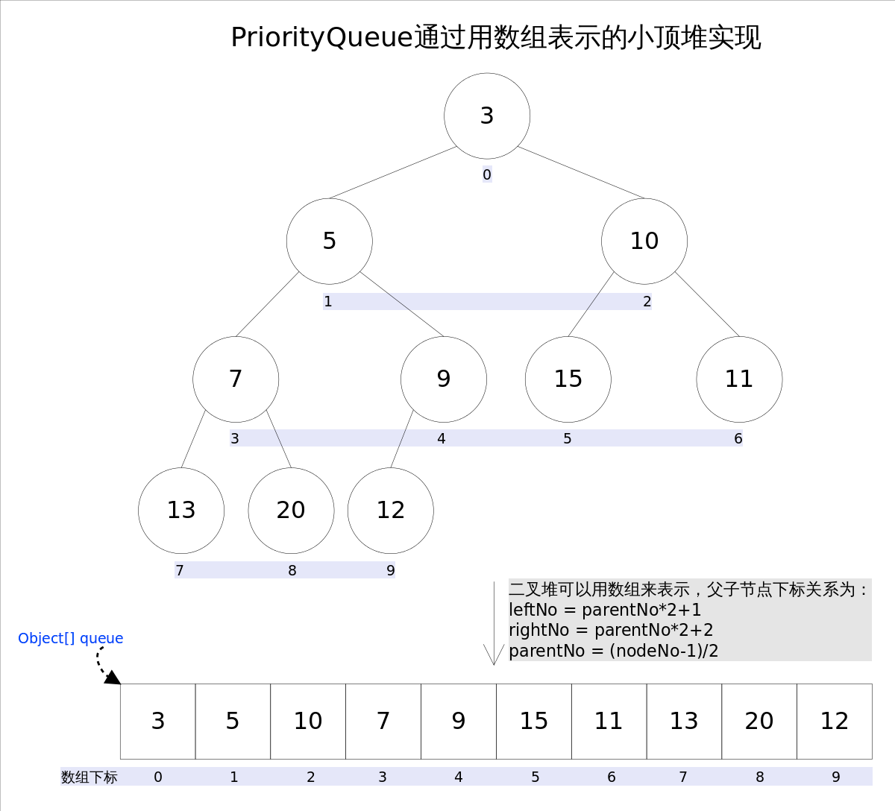

从图中可以看出，可以通过数组来实现平衡二叉堆。每一个节点的编号，可以使用数组的下标来表示。

> 1. 数组的第一个元素为二叉树的根节点，在所有节点中权值最小。
> 2. 父子节点之间的关系可以用以下算法表示。这个算法很重要。在新增元素或者删除元素的时候，都需要使用到该算法。
>
>> leftNo = parentNo * 2+1
>> rightNo = parentNo * 2+2
>> parentNo = (nodeNo-1)/2
>>

在优先队列中，一般只使用到新增元素和删除根节点元素，因此只对这两个算法进行介绍。

#### 1.1.2 新增元素

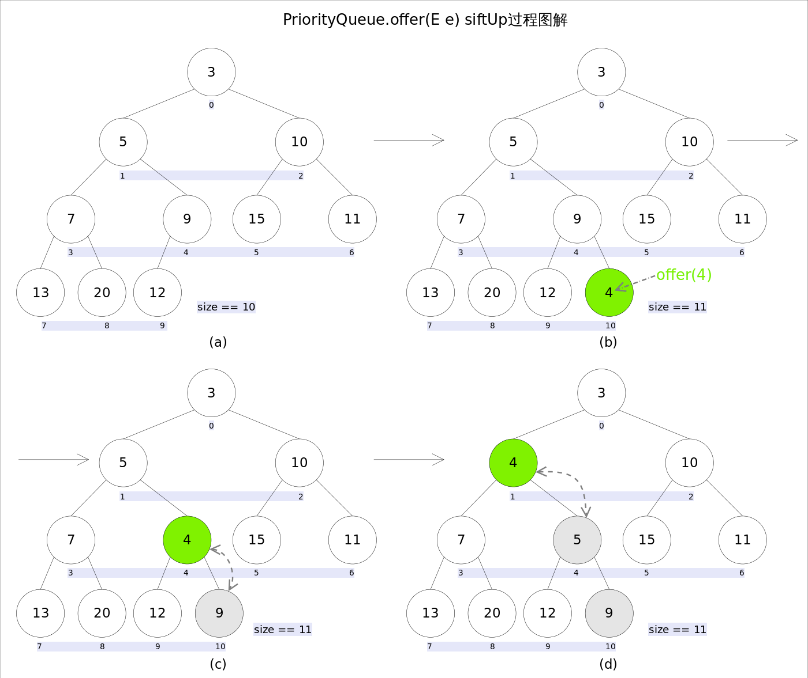
步骤如下:

> 1.先在队尾新增一个元素。如果数组长度不够就先扩容。
> 2.如果有父节点，则与父节点进行对比。如果权值比父节点小，则与父节点交换位置。
> 3.重复步骤2，直到没有父节点或者比父节点小则完成新增。2~3步一般称作siftUp。

```java
//siftUp()
private void siftUp(int k, E x) {
    while (k > 0) {
        int parent = (k - 1) >>> 1;//parentNo = (nodeNo-1)/2
        Object e = queue[parent];
        if (comparator.compare(x, (E) e) >= 0)//调用比较器的比较方法
            break;
        queue[k] = e;
        k = parent;
    }
    queue[k] = x;
}
```

通过以上步骤。可以保证所有的父节点权值都小于子节点的权值。

#### 1.1.3 删除队首元素

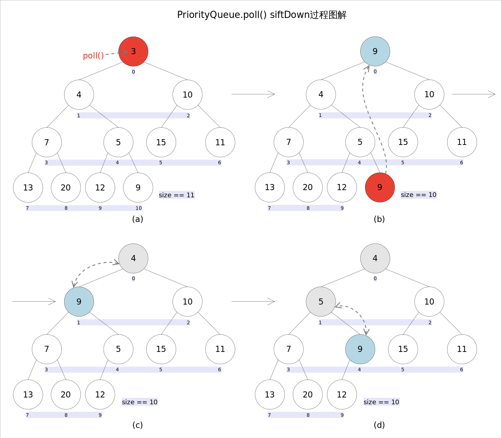
步骤如下：

> 1.删除数组的第一个元素。
> 2.将队尾的元素放置到头部位置，记为一个父节点。
> 3.通过比较获取子节点中较小的一个，并与父节点比较，如果父节点大于子节点，则交换位子。
> 4.重复步骤3，直到父节点小于等于子节点或者已经没有子节点，则结束比较。这个过程一般称作siftDown。

```java
//siftDown()
private void siftDown(int k, E x) {
    int half = size >>> 1;
    while (k < half) {
        //首先找到左右孩子中较小的那个，记录到c里，并用child记录其下标
        int child = (k << 1) + 1;//leftNo = parentNo*2+1
        Object c = queue[child];
        int right = child + 1;
        if (right < size &&
            comparator.compare((E) c, (E) queue[right]) > 0)
            c = queue[child = right];
        if (comparator.compare(x, (E) c) <= 0)
            break;
        queue[k] = c;//然后用c取代原来的值
        k = child;
    }
    queue[k] = x;
}
```

### 1.2 Timer 核心执行逻辑

Timer 提交任务的方法有6个

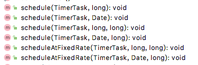

代表了6种不同的场景

delay： 延迟毫秒数period： 时间间隔

> 1.延迟delay毫秒后，执行任务一次。
> 2.延迟delay毫秒后，周期性执行任务，两次任务之间间隔period毫秒。
> 3.延迟delay毫秒后，以固定频率执行任务，两次任务之间间隔period毫秒。
>
> 4.指定的时间Date开始，执行任务一次。
> 5.指定的时间Date开始，周期性执行任务，两次任务之间间隔period毫秒。
> 6.指定的时间Date开始，以固定频率执行任务，两次任务之间间隔period毫秒。

需要特别说明的是2和3，5和6之间的区别，也就是schedule和scheduleAtFixedRate的区别。具体看下表：


| 方法名              | 下一个执行时间nextExecutionTime | 说明                                                                                       |
| --------------------- | --------------------------------- | -------------------------------------------------------------------------------------------- |
| schedule            | currentTime + delay             | 当前序堵塞时，影响到后续任务的下次计划时间，下次任务会推迟执行，对于丢失的时间不会补上任务 |
| scheduleAtFixedRate | nextExecutionTime + delay       | 当堵塞时，影响到后续任务的计划时间，任务的次数不会丢失，快速补上调度次数                   |

注： currentTime：当前时间，nextExecutionTime：下次执行时间，delay：时间间隔

#### 1.2.1 Timer简单的例子：

```java
public class Application {
    public static void main(String[] args) {
        //初始化一个timer对象
        Timer timer = new Timer();
        //创建抽象类TimerTask的实例。
        TimerTask myTask = new TimerTask() {
            @Override
            public void run() {
                System.out.println("执行run方法，time="+System.currentTimeMillis()/1000%60+"秒");
            }
        };
        //提交任务，延迟1秒执行，每两秒执行一次
        timer.schedule(myTask, 1000, 1000*2);
    }
}
```

结果：

> 执行run方法，time=25秒
> 执行run方法，time=27秒
> 执行run方法，time=29秒
> 执行run方法，time=31秒
> 执行run方法，time=33秒
> 执行run方法，time=35秒
> 执行run方法，time=37秒

原始代码分析如下，只挑选了核心代码展示。

#### 1.2.2 Timer 类源码分析

Timer 是整个任务架构的组织者，也是入口，因此首先看Timer的代码。

```java
public class Timer {
    // TaskQueue 实现了一个优先队列
    private final TaskQueue queue = new TaskQueue();
    // TimerThread继承了Thread。同时组合了TaskQueue。当Timer实例化时。会启动TimerThread实例的的start()方法。启动线程处理定时任务。
    private final TimerThread thread = new TimerThread(queue);

   //构造函数。做了一件事情，及时启动了TimerThread线程，处理队列数据。
   public Timer(String name, boolean isDaemon) {
      thread.setName(name);
      thread.setDaemon(isDaemon);
      thread.start();
   }
  
   //延迟delay毫秒后执行一次任务
   public void schedule(TimerTask task, long delay) {
      sched(task, System.currentTimeMillis()+delay, 0);
   }
   //延迟delay毫秒，以固定频率执行定时任务。下次的执行时间为当前系统时间(System.currentTimeMillis())+|period|
   //当发生阻塞时，有可能丢失调度次数
   public void schedule(TimerTask task, long delay, long period) {
      sched(task, System.currentTimeMillis()+delay, -period);
   }
   //延迟delay毫秒，以固定频率执行定时任务。与schedule不同。下次执行时间为当前本应执行时间(nextExecutionTime)+period
   //当发生阻塞时，不会丢失调度次数。
   public void scheduleAtFixedRate(TimerTask task, long delay, long period) {
      sched(task, System.currentTimeMillis()+delay, period);
   }
   
   
   
    /**
     * 核心新增定时任务的方法。
     * @param task 为实现了业务的任务类。
     * @param time 为下次执行任务的时间。  
     * @param period  为0时表示不会重复执行。当period !=0时表示会周期性执行
     */
    private void sched(TimerTask task, long time, long period) {
        //以下代码省去了部分校验代码
        synchronized(queue) {
            synchronized(task.lock) {
                task.nextExecutionTime = time;
                task.period = period;
                task.state = TimerTask.SCHEDULED;
            }
            queue.add(task);
            if (queue.getMin() == task)
                //说明加入task之前。队列为空，处于wait状态。需要唤起。
                queue.notify();
        }
    }
  
   //省略。。。

}
```

#### 1.2.3  TaskQueue 类源码分析

TaskQueue 本质是一个平衡二叉堆，1.1已经有所介绍。

```java
class TaskQueue {
    /**
     * Priority queue represented as a balanced binary heap: the two children
     * of queue[n] are queue[2*n] and queue[2*n+1].  The priority queue is
     * ordered on the nextExecutionTime field: The TimerTask with the lowest
     * nextExecutionTime is in queue[1] (assuming the queue is nonempty).  For
     * each node n in the heap, and each descendant of n, d,
     * n.nextExecutionTime <= d.nextExecutionTime.
     * 注释已经讲明，就是一个平衡二叉堆。
     */
    private TimerTask[] queue = new TimerTask[128];

  
    void add(TimerTask task) {
        // Grow backing store if necessary
        if (size + 1 == queue.length)
            queue = Arrays.copyOf(queue, 2*queue.length);
        //加到队尾
        queue[++size] = task;
        //向上排序
        fixUp(size);
    }
  
    private void fixUp(int k) {
        while (k > 1) {
            int j = k >> 1;
            if (queue[j].nextExecutionTime <= queue[k].nextExecutionTime)
                break;
            TimerTask tmp = queue[j];  queue[j] = queue[k]; queue[k] = tmp;
            k = j;
        }
    }

   void rescheduleMin(long newTime) {
      queue[1].nextExecutionTime = newTime;
      fixDown(1);
   }
   
    //删除元素时向下排序
    private void fixDown(int k) {
        int j;
        while ((j = k << 1) <= size && j > 0) {
            if (j < size &&
                queue[j].nextExecutionTime > queue[j+1].nextExecutionTime)
                j++; // j indexes smallest kid
            if (queue[k].nextExecutionTime <= queue[j].nextExecutionTime)
                break;
            TimerTask tmp = queue[j];  queue[j] = queue[k]; queue[k] = tmp;
            k = j;
        }
    }

    //省略其他
}
```

#### 1.2.3 TimerThread 类源码分析

从Timer代码可以看到，当实例化Timer时，将会启动一个TimerThread线程，具体作用是不断轮询队列的头部元素，然后执行业务代码。核心代码如下（省略部分代码）：

```java
class TimerThread extends Thread {
    //标识线程已经启用。当为false时，跳出循环。
    boolean newTasksMayBeScheduled = true;
    private TaskQueue queue;

    public void run() {
        try {
            mainLoop();
        } finally {
            //忽略。。。
        }
    }

    //执行轮询
    private void mainLoop() {
        while (true) {
            try {
                TimerTask task;
                boolean taskFired;
                synchronized(queue) {
                    // Wait for queue to become non-empty
                    while (queue.isEmpty() && newTasksMayBeScheduled) {
                       //while循环 让出锁，等待新任务加入
                       queue.wait();
                    }
                    if (queue.isEmpty()){
                       //此时newTasksMayBeScheduled队列已死。退出循环
                       break; 
                    }
                    long currentTime, executionTime;
                    task = queue.getMin();
                    synchronized(task.lock) {
                        //判断状态
                        if (task.state == TimerTask.CANCELLED) {
                            //检查已经取消的任务，移除。
                            queue.removeMin();
                            continue;  
                        }
          
                        currentTime = System.currentTimeMillis();
                        //当前task计划的执行时间。
                        executionTime = task.nextExecutionTime;
                        if (taskFired = (executionTime<=currentTime)) {
                            //当前任务的计划执行时间<=当前时间，则允许执行。
                            if (task.period == 0) { // Non-repeating, remove
                                //只执行一次的任务，移除。
                                queue.removeMin();
                                task.state = TimerTask.EXECUTED;
                            } else { 
                                //修改队列中最小的一个task的时间为下一个执行时间，并且重新排序。
                                queue.rescheduleMin(
                                  task.period<0 ? currentTime   - task.period
                                                : executionTime + task.period);
                            }
                        }
                    }
                    if (!taskFired) // Task hasn't yet fired; wait
                        //最近时间执行的任务还未到时间，需要等待。让出锁。
                        queue.wait(executionTime - currentTime);
                }
                if (taskFired)  
                    //执行业务逻辑。这里可以看到是同步执行的。如果业务逻辑耗时较长，会影响后续任务的执行。
                    task.run();
            } catch(InterruptedException e) {
            }
        }
    }
}
```

TimerThread 中的 mainLoop 方法+TaskQueue队列，看起来非常熟悉，在queue为空的时候，会调用queue.wait()方法。直到Timer在新增元素时，调用了queue.notify()。这些代码和BlockQueue非常像。

#### 1.2.4 TimerTask 类源码分析

```java
public abstract class TimerTask implements Runnable {
    //执行状态
    int state = VIRGIN;
    //下次执行时间，如果是重复的任务，在任务执行前会被更新成下次的执行时间。
    long nextExecutionTime;
    // 毫秒数，用于重复执行的时间间隔。证书标识以固定频率调度。负数标识以固定的时间延迟调度。0代表不会重复执行。
    long period = 0;
    //抽象犯法，用于实现业务
    public abstract void run();
    //省略部分代码。
}
```

### 1.3 Timer 调度示意图

通过对Timer的四个核心类，我们可以得出以下调度示意图。

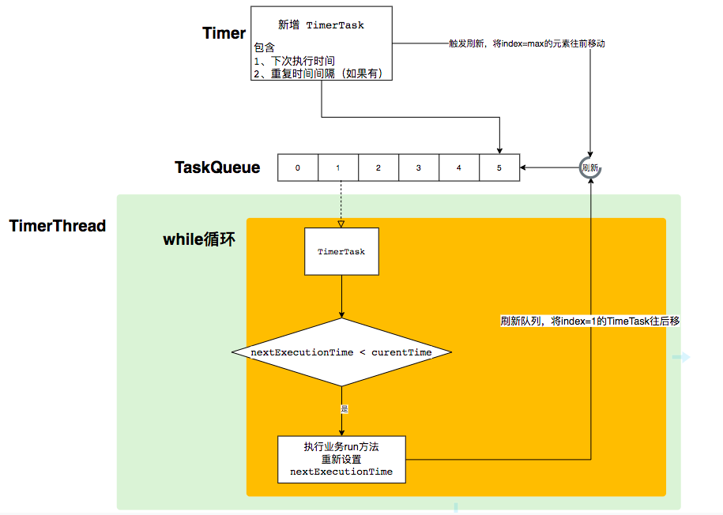

### 1.4 Timer 总结

可以看到，Timer 是JDK自带的任务调度器。实现的逻辑如下

> - 实现一个优先队列。队列的头部为最先需要执行的任务。
> - 启动一个后台线程，不断从优先队列中获取待执行的任务。
> - 执行任务。

通过使用Timer，我们可以方便地在一个线程中执行多个计划任务。但是也有一定的局限性，主要是多个任务之间相互影响：

> - 所有的任务都在一个线程中执行，如果前面的任务耗时比较长，则会影响后续任务的执行。
> - 假设前序任务抛出了非InterruptedException的异常，则整个队列将会被清空，任务调度终止。

基于以上局限性，在实际应用中，使用Timer使用得并不多。常用的为 ScheduledExecutorService。ScheduledExecutorService与Timer 的最大区别是将任务提交给线程池处理。

## 2. ScheduledExecutorService

在前一章节可以了解到，在 Timer 类中所有的任务都是同步执行，如果前序任务发生了阻塞或者耗时比较长，那么后续任务就容易被阻塞到。

JDK在1.5之后J引入了 ThreadPoolExecutor 线程池技术。 线程池技术的逻辑机构图如下：

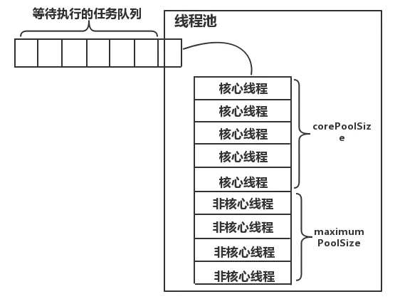

(参考[聊聊Java进阶之并发基础技术—线程池剖析](https://www.jianshu.com/p/41c9db9862be))

从上图可以看到，线程池也是将不同的任务加入到一个队列中（BlockingQueue），等待着多个线程的调用。与Timer的调度很相似，只是最大区别是线程池队列是被多个线程调用的。

因此JDK在1.5引入了ThreadPoolExecutor的同时，也重新编写了一套新任务调度器-ScheduledExecutorService,具体实现类为ScheduledThreadPoolExecutor，用于任务的调度。

其继承关系如下：
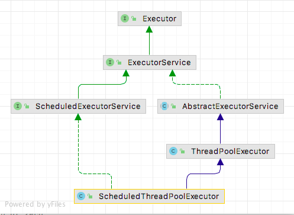

从继承关系中可以看出，ScheduledThreadPoolExecutor 继承了 ThreadPoolExecutor，拥有线程池的所有功能。

ScheduledThreadPoolExecutor 在实现上与Timer是相似的，都是通过实现一个优先队列来管理任务，同时这个优先队列又是一个阻塞队列，在获取第一个任务后，只有到了执行时间才会返回任务。一个比较大的改进在于，获取任务后不是直接执行代码，而是交给线程池来调度。

ScheduledExecutorService 的一些核心类如下：


| 类                                                                   | 功能                             | 说明                                                 |
| ---------------------------------------------------------------------- | ---------------------------------- | ------------------------------------------------------ |
| java.util.concurrent.ScheduledExecutorService                        | 抽象类，定义了提交任务的抽象方法 |                                                      |
| java.util.concurrent.Executors.DelegatedScheduledExecutorService     | 包装类                           | 用于包装 ScheduledThreadPoolExecutor，只暴露关键方法 |
| java.util.concurrent.ScheduledThreadPoolExecutor                     | 核心执行器                       |                                                      |
| java.util.concurrent.ScheduledThreadPoolExecutor.DelayedWorkQueue    | 延迟阻塞队列                     | 任务周期执行的核心方法在这个类中实现                 |
| java.util.concurrent.ScheduledThreadPoolExecutor.ScheduledFutureTask | 队列中的对象                     | 说明                                                 |

### 2.1 ScheduledExecutorService 的简单用法和介绍

```java
public class Application {
    public static void main(String[] args) {
        ScheduledExecutorService scheduledExecutorService = Executors.newSingleThreadScheduledExecutor();
        Runnable runnable = ()->{System.out.println("执行run方法，time="+System.currentTimeMillis()/1000%60+"秒");};
        scheduledExecutorService.scheduleAtFixedRate(runnable, 1, 2, TimeUnit.SECONDS);
    }
}

```

查看 ScheduledExecutorService 的结构，
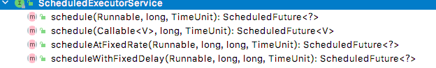

提交任务的方法共有4个，与Timer不同的是，可以提交Callable类型的任务。

```java
public interface ScheduledExecutorService extends ExecutorService {
   //delay时间后，执行一次任务
    public ScheduledFuture<?> schedule(Runnable command, long delay, TimeUnit unit);
    //delay时间后，执行一次任务有返回值的任务
    public <V> ScheduledFuture<V> schedule(Callable<V> callable, long delay, TimeUnit unit);
    //以固定频率执行任务
    public ScheduledFuture<?> scheduleAtFixedRate(Runnable command, long initialDelay, long period, TimeUnit unit);
    //以固定延迟时间执行任务
    public ScheduledFuture<?> scheduleWithFixedDelay(Runnable command, long initialDelay, long delay, TimeUnit unit);
}
```

### 2.2 ScheduledThreadPoolExecutor 类

ScheduledExecutorService只定义了相应的规范，还需要具体类进行实现。

通过查看 Executors.newSingleThreadScheduledExecutor()，具体实现如下

```java
    public static ScheduledExecutorService newSingleThreadScheduledExecutor() {
        return new DelegatedScheduledExecutorService(new ScheduledThreadPoolExecutor(1));
    }

```

DelegatedScheduledExecutorService 只是一个包装类，核心逻辑在 ScheduledThreadPoolExecutor。
其构造函数调用了父类的构造函数的时候，传入了 DelayedWorkQueue 延时阻塞队列。

```java
public class ScheduledThreadPoolExecutor
        extends ThreadPoolExecutor
        implements ScheduledExecutorService {
    // 构造函数1
   public ScheduledThreadPoolExecutor(int corePoolSize) {
      super(corePoolSize, Integer.MAX_VALUE, 0, NANOSECONDS, new DelayedWorkQueue());
   }
   // 构造函数2
   public ScheduledThreadPoolExecutor(int corePoolSize, ThreadFactory threadFactory) {
      super(corePoolSize, Integer.MAX_VALUE, 0, NANOSECONDS, new DelayedWorkQueue(), threadFactory);
   }
   // 构造函数3
   public ScheduledThreadPoolExecutor(int corePoolSize, RejectedExecutionHandler handler) {
      super(corePoolSize, Integer.MAX_VALUE, 0, NANOSECONDS, new DelayedWorkQueue(), handler);
   }
   // 构造函数4
   public ScheduledThreadPoolExecutor(int corePoolSize, ThreadFactory threadFactory, RejectedExecutionHandler handler) {
      super(corePoolSize, Integer.MAX_VALUE, 0, NANOSECONDS, new DelayedWorkQueue(), threadFactory, handler);
   }
   //ScheduledThreadPoolExecutor 提供了4个构造函数，每个构造函数都调用了父类ThreadPoolExecutor的构造函数，这四个经典参数中，DelayedWorkQueue是不变的，说明它是实现任务队列的关键。
   
   
   
    //向队列提交任务。
    // 查看源码，所有提交任务的方法，经过包装后最终会调用delayedExecute，像队列中新增任务。并调用父类的ensurePrestart()方法确认线程池已经准备就绪。
   private void delayedExecute(RunnableScheduledFuture<?> task) {
      if (isShutdown())
         reject(task);
      else {
         super.getQueue().add(task);
         if (isShutdown() &&
                 !canRunInCurrentRunState(task.isPeriodic()) &&
                 remove(task))
            task.cancel(false);
         else
            ensurePrestart();
      }
   }
}
```

到这时ScheduledExecutorService的秘密浮出水面，核心在于 DelayedWorkQueue。

### 2.3 DelayedWorkQueue 类实现

DelayedWorkQueue 类的定义如下。可以看到，DelayedWorkQueue的实现了BlockingQueue接口，可以传入JDK的线程池进行消费。

```java
static class DelayedWorkQueue extends AbstractQueue<Runnable>
        implements BlockingQueue<Runnable> {
}
```

但是具体何如实现队列中的任务，在指定的时间被调度呢？

首先来看一下他的队列实现方式。

```java

static class DelayedWorkQueue extends AbstractQueue<Runnable> implements BlockingQueue<Runnable> {
   /*
    * A DelayedWorkQueue is based on a heap-based data structure
    * like those in DelayQueue and PriorityQueue, except that
    * every ScheduledFutureTask also records its index into the
    * heap array. 
    * ...
    * 
    * 从以上注释中可以知道 DelayedWorkQueue 本质上也是一个基于堆的数据结构。
    */
   
   //初始化了一个数组
   private RunnableScheduledFuture<?>[] queue = new RunnableScheduledFuture<?>[INITIAL_CAPACITY];
   //用于新增元素时向上移动元素
   private void siftUp(int k, RunnableScheduledFuture<?> key) {
       //省略代码
   }
   //去除元素时向下移动元素
   private void siftDown(int k, RunnableScheduledFuture<?> key) {
       //省略代码
   }
   
   private final ReentrantLock lock = new ReentrantLock();
   private final Condition available = lock.newCondition();
   
   //查看阻塞队列的take方法
   public RunnableScheduledFuture<?> take() throws InterruptedException {
      final ReentrantLock lock = this.lock;
      lock.lockInterruptibly();
      try {
         for (;;) {
             //1、从队首获取待执行的任务。此任务在队列中最早执行。
            RunnableScheduledFuture<?> first = queue[0];
            if (first == null)
                // 2 队列中还没有元素，等待。
               available.await();
            else {
                //3 delay=下次执行时间-当前时间。当<=0说明需要被执行。
               long delay = first.getDelay(NANOSECONDS);
               if (delay <= 0) {
                  // 4 删除队列的第一个个元素并重新向下排序。返回任务
                  return finishPoll(first);
               }
             
               first = null; // don't retain ref while waiting  等待时去除引用
               if (leader != null)
                  available.await();
               else {
                  Thread thisThread = Thread.currentThread();
                  leader = thisThread;
                  try {
                      //5 当前线程等待，直到被唤醒或者等待时长结束
                     available.awaitNanos(delay);
                  } finally {
                     if (leader == thisThread)
                        leader = null;
                  }
               }
            }
         }
      } finally {
         if (leader == null && queue[0] != null)
            available.signal();
         lock.unlock();
      }
   }

   /**
    * 查看finishPoll方法。
    * 
    * 使用最后一个元素替换掉当前元素，并且重新向下排序。
    * 注意，这时第一个元素已经从队列中去除，这一点与Timer的实现方式不同。
    * Timer是修改时间了之后，从上往下重新排序。只需要排序一次。
    * ScheduledExecutorService执行一个定时任务，需要进行两次排序。第一次是获取了task,第二次是真正执行task的时候。
    * 
    * @param f
    * @return
    */
   private RunnableScheduledFuture<?> finishPoll(RunnableScheduledFuture<?> f) {
      int s = --size;
      RunnableScheduledFuture<?> x = queue[s];
      queue[s] = null;
      if (s != 0)
          //把队列头部换成x，向下排序
         siftDown(0, x);
      setIndex(f, -1);
      return f;
   }
}
```

### 2.4 ScheduledFutureTask 类

从上一节DelayedWorkQueue类中的take方法和finishPoll方法可知，在线程池获取task后，已经从队列中移走，那么对于重复执行的队列怎么办呢？那就是在线程池执行run方法前，重新将task加到队列中。

```java
// 注意 ScheduledFutureTask 属于  ScheduledThreadPoolExecutor 的成员内部类，因此可以使用ScheduledThreadPoolExecutor方法和成员变量。
public class ScheduledThreadPoolExecutor
        extends ThreadPoolExecutor
        implements ScheduledExecutorService {
  
   private class ScheduledFutureTask<V> extends FutureTask<V> implements RunnableScheduledFuture<V> {

      /** 下次执行时间 */
      private long time;
      /** 周期性执行任务的时间间隔 分为0、正、负值。*/
      private final long period;

      ScheduledFutureTask(Runnable r, V result, long ns, long period) {
         super(r, result);
         this.time = ns;
         this.period = period;
         this.sequenceNumber = sequencer.getAndIncrement();
      }

      /**Overrides FutureTask version so as to reset/requeue if periodic. 
       * 重写了 FutureTask 的run方法，主要是增加了重置下个调度时间以及重新排序*/
      public void run() {
         boolean periodic = isPeriodic();
         if (!canRunInCurrentRunState(periodic))
             //判断当前状态能不能运行
            cancel(false);
         else if (!periodic)
             //非周期性的任务，只执行一次
            ScheduledFutureTask.super.run();
         else if (ScheduledFutureTask.super.runAndReset()) {
             //设置下次执行时间
            setNextRunTime();
            //直接调用外部类的方法。重新将任务加入到队列中。
            reExecutePeriodic(outerTask);
         }
      }
   }
   //重新将任务加入到队列中
   void reExecutePeriodic(RunnableScheduledFuture<?> task) {
      if (canRunInCurrentRunState(true)) {
          //往队列加任务
         super.getQueue().add(task);
         if (!canRunInCurrentRunState(true) && remove(task))
            task.cancel(false);
         else
            ensurePrestart();
      }
   }
}

```

### 2.5 ScheduledExecutorService 总结

通过分析源码可以看出，ScheduledExecutorService  是通过实现一个优先队列来存储和调度任务的。从原理上来说是和Timer是类似的。可以认为是Timer 的升级版，新增了线程池执行任务的功能。

ScheduledExecutorService 和 Timer 比较


|           框架           | 相同                 | 不同                                                                                                                              |
| :------------------------: | ---------------------- | ----------------------------------------------------------------------------------------------------------------------------------- |
|          Timer          | 都使用堆作为数据结构 | 1、同步执行任务<br>    2、从队列头部获取任务之后，直接修改下次执行时间，直接排序                                                  |
| ScheduledExecutorService |                      | 1、线程池异步执行任务<br>      2、从头部获取任务后，移除当前任务 ，排序一次。在执行任务前修改时间后，再提交到队列。相当于排序两次 |

但是ScheduledExecutorService也有一定的局限性，那就是任务只能执行一次或者以固定的时间差周期性执行。不够灵活。

## 3 Spring Task

Spring Task处于spring-context项目的org.springframework.scheduling包下。可以通过注解的方式，将Spring bean中的某个方法变成一个task，非常方便。而且引入了cron表达式，使用更加灵活。

### 3.1 Spring Task 简单用法

新建一个maven项目，引入spring-context包

```xml
<dependency>
   <groupId>org.springframework</groupId>
   <artifactId>spring-context</artifactId>
   <version>5.3.15</version>
</dependency>
```

新建一个启动类

```java
@Configuration
@EnableScheduling
public class Application {

    public static void main(String[] args) {
        AnnotationConfigApplicationContext annotationConfigApplicationContext = new AnnotationConfigApplicationContext(Application.class);
    }
    @Scheduled(fixedRate = 1*1000)
    public void schedled(){
        System.out.println("执行定时任务，time="+System.currentTimeMillis()/1000%60+"秒");
    }
}
```

启动main方法后，执行结果如下：

> 执行定时任务，time=18秒
> 执行定时任务，time=19秒
> 执行定时任务，time=20秒
> 执行定时任务，time=21秒

从以上demo中可以看出，在spring中，只需要两个注解@EnableScheduling和@Scheduled，就可以启动一个定时任务了，非常方便。

### 3.2 Spring Task核心类


| 类                                                                                  | 功能                 | 说明                                                         |
| ------------------------------------------------------------------------------------- | ---------------------- | -------------------------------------------------------------- |
| org.springframework.scheduling.annotation.Scheduled                                 | 注解类               | 将一个方法标记为定时执行的task，提供了多种配置触发时间的方式 |
| org.springframework.scheduling.annotation.ScheduledAnnotationBeanPostProcessor      | 后置处理器           | 解析所有被Scheduled标识的方法处理成的task，并做相关配置      |
| org.springframework.scheduling.config.ScheduledTaskRegistrar                        | 任务注册中心         | 缓存了task和任务处理器                                       |
| org.springframework.scheduling.concurrent.ConcurrentTaskScheduler                   | 默认调度器           | 内置了ScheduledExecutorService                               |
| org.springframework.scheduling.concurrent.ReschedulingRunnable.ReschedulingRunnable | cron表达式Task适配器 | 对于使用了Trigger的Task，将使用ReschedulingRunnable重新封装  |
| org.springframework.scheduling.Trigger                                              | 触发器               | 对于cron表达式的task，有用到                                 |

### 3.3 Scheduled 注解

首先看一下Scheduled的代码，看提供了哪些工鞥呢。

```java
public @interface Scheduled {
    //核心参数如下
   //1、cron表达式
	String cron() default "";
    //2、固定延迟
	long fixedDelay() default -1;
    //3、固定频率
	long fixedRate() default -1;
    //4、固定的延迟
	long initialDelay() default -1;
    //时间单位，默认是毫秒
    TimeUnit timeUnit() default TimeUnit.MILLISECONDS;
    //忽略其他
}
```

Scheduled 中包含了任务调度的相关配置。 相比较ScheduledExecutorService，多了cron表达式。在任务的控制上更加灵活，不再局限于固定重复周期。

### 3.4 ScheduledAnnotationBeanPostProcessor 类

spring-task需要@EnableScheduling开启注解，查看其定义：

```java
@Target(ElementType.TYPE)
@Retention(RetentionPolicy.RUNTIME)
@Import(SchedulingConfiguration.class)
@Documented
public @interface EnableScheduling {
}
```

最重要的是@Import(SchedulingConfiguration.class)，将SchedulingConfiguration注入到spring容器中

```java
@Configuration(proxyBeanMethods = false)
@Role(BeanDefinition.ROLE_INFRASTRUCTURE)
public class SchedulingConfiguration {

	@Bean(name = TaskManagementConfigUtils.SCHEDULED_ANNOTATION_PROCESSOR_BEAN_NAME)
	@Role(BeanDefinition.ROLE_INFRASTRUCTURE)
	public ScheduledAnnotationBeanPostProcessor scheduledAnnotationProcessor() {
		return new ScheduledAnnotationBeanPostProcessor();
	}

}
```

SchedulingConfiguration只做了一件实行，那就是配置了ScheduledAnnotationBeanPostProcessor。

ScheduledAnnotationBeanPostProcessor实现了Spring的后置处理器，因此在Spring初始化后，根据相应的配置或者注解，可以筛选出对应的方法，封装成为ScheduledTask。等待被调用。在Spring初始化完成后将会触发任务的调度。

```java

//只保留核心代码
public class ScheduledAnnotationBeanPostProcessor
        implements ScheduledTaskHolder, MergedBeanDefinitionPostProcessor, DestructionAwareBeanPostProcessor,
        Ordered, EmbeddedValueResolverAware, BeanNameAware, BeanFactoryAware, ApplicationContextAware,
        SmartInitializingSingleton, ApplicationListener<ContextRefreshedEvent>, DisposableBean {
  
    //用来缓存task和TaskScheduler调度器
   private final ScheduledTaskRegistrar registrar;
  
    //处理Spring bean
   protected void processScheduled(Scheduled scheduled, Method method, Object bean) {
      try {
          //将Spring bean 封装成为一个Runnable
         Runnable runnable = createRunnable(bean, method);
         // 获取配置
         String cron = scheduled.cron();
         //解析cron
         cron = this.embeddedValueResolver.resolveStringValue(cron);
         //这里只摘录了cron方式配置，其他的如fixedDelay配置，fixedRate 配置同理
         if (StringUtils.hasText(cron)) {
            String zone = scheduled.zone();
            if (StringUtils.hasLength(cron)) {
                //注意这里 registrar 中缓存了 CronTask
                  tasks.add(this.registrar.scheduleCronTask(new CronTask(runnable, new CronTrigger(cron, timeZone))));
            }
         }
   
      }catch (Exception e){}
  
   }

   //监听容器刷新时间
   public void onApplicationEvent(ContextRefreshedEvent event) {
      if (event.getApplicationContext() == this.applicationContext) {
         finishRegistration();
      }
   }
   
   //这部分主要是从Spring中获取 scheduler 只保留核心代码
   private void finishRegistration() {
   
      if (this.registrar.hasTasks() && this.registrar.getScheduler() == null) {
         try {
             //1、根据类型获取TaskScheduler实现类
            this.registrar.setTaskScheduler(resolveSchedulerBean(this.beanFactory, TaskScheduler.class, false));
         }
         catch (NoUniqueBeanDefinitionException ex) {
            try {
                //2、实现类不唯一，尝试使用默认名称taskScheduler查找
               this.registrar.setTaskScheduler(resolveSchedulerBean(this.beanFactory, TaskScheduler.class, true));
            }
            catch (NoSuchBeanDefinitionException ex2) {
            }
         }
         catch (NoSuchBeanDefinitionException ex) {
            try {
               //3、根据类型获取 ScheduledExecutorService 实现类
               this.registrar.setScheduler(resolveSchedulerBean(this.beanFactory, ScheduledExecutorService.class, false));
            }
            catch (NoUniqueBeanDefinitionException ex2) {
               try {
                  //4、实现类不唯一，尝试使用默认名称taskScheduler查找
                  this.registrar.setScheduler(resolveSchedulerBean(this.beanFactory, ScheduledExecutorService.class, true));
               }
               catch (NoSuchBeanDefinitionException ex3) {
               }
            }
            catch (NoSuchBeanDefinitionException ex2) {
               // Giving up -> falling back to default scheduler within the registrar...
            }
         }
      }

      this.registrar.afterPropertiesSet();
   }
}
```

从 ScheduledAnnotationBeanPostProcessor 源码可以看出，经过处理后，所有的任务和执行器都存放于ScheduledTaskRegistrar中。通过调用afterPropertiesSet()来启动任务。总结来说，做了以下3件事情

> 1、将被注解的方法封装成为 Task。
> 2、从容器中查找 TaskScheduler。
> 3、将1和2都存到ScheduledTaskRegistrar。

### 3.5 ScheduledTaskRegistrar 类

```java
public class ScheduledTaskRegistrar implements ScheduledTaskHolder, InitializingBean, DisposableBean {

    //处理器，是Spring的类
	private TaskScheduler taskScheduler;
  
	//默认处理器 JDK
	private ScheduledExecutorService localExecutor;

    //根据不同的配置，缓存了不同的类型的task。名字与Scheduled中配置基本一样。
	@Nullable
	private List<TriggerTask> triggerTasks;

	@Nullable
	private List<CronTask> cronTasks;

	@Nullable
	private List<IntervalTask> fixedRateTasks;

	@Nullable
	private List<IntervalTask> fixedDelayTasks;

	private final Map<Task, ScheduledTask> unresolvedTasks = new HashMap<>(16);
    //已经加入执行器中的任务
	private final Set<ScheduledTask> scheduledTasks = new LinkedHashSet<>(16);

   @Override
   public void afterPropertiesSet() {
      scheduleTasks();
   }
    //具体将任务提交到执行器中的方法
   protected void scheduleTasks() {
      if (this.taskScheduler == null) {
          //当容器中没有找到执行器的时候，将会使用 ScheduledExecutorService。此时只有一个线程处理。
         this.localExecutor = Executors.newSingleThreadScheduledExecutor();
         //需要将ScheduledExecutorService 封装成为 TaskScheduler 才能够使用
         this.taskScheduler = new ConcurrentTaskScheduler(this.localExecutor);
      }
  
      if (this.cronTasks != null) {
         for (CronTask task : this.cronTasks) {
            addScheduledTask(scheduleCronTask(task));
         }
      }
      if (this.fixedRateTasks != null) {
         for (IntervalTask task : this.fixedRateTasks) {
            addScheduledTask(scheduleFixedRateTask(task));
         }
      }
      //省略部分代码
   }

   public ScheduledTask scheduleTriggerTask(TriggerTask task) {
      ScheduledTask scheduledTask = this.unresolvedTasks.remove(task);
      boolean newTask = false;
      if (scheduledTask == null) {
         scheduledTask = new ScheduledTask(task);
         newTask = true;
      }
      if (this.taskScheduler != null) {
          //执行任务
         scheduledTask.future = this.taskScheduler.schedule(task.getRunnable(), task.getTrigger());
      }
      else {
         addTriggerTask(task);
         this.unresolvedTasks.put(task, scheduledTask);
      }
      return (newTask ? scheduledTask : null);
   }
}
```

### 3.6 TaskScheduler 以及实现类

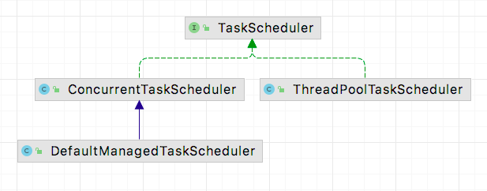

TaskScheduler 定义了一系列提交任务的方法，与 ScheduledExecutorService 角色相当。
但需要注意的是新增了一个方法。

```
ScheduledFuture<?> schedule(Runnable task, Trigger trigger);
```

这个方法比较特殊，也是实现cron表达式的关键。

spring提供了三个实现类。

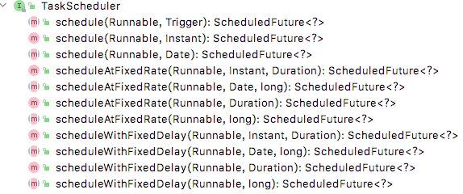

实现类 ConcurrentTaskScheduler 注解上讲的很明白，就是一个将java.util.concurrent.ScheduledExecutorService 适配成 TaskScheduler 的适配器。
其构造器如下
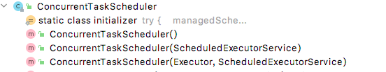

ThreadPoolTaskScheduler 则是封装了ScheduledThreadPoolExecutor。
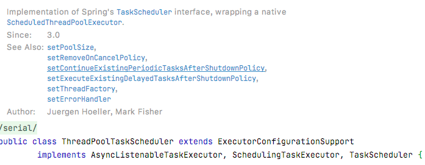

### 3.7 如何执行cron表达式的任务

从前面的代码中我们知道， Spring-task默认使用  ScheduledExecutorService 作为底层逻辑，但是ScheduledExecutorService并不支持cron表达式。可以通过将cron表达式的任务分装成ScheduledExecutorService支持的参数即可。也就是

> 1、将task封装成为CronTask， 先计算cron的下次执行时间与当前的时间差delay。
> 2、调用 ScheduledExecutorService 实例提交任务。让任务延迟delay执行一次，注意只执行一次。
> 3、执行业务 run 方法。
> 4、重复执行1-3即可。

这个思路与ScheduledExecutorService获取task后再提交到队列中的思路是一样的。因此不再详细表述， 具体代码参考 ReschedulingRunnable 类和 CronTask 类。

```java
class ReschedulingRunnable extends DelegatingErrorHandlingRunnable implements ScheduledFuture<Object> {
   // trigger 封装了cron和获取下次触发时间的类
   private final Trigger trigger;
    // 上下文
	private final SimpleTriggerContext triggerContext;
    // 执行器
	private final ScheduledExecutorService executor;

	@Nullable
	private ScheduledFuture<?> currentFuture;

	@Nullable
	private Date scheduledExecutionTime;

	private final Object triggerContextMonitor = new Object();

    //重新将task封装成为 ReschedulingRunnable 
	public ReschedulingRunnable(Runnable delegate, Trigger trigger, Clock clock,
			ScheduledExecutorService executor, ErrorHandler errorHandler) {
		super(delegate, errorHandler);
		this.trigger = trigger;
		this.triggerContext = new SimpleTriggerContext(clock);
		this.executor = executor;
	}

  
	@Nullable
	public ScheduledFuture<?> schedule() {
		synchronized (this.triggerContextMonitor) {
            //获取下次执行时间
			this.scheduledExecutionTime = this.trigger.nextExecutionTime(this.triggerContext);
			if (this.scheduledExecutionTime == null) {
				return null;
			}
			long initialDelay = this.scheduledExecutionTime.getTime() - this.triggerContext.getClock().millis();
            //提交到线程池 ScheduledExecutorService。只执行一次。
			this.currentFuture = this.executor.schedule(this, initialDelay, TimeUnit.MILLISECONDS);
			return this;
		}
	}

	@Override
	public void run() {
		Date actualExecutionTime = new Date(this.triggerContext.getClock().millis());
        //执行业务方法
		super.run();
		Date completionTime = new Date(this.triggerContext.getClock().millis());
		synchronized (this.triggerContextMonitor) {
			Assert.state(this.scheduledExecutionTime != null, "No scheduled execution");
            //更新相关参数
			this.triggerContext.update(this.scheduledExecutionTime, actualExecutionTime, completionTime);
            //判断是否可以继续执行
			if (!obtainCurrentFuture().isCancelled()) {
                //继续提交任务
				schedule();
			}
		}
	}
    //省略其他代码。。。
}
```

### 3.8 总结

spring task中任务处理器为TaskScheduler实现类，任务为Trigger的实现类。基本的思想还是与 ScheduledExecutorService 想类似的。在默认情况下也是使用ScheduledExecutorService作为任务的处理器。

使用spring task需要注意的是，如果我们没有配置TaskScheduler实例，默认情况下使用 Executors.newSingleThreadScheduledExecutor()新建了一个实例，这个实例只有一个线程处理任务，在任务耗时比较高的情况下会有可能发生阻塞。最好是配置一个ScheduledExecutorService实例交给Spring管理

如：

```java
@Configuration
@EnableScheduling
public class Application2 {

    public static void main(String[] args) {
        AnnotationConfigApplicationContext annotationConfigApplicationContext = new AnnotationConfigApplicationContext(Application2.class);
    }
  
    @Scheduled(fixedRate = 100)
    public void schedled(){
        System.out.println("执行定时任务，time="+System.currentTimeMillis()/1000%60+"秒。threadName="+Thread.currentThread().getName());
    }

    @Bean
    public ScheduledExecutorService executorService(){
        ThreadFactory factory = new ThreadFactory() {
            private  int seq = 0;
            @Override
            public Thread newThread(Runnable r) {
                return new Thread(r,"定时任务线程池 seq="+seq++);
            }
        };
        ScheduledExecutorService scheduledExecutorService = Executors.newScheduledThreadPool(3, factory);
        return scheduledExecutorService;
    }
}

```

## 4 XXL-JOB

XXL-JOB是一个分布式任务调度平台，其核心设计目标是开发迅速、学习简单、轻量级、易扩展。现已开放源代码并接入多家公司线上产品线，开箱即用。
由于是国产开发的，中文文档，而且很全面，可以直接看官方文档 [《分布式任务调度平台XXL-JOB》-官方文档](https://www.xuxueli.com/xxl-job/) 。
另外，最初作者使用的底层框架是Quartz，后来发现Quartz太过麻烦，自研了一个调度器，简单但是很实用，很值得学习。

### 4.1 为什么我们需要一个分布式的调度平台

前面介绍的Timer, ScheduledExcutorService 和 Spring Task，都是针对单个实例内的任务调度。假设有一个任务A，是给用户发送消息的，设置每一秒执行一次，如果部署了3个实例，那么就会变成每秒执行3次，可能会导致并发问题。此外在实际的业务中，我们还有可能需要随时调整调度周期，随时停止和启动一个任务等。因此在分布式系统中，有一个分布式调度器尤为重要。

### 4.2 XXL-JOB 的模块

XXL-JOB的核心模块分为2个。另外xxl-job-executor-samples是一个demo模块
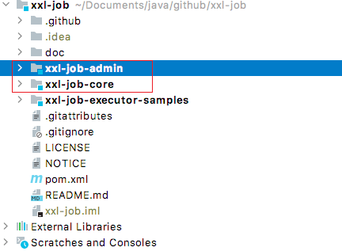


| 模块          | 说明               | 功能                       |
| --------------- | -------------------- | ---------------------------- |
| xxl-job-admin | 服务端（调度中心） | 管理界面+任务调度          |
| xxl-job-core  | 客户端（执行器）   | 在项目中引用，执行业务逻辑 |

架构图
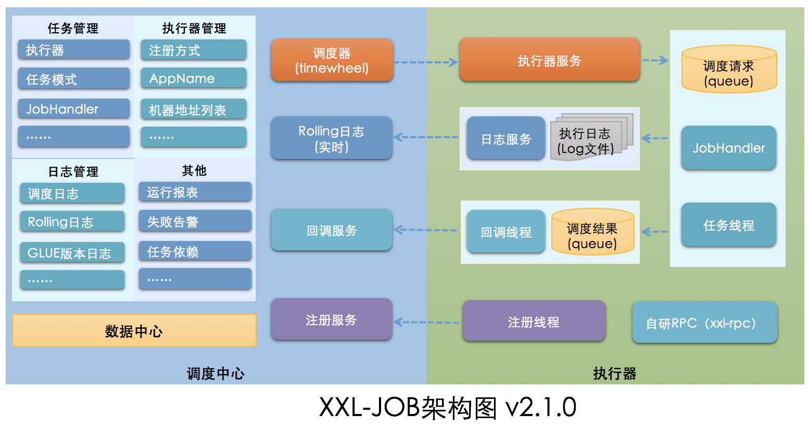

### 4.3 XXL-JOB 服务端 xxl-job-admin

**服务端**核心类如下：


| 类                                                 | 功能                                                  | 说明 |
| ---------------------------------------------------- | ------------------------------------------------------- | ------ |
| com.xxl.job.admin.core.thread.JobScheduleHelper    | 将需要执行的JOB提交到线程池                           |      |
| com.xxl.job.admin.core.model.XxlJobInfo            | 实体类记录了一个任务的配置，持久化到mysql中           |      |
| com.xxl.job.admin.core.thread.JobTriggerPoolHelper | 定义了两个线程池，用户接受JobScheduleHelper提交的任务 |      |
| com.xxl.job.admin.core.thread.JobRegistryHelper    | 注册中心 ，接收客户端的注册和心跳                     |      |

#### 4.3.1 JobScheduleHelper 类

从前面对任务调度的介绍可以看出，一个任务调度器，离不开

> 1.一个带有执行时间的任务
> 2.轮询执行任务的调度器

XXL-JOB 也不例外。其中JobScheduleHelper类就属于轮询执行任务的调度器，包含了任务调用的基本逻辑，属于必看的类

源码逻辑解析
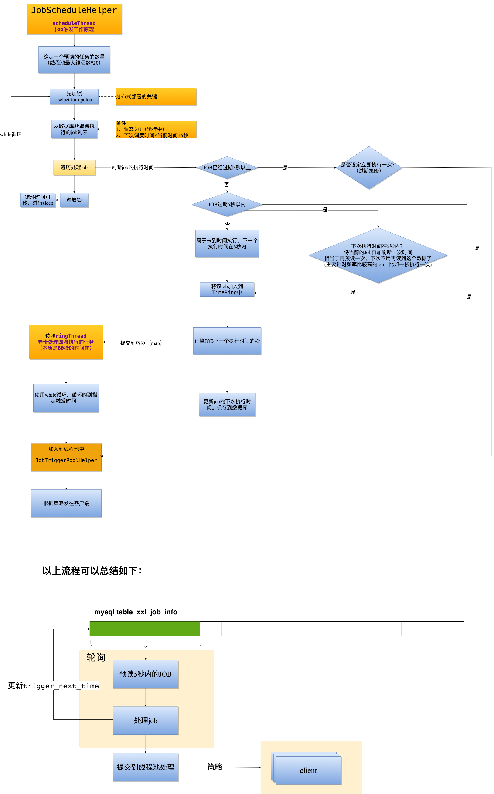

从以上逻辑看，XXL-JOB的核心逻辑与JDK的 ScheduledExecutorService 是基本类似的。都是先从一个队列（xxl-job是使用mysql排序）中取出JOB，然后提交给线程池处理。

但有一点区别：XXL-JOB是从数据库读取数据，因此为了提高性能，做了一个预读5秒的变化。未到时间执行的job提交给时间轮，再由时间轮提交给线程池处理。

具体代码如下

```java

public class JobScheduleHelper {
    //忽略部分代码
    //预读5秒
    public static final long PRE_READ_MS = 5000;    // pre read
    //时间轮刻度-任务ID映射表
    private volatile static Map<Integer, List<Integer>> ringData = new ConcurrentHashMap<>();

    public void start(){
        scheduleThread = new Thread(new Runnable() {
            @Override
            public void run() {
                // 按照默认配置 （快200+慢100）* 20 = 6000
                int preReadCount = (XxlJobAdminConfig.getAdminConfig().getTriggerPoolFastMax() + XxlJobAdminConfig.getAdminConfig().getTriggerPoolSlowMax()) * 20;

                while (!scheduleThreadToStop) {
                    // Scan Job
                    long start = System.currentTimeMillis();
                    //数据库连接
                    Connection conn = null;
                    PreparedStatement preparedStatement = null;

                    boolean preReadSuc = true;
                    try {

                        conn = XxlJobAdminConfig.getAdminConfig().getDataSource().getConnection();
                        conn.setAutoCommit(false);
                        //加锁
                        preparedStatement = conn.prepareStatement(  "select * from xxl_job_lock where lock_name = 'schedule_lock' for update" );
                        preparedStatement.execute();

                        // 1、预读 查询数据库，获取下次执行时间 <= 当前时间+5秒 的所有JOB
                        long nowTime = System.currentTimeMillis();
                      
                        //SELECT * FROM xxl_job_info AS t WHERE t.trigger_status = 1 and t.trigger_next_time <= #{maxNextTime} ORDER BY id ASC LIMIT #{pagesize}
                        List<XxlJobInfo> scheduleList = XxlJobAdminConfig.getAdminConfig().getXxlJobInfoDao().scheduleJobQuery(nowTime + PRE_READ_MS, preReadCount);
                      
                        if (scheduleList!=null && scheduleList.size()>0) {
                            // 2、遍历处理JOB，看是直接提交给线程池还是先提交到 time-ring后再提交给线程池。
                            for (XxlJobInfo jobInfo: scheduleList) {
                                // time-ring jump
                                if (nowTime > jobInfo.getTriggerNextTime() + PRE_READ_MS) {
                                    // 2.1、超时>5秒以上，当做错失触发时机

                                    // 1、超时触发策略
                                    MisfireStrategyEnum misfireStrategyEnum = MisfireStrategyEnum.match(jobInfo.getMisfireStrategy(), MisfireStrategyEnum.DO_NOTHING);
                                  
                                    if (MisfireStrategyEnum.FIRE_ONCE_NOW == misfireStrategyEnum) {
                                        // FIRE_ONCE_NOW 》 trigger
                                        JobTriggerPoolHelper.trigger(jobInfo.getId(), TriggerTypeEnum.MISFIRE, -1, null, null, null);
                                    }
                                    // 2、更新时间
                                    refreshNextValidTime(jobInfo, new Date());

                                } else if (nowTime > jobInfo.getTriggerNextTime()) {
                                    // 2.2、超时时间在5秒以内
                                    // 1、提交到线程池
                                    JobTriggerPoolHelper.trigger(jobInfo.getId(), TriggerTypeEnum.CRON, -1, null, null, null);
                                    // 2、刷新一次时间
                                    refreshNextValidTime(jobInfo, new Date());
                                    if (jobInfo.getTriggerStatus()==1 && nowTime + PRE_READ_MS > jobInfo.getTriggerNextTime()) {
                                       //下次执行在5秒内，说明下次循环还有它，可以再预读一次，直接提交到时间轮，提高想能
                                        // 1、计算时间轮刻度
                                        int ringSecond = (int)((jobInfo.getTriggerNextTime()/1000)%60);
                                        // 2、提交到时间轮
                                        pushTimeRing(ringSecond, jobInfo.getId());
                                        // 3、再更新一次时间
                                        refreshNextValidTime(jobInfo, new Date(jobInfo.getTriggerNextTime()));

                                    }

                                } else {
                                    // 2.3、未到执行时间
                                    // 1、计算时间轮刻度
                                    int ringSecond = (int)((jobInfo.getTriggerNextTime()/1000)%60);
                                    // 2、提交到时间轮线程
                                    pushTimeRing(ringSecond, jobInfo.getId());
                                    // 3、刷新
                                    refreshNextValidTime(jobInfo, new Date(jobInfo.getTriggerNextTime()));
                                }
                            }
                            // 3、将修改了下次执行时间的任务存到数据库中
                            for (XxlJobInfo jobInfo: scheduleList) {
                                XxlJobAdminConfig.getAdminConfig().getXxlJobInfoDao().scheduleUpdate(jobInfo);
                            }
                        } else {
                            preReadSuc = false;
                        }
                    } finally {
                        //省略处理数据库连接
                    }
                    long cost = System.currentTimeMillis()-start;
                    //省略。。。
                }
            }
        });
        scheduleThread.setDaemon(true);
        scheduleThread.setName("xxl-job, admin JobScheduleHelper#scheduleThread");
        scheduleThread.start();
      
        // ring thread
        ringThread = new Thread(new Runnable() {
            @Override
            public void run() {

                while (!ringThreadToStop) {

                    //时间轮代码，忽略
                }
                logger.info(">>>>>>>>>>> xxl-job, JobScheduleHelper#ringThread stop");
            }
        });
        ringThread.setDaemon(true);
        ringThread.setName("xxl-job, admin JobScheduleHelper#ringThread");
        ringThread.start();
    }
    //忽略其他代码
}

```

#### 4.3.2 JobRegistryHelper 类

#### 4.3.3 服务端整体初始化逻辑

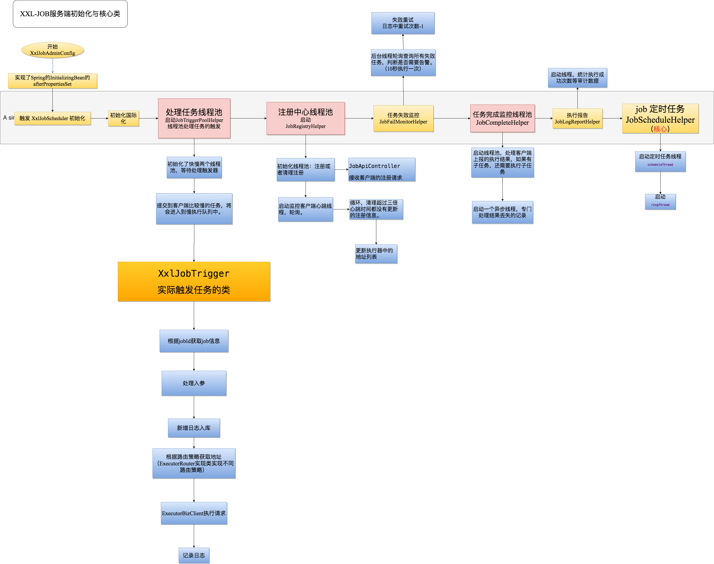

### 4.4 客户端逻辑

**客户端**核心类如下：

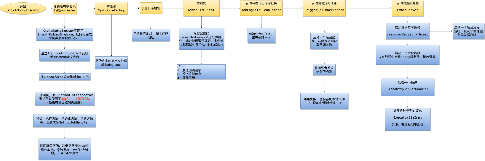


| 类                                         | 功能             | 说明                                                                                                          |
| -------------------------------------------- | ------------------ | --------------------------------------------------------------------------------------------------------------- |
| com.xxl.job.core.handler.annotation.XxlJob | Task注解         | 被标注的方法将会被处理成为 IJobHandler, 与@Scheduled注解功能相似 （19年底新增注解）。 每个IJobHandler有唯标识 |
| com.xxl.job.core.server.EmbedServer        | 客户端server     | 启动一个netty,用于接收服务端的调度                                                                            |
| com.xxl.job.core.biz.impl.ExecutorBizImpl  | 处理服务端的请求 | EmbedServer接收请求后，实际交给ExecutorBizImpl进行处理，处理后缓存于LinkedBlockingQueue中等待调用             |
| com.xxl.job.core.biz.model.TriggerParam    | 触发参数         | 记录服务端发送过来的任务                                                                                      |
| com.xxl.job.core.thread.JobThread          | Job线程          | 用 LinkedBlockingQueue 缓存服务端传递过来的 TriggerParam。轮询 LinkedBlockingQueue。                          |
| com.xxl.job.core.handler.IJobHandler       | Task抽象类       | 被@XxlJob的注释的方法，或者通过服务端传递过来的代码，将会封装成为一个  IJobHandler    实现类                  |
| com.xxl.job.core.context.XxlJobContext     | 上下文           | 内置InheritableThreadLocal，在线程中存储变量，供给IJobHandler                                                 |

从以上表格基本可以看出客户端的执行逻辑，因此不再详细描述。

## 5 Quartz

### 5.1 什么是 Quartz

从 [Quartz官网](http://www.quartz-scheduler.org/) 简介可以知道，
Quartz 是一个开源的任务调度框架，可以用于单体应用，也可以用于大型的电子商务平台，支持成千上万的任务。

### 5.1 Quartz 简单demo

新建一个maven项目，引入依赖

```xml
<dependency>
   <groupId>org.quartz-scheduler</groupId>
   <artifactId>quartz</artifactId>
   <version>2.3.1</version>
</dependency>
```

````java
public class Application {
    public static void main(String[] args) {
        try {
            Scheduler scheduler = StdSchedulerFactory.getDefaultScheduler();
            scheduler.start();
            //定义一个工作对象 设置工作名称与组名
            JobDetail job = JobBuilder.newJob(HelloJob.class).withIdentity("job41","group1").build();
            //定义一个触发器 简单Trigger 设置工作名称与组名 5秒触发一次
            Trigger trigger = TriggerBuilder.newTrigger().withIdentity("trigger1","group1").startNow().withSchedule(SimpleScheduleBuilder.repeatSecondlyForever(5)).build();
            //设置工作 与触发器
            scheduler.scheduleJob(job, trigger);
//            scheduler.shutdown();
        } catch (SchedulerException se) {
            se.printStackTrace();
        }
    }
}

````

Scheduler 是一个接口定义了一系列提交job的方法。
其实现类如下:
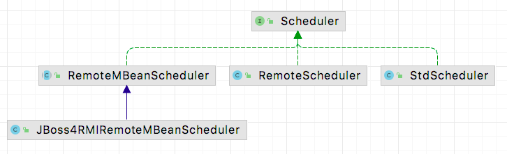

查看 StdScheduler 本质上是一个代理类，代理了 QuartzScheduler 类的所有方法。

挑选一个方法来看：

```java
public class QuartzScheduler implements RemotableQuartzScheduler {
    //存储job
   private QuartzSchedulerResources resources;

   public Date scheduleJob(JobDetail jobDetail,
                           Trigger trigger) throws SchedulerException {
       //省略校验
      OperableTrigger trig = (OperableTrigger) trigger;

      if (trigger.getJobKey() == null) {
         trig.setJobKey(jobDetail.getKey());
      } else if (!trigger.getJobKey().equals(jobDetail.getKey())) {
         throw new SchedulerException(
                 "Trigger does not reference given job!");
      }

      trig.validate();

      Calendar cal = null;
      if (trigger.getCalendarName() != null) {
         cal = resources.getJobStore().retrieveCalendar(trigger.getCalendarName());
      }
      Date ft = trig.computeFirstFireTime(cal);

      if (ft == null) {
         throw new SchedulerException(
                 "Based on configured schedule, the given trigger '" + trigger.getKey() + "' will never fire.");
      }

      resources.getJobStore().storeJobAndTrigger(jobDetail, trig);
      notifySchedulerListenersJobAdded(jobDetail);
      notifySchedulerThread(trigger.getNextFireTime().getTime());
      notifySchedulerListenersSchduled(trigger);

      return ft;
   }

   //start方法
   public void start() throws SchedulerException {

      if (shuttingDown|| closed) {
         throw new SchedulerException(
                 "The Scheduler cannot be restarted after shutdown() has been called.");
      }

      // QTZ-212 : calling new schedulerStarting() method on the listeners
      // right after entering start()
      notifySchedulerListenersStarting();

      if (initialStart == null) {
         initialStart = new Date();
         //启动了线程
         this.resources.getJobStore().schedulerStarted();
         startPlugins();
      } else {
         resources.getJobStore().schedulerResumed();
      }

      schedThread.togglePause(false);

      getLog().info(
              "Scheduler " + resources.getUniqueIdentifier() + " started.");

      notifySchedulerListenersStarted();
   }
}
```

可以看到存储和触发的代码

> resources.getJobStore().storeJobAndTrigger(jobDetail, trig);

其中resources.getJobStore() 为 JobStore 实例。用于存储job和triger提供给 QuartzScheduler 使用。

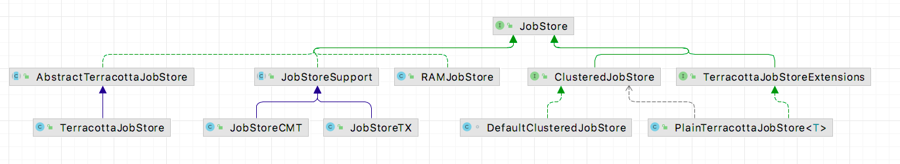

查看 RAMJobStore 。

```java
public class RAMJobStore implements JobStore {

    /*
     * ~~~~~~~~~~~~~~~~~~~~~~~~~~~~~~~~~~~~~~~~~~~~~~~~~~~~~~~~~~~~~~~~~~~~~~~~~
     * 
     * Data members.
     * 
     * ~~~~~~~~~~~~~~~~~~~~~~~~~~~~~~~~~~~~~~~~~~~~~~~~~~~~~~~~~~~~~~~~~~~~~~~~~
     */

    protected HashMap<JobKey, JobWrapper> jobsByKey = new HashMap<JobKey, JobWrapper>(1000);

    protected HashMap<TriggerKey, TriggerWrapper> triggersByKey = new HashMap<TriggerKey, TriggerWrapper>(1000);

    protected HashMap<String, HashMap<JobKey, JobWrapper>> jobsByGroup = new HashMap<String, HashMap<JobKey, JobWrapper>>(25);

    protected HashMap<String, HashMap<TriggerKey, TriggerWrapper>> triggersByGroup = new HashMap<String, HashMap<TriggerKey, TriggerWrapper>>(25);

    protected TreeSet<TriggerWrapper> timeTriggers = new TreeSet<TriggerWrapper>(new TriggerWrapperComparator());

    protected HashMap<String, Calendar> calendarsByName = new HashMap<String, Calendar>(25);

    protected Map<JobKey, List<TriggerWrapper>> triggersByJob = new HashMap<JobKey, List<TriggerWrapper>>(1000);

    protected final Object lock = new Object();

    protected HashSet<String> pausedTriggerGroups = new HashSet<String>();

    protected HashSet<String> pausedJobGroups = new HashSet<String>();

    protected HashSet<JobKey> blockedJobs = new HashSet<JobKey>();
  
    protected long misfireThreshold = 5000l;

    protected SchedulerSignaler signaler;

    //获取下一个任务
   public List<OperableTrigger> acquireNextTriggers(long noLaterThan, int maxCount, long timeWindow) {
      synchronized (lock) {
         List<OperableTrigger> result = new ArrayList<OperableTrigger>();
         Set<JobKey> acquiredJobKeysForNoConcurrentExec = new HashSet<JobKey>();
         Set<TriggerWrapper> excludedTriggers = new HashSet<TriggerWrapper>();
         long batchEnd = noLaterThan;

         // return empty list if store has no triggers.
         if (timeTriggers.size() == 0)
            return result;

         while (true) {
            TriggerWrapper tw;

            try {
               tw = timeTriggers.first();
               if (tw == null)
                  break;
               timeTriggers.remove(tw);
            } catch (java.util.NoSuchElementException nsee) {
               break;
            }

            if (tw.trigger.getNextFireTime() == null) {
               continue;
            }

            if (applyMisfire(tw)) {
               if (tw.trigger.getNextFireTime() != null) {
                  timeTriggers.add(tw);
               }
               continue;
            }

            if (tw.getTrigger().getNextFireTime().getTime() > batchEnd) {
               timeTriggers.add(tw);
               break;
            }

            // If trigger's job is set as @DisallowConcurrentExecution, and it has already been added to result, then
            // put it back into the timeTriggers set and continue to search for next trigger.
            JobKey jobKey = tw.trigger.getJobKey();
            JobDetail job = jobsByKey.get(tw.trigger.getJobKey()).jobDetail;
            if (job.isConcurrentExectionDisallowed()) {
               if (acquiredJobKeysForNoConcurrentExec.contains(jobKey)) {
                  excludedTriggers.add(tw);
                  continue; // go to next trigger in store.
               } else {
                  acquiredJobKeysForNoConcurrentExec.add(jobKey);
               }
            }

            tw.state = TriggerWrapper.STATE_ACQUIRED;
            tw.trigger.setFireInstanceId(getFiredTriggerRecordId());
            OperableTrigger trig = (OperableTrigger) tw.trigger.clone();
            if (result.isEmpty()) {
               batchEnd = Math.max(tw.trigger.getNextFireTime().getTime(), System.currentTimeMillis()) + timeWindow;
            }
            result.add(trig);
            if (result.size() == maxCount)
               break;
         }

         // If we did excluded triggers to prevent ACQUIRE state due to DisallowConcurrentExecution, we need to add them back to store.
         if (excludedTriggers.size() > 0)
            timeTriggers.addAll(excludedTriggers);
         return result;
      }
   }
}
```

从以上源码可知 RAMJobStore 是存储job以及相关参数的地方。
其中特别注意的是timeTriggers属性，其使用TreeSet来保存，这个是实现类似Timer优先队列的作用。

QuartzSchedulerThread 的run方法，就是去获取任务的地方。

```java
public class QuartzSchedulerThread extends Thread {

    /**
     * <p>
     * The main processing loop of the <code>QuartzSchedulerThread</code>.
     * </p>
     */
    @Override
    public void run() {
        int acquiresFailed = 0;

        while (!halted.get()) {
            try {
                // check if we're supposed to pause...
                synchronized (sigLock) {
                    while (paused && !halted.get()) {
                        try {
                            // wait until togglePause(false) is called...
                            sigLock.wait(1000L);
                        } catch (InterruptedException ignore) {
                        }

                        // reset failure counter when paused, so that we don't
                        // wait again after unpausing
                        acquiresFailed = 0;
                    }

                    if (halted.get()) {
                        break;
                    }
                }

                // wait a bit, if reading from job store is consistently
                // failing (e.g. DB is down or restarting)..
                if (acquiresFailed > 1) {
                    try {
                        long delay = computeDelayForRepeatedErrors(qsRsrcs.getJobStore(), acquiresFailed);
                        Thread.sleep(delay);
                    } catch (Exception ignore) {
                    }
                }

                int availThreadCount = qsRsrcs.getThreadPool().blockForAvailableThreads();
                if(availThreadCount > 0) { // will always be true, due to semantics of blockForAvailableThreads...

                    List<OperableTrigger> triggers;

                    long now = System.currentTimeMillis();

                    clearSignaledSchedulingChange();
                    try {
                        triggers = qsRsrcs.getJobStore().acquireNextTriggers(
                                now + idleWaitTime, Math.min(availThreadCount, qsRsrcs.getMaxBatchSize()), qsRsrcs.getBatchTimeWindow());
                        acquiresFailed = 0;
                        if (log.isDebugEnabled())
                            log.debug("batch acquisition of " + (triggers == null ? 0 : triggers.size()) + " triggers");
                    } catch (JobPersistenceException jpe) {
                        if (acquiresFailed == 0) {
                            qs.notifySchedulerListenersError(
                                "An error occurred while scanning for the next triggers to fire.",
                                jpe);
                        }
                        if (acquiresFailed < Integer.MAX_VALUE)
                            acquiresFailed++;
                        continue;
                    } catch (RuntimeException e) {
                        if (acquiresFailed == 0) {
                            getLog().error("quartzSchedulerThreadLoop: RuntimeException "
                                    +e.getMessage(), e);
                        }
                        if (acquiresFailed < Integer.MAX_VALUE)
                            acquiresFailed++;
                        continue;
                    }

                    if (triggers != null && !triggers.isEmpty()) {

                        now = System.currentTimeMillis();
                        long triggerTime = triggers.get(0).getNextFireTime().getTime();
                        long timeUntilTrigger = triggerTime - now;
                        while(timeUntilTrigger > 2) {
                            synchronized (sigLock) {
                                if (halted.get()) {
                                    break;
                                }
                                if (!isCandidateNewTimeEarlierWithinReason(triggerTime, false)) {
                                    try {
                                        // we could have blocked a long while
                                        // on 'synchronize', so we must recompute
                                        now = System.currentTimeMillis();
                                        timeUntilTrigger = triggerTime - now;
                                        if(timeUntilTrigger >= 1)
                                            sigLock.wait(timeUntilTrigger);
                                    } catch (InterruptedException ignore) {
                                    }
                                }
                            }
                            if(releaseIfScheduleChangedSignificantly(triggers, triggerTime)) {
                                break;
                            }
                            now = System.currentTimeMillis();
                            timeUntilTrigger = triggerTime - now;
                        }

                        // this happens if releaseIfScheduleChangedSignificantly decided to release triggers
                        if(triggers.isEmpty())
                            continue;

                        // set triggers to 'executing'
                        List<TriggerFiredResult> bndles = new ArrayList<TriggerFiredResult>();

                        boolean goAhead = true;
                        synchronized(sigLock) {
                            goAhead = !halted.get();
                        }
                        if(goAhead) {
                            try {
                                List<TriggerFiredResult> res = qsRsrcs.getJobStore().triggersFired(triggers);
                                if(res != null)
                                    bndles = res;
                            } catch (SchedulerException se) {
                                qs.notifySchedulerListenersError(
                                        "An error occurred while firing triggers '"
                                                + triggers + "'", se);
                                //QTZ-179 : a problem occurred interacting with the triggers from the db
                                //we release them and loop again
                                for (int i = 0; i < triggers.size(); i++) {
                                    qsRsrcs.getJobStore().releaseAcquiredTrigger(triggers.get(i));
                                }
                                continue;
                            }

                        }

                        for (int i = 0; i < bndles.size(); i++) {
                            TriggerFiredResult result =  bndles.get(i);
                            TriggerFiredBundle bndle =  result.getTriggerFiredBundle();
                            Exception exception = result.getException();

                            if (exception instanceof RuntimeException) {
                                getLog().error("RuntimeException while firing trigger " + triggers.get(i), exception);
                                qsRsrcs.getJobStore().releaseAcquiredTrigger(triggers.get(i));
                                continue;
                            }

                            // it's possible to get 'null' if the triggers was paused,
                            // blocked, or other similar occurrences that prevent it being
                            // fired at this time...  or if the scheduler was shutdown (halted)
                            if (bndle == null) {
                                qsRsrcs.getJobStore().releaseAcquiredTrigger(triggers.get(i));
                                continue;
                            }

                            JobRunShell shell = null;
                            try {
                                shell = qsRsrcs.getJobRunShellFactory().createJobRunShell(bndle);
                                shell.initialize(qs);
                            } catch (SchedulerException se) {
                                qsRsrcs.getJobStore().triggeredJobComplete(triggers.get(i), bndle.getJobDetail(), CompletedExecutionInstruction.SET_ALL_JOB_TRIGGERS_ERROR);
                                continue;
                            }

                            if (qsRsrcs.getThreadPool().runInThread(shell) == false) {
                                // this case should never happen, as it is indicative of the
                                // scheduler being shutdown or a bug in the thread pool or
                                // a thread pool being used concurrently - which the docs
                                // say not to do...
                                getLog().error("ThreadPool.runInThread() return false!");
                                qsRsrcs.getJobStore().triggeredJobComplete(triggers.get(i), bndle.getJobDetail(), CompletedExecutionInstruction.SET_ALL_JOB_TRIGGERS_ERROR);
                            }

                        }

                        continue; // while (!halted)
                    }
                } else { // if(availThreadCount > 0)
                    // should never happen, if threadPool.blockForAvailableThreads() follows contract
                    continue; // while (!halted)
                }

                long now = System.currentTimeMillis();
                long waitTime = now + getRandomizedIdleWaitTime();
                long timeUntilContinue = waitTime - now;
                synchronized(sigLock) {
                    try {
                      if(!halted.get()) {
                        // QTZ-336 A job might have been completed in the mean time and we might have
                        // missed the scheduled changed signal by not waiting for the notify() yet
                        // Check that before waiting for too long in case this very job needs to be
                        // scheduled very soon
                        if (!isScheduleChanged()) {
                          sigLock.wait(timeUntilContinue);
                        }
                      }
                    } catch (InterruptedException ignore) {
                    }
                }

            } catch(RuntimeException re) {
                getLog().error("Runtime error occurred in main trigger firing loop.", re);
            }
        } // while (!halted)

        // drop references to scheduler stuff to aid garbage collection...
        qs = null;
        qsRsrcs = null;
    }

  

  

} 
```

## 6 Elastic-Job

## 7 Apache DolphinScheduler

# 总结

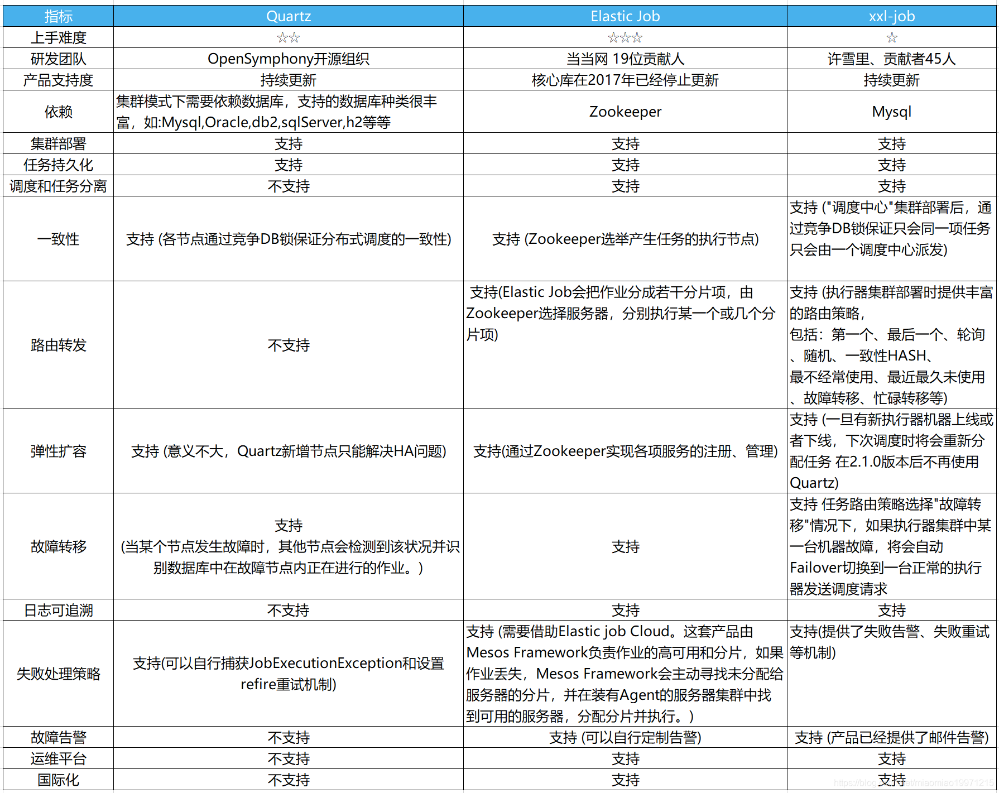

# 引用

1. [Spring Job？Quartz？XXL-Job？年轻人才做选择，艿艿全莽~
   ](https://mp.weixin.qq.com/s?__biz=MzUzMTA2NTU2Ng==&mid=2247490679&idx=1&sn=25374dbdcca95311d41be5d7b7db454d&chksm=fa4963c6cd3eead055bb9cd10cca13224bb35d0f7373a27aa22a55495f71e24b8273a7603314&scene=27#wechat_redirect)
2. [Timer与TimerTask的真正原理&amp;使用介绍](https://blog.csdn.net/xieyuooo/article/details/8607220)
3. [深入 DelayQueue 内部实现](https://www.zybuluo.com/mikumikulch/note/712598)
4. [PriorityQueue详解](https://www.jianshu.com/p/f1fd9b82cb72)
5. [Java优先级队列DelayedWorkQueue原理分析](https://www.jianshu.com/p/587901245c95)
6. [【Java基础】JAVA中优先队列详解](https://www.cnblogs.com/satire/p/14919342.html)
7. [quartz （从原理到应用）详解篇](https://blog.csdn.net/lkl_csdn/article/details/73613033)
8. [《分布式任务调度平台XXL-JOB》-官方文档](https://www.xuxueli.com/xxl-job/)
9. [平衡二叉堆](https://blog.csdn.net/weixin_33704234/article/details/91899391)
10. [聊聊Java进阶之并发基础技术—线程池剖析](https://www.jianshu.com/p/41c9db9862be)
11. [Java中常见的几种任务调度框架对比](https://blog.csdn.net/miaomiao19971215/article/details/105634418?spm=1001.2101.3001.6650.2&utm_medium=distribute.pc_relevant.none-task-blog-2%7Edefault%7EBlogCommendFromBaidu%7ERate-2.pc_relevant_default&depth_1-utm_source=distribute.pc_relevant.none-task-blog-2%7Edefault%7EBlogCommendFromBaidu%7ERate-2.pc_relevant_default&utm_relevant_index=5)
12. [Quartz 源码解析(一) —— 基本介绍](https://www.jianshu.com/p/3f77224ad9d4)
