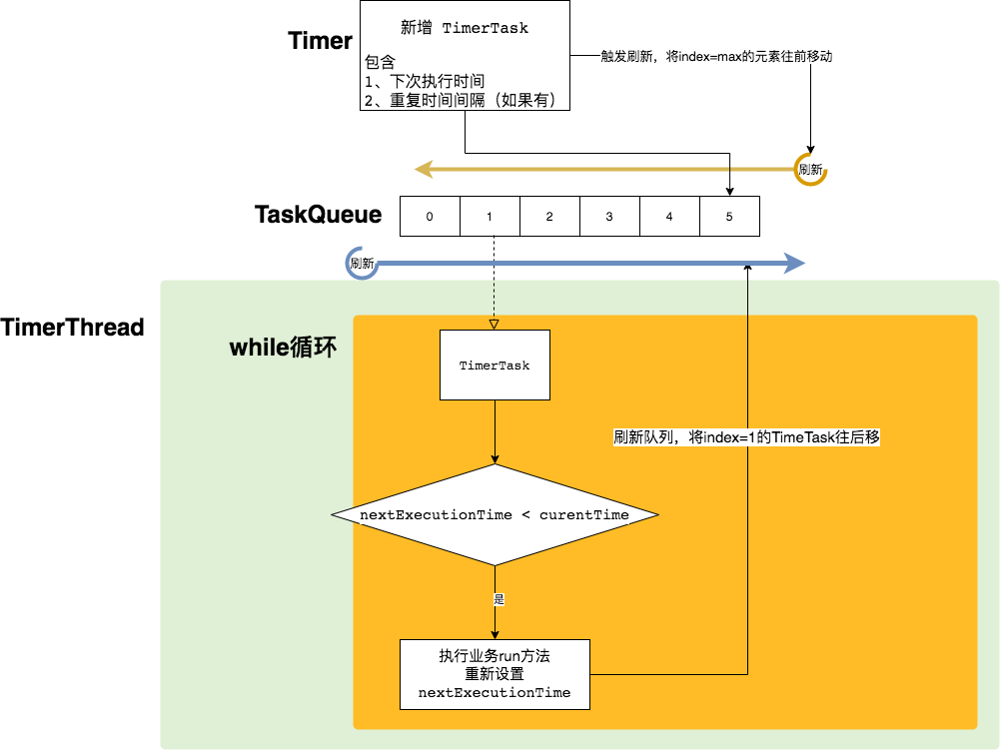
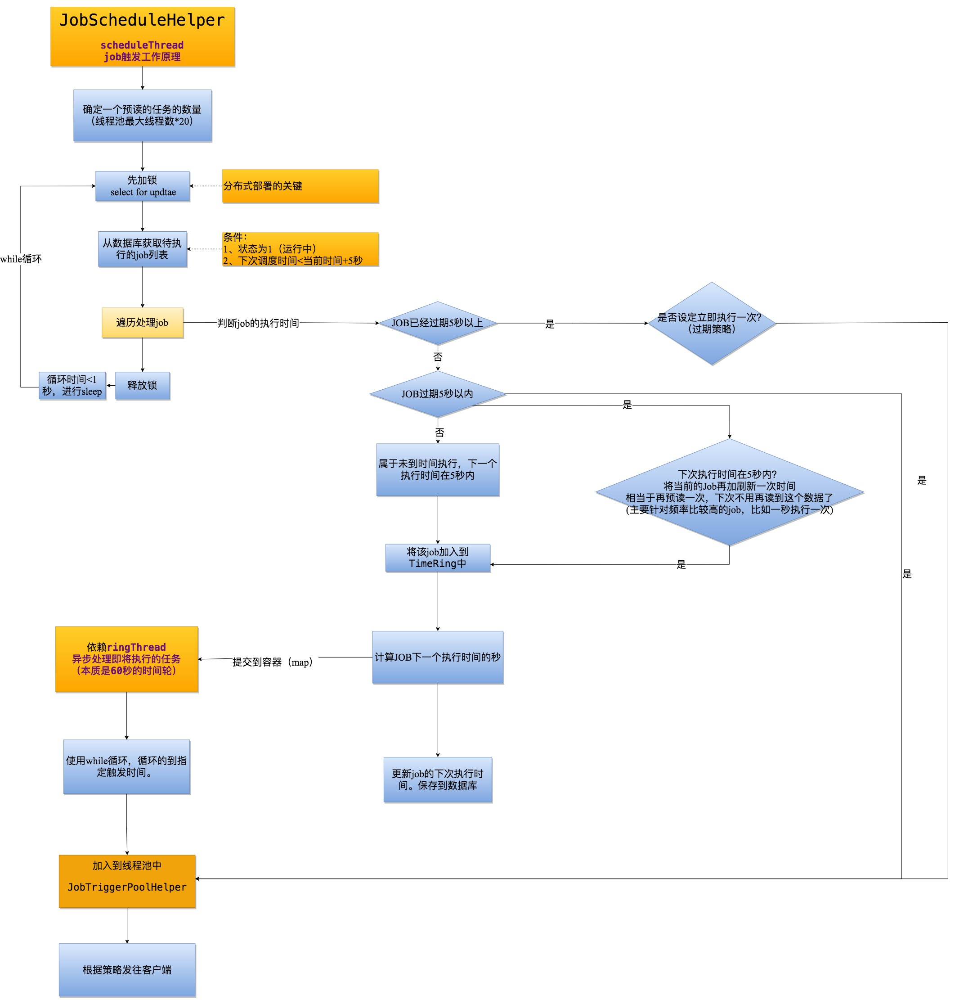

<div style="text-align: center;"><span style="font-size: xxx-large" >JAVA 任务调度技术</span></div>

## 前言

在日常开发过程中，我们经常会遇到在将来某个时间，或者周期性执行某段代码的场景。比如定期同步订单，定期发送消息等。这些重复执行的代码段可以抽象为一个任务(Task)。 一个Task的特点如下：

> 1.包含需要重复（一次或者多次）执行的业务逻辑。
> 2.包含下次执行时间。
> 3.当下次执行时间 < 当前时间时，该任务需要执行。
> 4.如果是一个重复执行的任务，在完成本次执行后，需要修改任务的下次执行时间。

围绕Task的特点，开发者们开发了不同的调度框架或者中间件。以下表格列出了部分实现。本文对部分技术的实现进行了介绍。


| 技术                                          |         来源         | 使用场景             | 说明                      |
| ----------------------------------------------- | :---------------------: | ---------------------- | --------------------------- |
| java.util.Timer                               |        JDK自带        | 目前比较少使用       |                           |
| java.util.concurrent.ScheduledExecutorService |        JDK自带        | 简单的任务调度       |                           |
| Spring Task                                   |    Spring-context    | 适合单项目调度       |                           |
| XXL-JOB                                       |    国产开源中间件    | 可用于分布式项目调度 |                           |
| Quartz                                        | OpenSymphony 开源组织 |                      |                           |
| Elastic-Job                                   |      当当⽹开源      |                      | 需要依赖ZooKeeper + Mesos |
| Apache DolphinScheduler                       |       易观开源       | 大数据任务调度       |                           |

## 1. Timer

java.util.Timer 是JDK自带的任务调度器，比较简单，虽然目前基本不再使用Timer来进行任务调度，但是后续的ScheduledExecutorService和Spring Task的基本原理和Timer基本类似，因此需要对Timer进行一个详细的了解。

实现比较简单。核心类有以下几个类


| 类                    | 功能                                         | 说明                                          |
| ----------------------- | ---------------------------------------------- | ----------------------------------------------- |
| java.util.Timer       | 入口类，新增任务并启动调度器                 |                                               |
| java.util.TaskQueue   | 任务队列                                     | 优先队列，头部节点为最早执行的Task            |
| java.util.TimerThread | 执行任务的线程，继承了java.lang.Thread       | 核心方法为mainLoop()。                        |
| java.util.TimerTask   | 抽象类，通过实现该类的抽象方法来实现业务逻辑 | 核心属性：nextExecutionTime下一个执行时间点。 |

### 1.1 数据结构-平衡二叉堆

每一个任务都包含一个指定的下次执行时间，只要这个执行时间小于当前时间，那么该任务需要执行。在多任务的场景下，我们如何挑选出需要执行的任务呢？

> **方案1.** 对所有的任务进行遍历，对于可执行时间小于当前时间的任务，执行业务逻辑。
>
>> 时间复杂度为O(n)。而且发现，一些时间没到的任务也被遍历到了。性能有些浪费了。
>>
>
> **方案2.** 先对所有的任务，按照下次执行时间的大小进行排序，每次只取头部任务，即时间最小的任务进行时间判断，如果小于当前时间，则执行任务。
>
>> 对2进行分析可以发现，只要保证队列头部为最早执行的元素即可，对于其他地方，由于时间大于头部元素。因此是否有序并不重要。
>>
>
> **方案3.** 使用优先队列来保存任务即满足排序要求。

Timer中的的队列为优先队列，基本数据结构为平衡二叉堆(balanced binary heap)。因此想要理解Timer，需要对平衡二叉堆进行了解。
详细可以参考  [【Java基础】JAVA中优先队列详解](https://www.cnblogs.com/satire/p/14919342.html) 。 摘抄如下：

#### 1.1.1 基本结构

Java平衡二叉堆的定义为：

> 任意一个非叶子节点的权值，都不大于其左右子节点的权值

结构示例如下：


从图中可以看出，可以通过数组来实现平衡二叉堆。每一个节点的编号，可以使用数组的下标来表示。

> 1. 数组的第一个元素为二叉树的根节点，在所有节点中权值最小。
> 2. 父子节点之间的关系可以用以下算法表示。这个算法很重要。在新增元素或者删除元素的时候，都需要使用到该算法。
>
>> leftNo = parentNo * 2+1
>> rightNo = parentNo * 2+2
>> parentNo = (nodeNo-1)/2
>>

在优先队列中，一般只使用到新增元素和删除根节点元素，因此只对这两个算法进行介绍。

#### 1.1.2 新增元素


步骤如下:

> 1.先在队尾新增一个元素。如果数组长度不够就先扩容。
> 2.如果有父节点，则与父节点进行对比。如果权值比父节点小，则与父节点交换位置。
> 3.重复步骤2，直到没有父节点或者比父节点小则完成新增。2~3步一般称作siftUp。

```java
//siftUp()
private void siftUp(int k, E x) {
    while (k > 0) {
        int parent = (k - 1) >>> 1;//parentNo = (nodeNo-1)/2
        Object e = queue[parent];
        if (comparator.compare(x, (E) e) >= 0)//调用比较器的比较方法
            break;
        queue[k] = e;
        k = parent;
    }
    queue[k] = x;
}
```

通过以上步骤。可以保证所有的父节点权值都小于子节点的权值。

#### 1.1.3 删除队首元素


步骤如下：

> 1.删除数组的第一个元素。
> 2.将队尾的元素放置到头部位置，记为一个父节点。
> 3.通过比较获取子节点中较小的一个，并与父节点比较，如果父节点大于子节点，则交换位子。
> 4.重复步骤3，直到父节点小于等于子节点或者已经没有子节点，则结束比较。这个过程一般称作siftDown。

```java
//siftDown()
private void siftDown(int k, E x) {
    int half = size >>> 1;
    while (k < half) {
        //首先找到左右孩子中较小的那个，记录到c里，并用child记录其下标
        int child = (k << 1) + 1;//leftNo = parentNo*2+1
        Object c = queue[child];
        int right = child + 1;
        if (right < size &&
            comparator.compare((E) c, (E) queue[right]) > 0)
            c = queue[child = right];
        if (comparator.compare(x, (E) c) <= 0)
            break;
        queue[k] = c;//然后用c取代原来的值
        k = child;
    }
    queue[k] = x;
}
```

以上步骤可以使用下面的在线数据模拟器进行

> [平衡二叉堆数据结构模拟器](https://iacj.github.io/react-datastructer/#/heap)

### 1.2 Timer 核心执行逻辑

java.util.Timer位于JDK的rt.jar包下。始于jdk1.3。

核心方法如下



提交任务的方法有6个，代表了6种不同的场景delay： 延迟毫秒数period： 时间间隔

> 1.延迟delay毫秒后，执行任务一次。
> 2.延迟delay毫秒后，周期性执行任务，两次任务之间间隔period毫秒。
> 3.延迟delay毫秒后，以固定频率执行任务，两次任务之间间隔period毫秒。
>
> 4.指定的时间Date开始，执行任务一次。
> 5.指定的时间Date开始，周期性执行任务，两次任务之间间隔period毫秒。
> 6.指定的时间Date开始，以固定频率执行任务，两次任务之间间隔period毫秒。

需要特别说明的是2和3，5和6之间的区别，也就是schedule和scheduleAtFixedRate的区别。具体看下表：


| 方法名                                                                       | 下一个执行时间nextExecutionTime | 说明                                                                           |
| ------------------------------------------------------------------------------ | --------------------------------- | -------------------------------------------------------------------------------- |
| schedule                                                                     | currentTime + delay             | 当堵塞时，影响到后续任务的计划时间，任务会推迟执行，对于丢失的时间不会补上任务 |
| scheduleAtFixedRate                                                          | nextExecutionTime + delay       | 当堵塞时，影响到后续任务的计划时间，任务的次数不会丢失，快速补上调度次数       |
| 注： currentTime：当前时间，nextExecutionTime：下次执行时间，delay：时间间隔 |                                 |                                                                                |

#### 1.2.1一个简单的例子：

```java
public class Application {
    public static void main(String[] args) {
        //初始化一个timer对象
        Timer timer = new Timer();
        //创建TimerTask的实例。
        TimerTask myTask = new TimerTask() {
            @Override
            public void run() {
                System.out.println("执行run方法，time="+System.currentTimeMillis()/1000%60+"秒");
            }
        };
        //提交任务，延迟1秒执行，每两秒执行一次
        timer.schedule(myTask, 1000, 1000*2);
    }
}
```

结果：

> 执行run方法，time=25秒
> 执行run方法，time=27秒
> 执行run方法，time=29秒
> 执行run方法，time=31秒
> 执行run方法，time=33秒
> 执行run方法，time=35秒
> 执行run方法，time=37秒

原始代码分析如下，只挑选了核心代码展示。

#### 1.2.2 Timer 类源码分析

```java
public class Timer {
    // TaskQueue 实现了一个优先队列
    private final TaskQueue queue = new TaskQueue();
    // TimerThread继承了Thread。同时组合了TaskQueue。当Timer实例化时。会启动TimerThread实例的的start()方法。启动线程处理定时任务。
    private final TimerThread thread = new TimerThread(queue);

   /**
    * 构造函数。做了一件事情，及时启动了TimerThread线程，处理队列数据。
    * @param name
    * @param isDaemon
    */
   public Timer(String name, boolean isDaemon) {
      thread.setName(name);
      thread.setDaemon(isDaemon);
      thread.start();
   }
  
   //延迟delay毫秒后执行一次任务
   public void schedule(TimerTask task, long delay) {
      sched(task, System.currentTimeMillis()+delay, 0);
   }
   //延迟delay毫秒，以固定频率执行定时任务。下次的执行时间为当前系统时间(System.currentTimeMillis())+|period|
   //当发生阻塞时，有可能丢失调度次数
   public void schedule(TimerTask task, long delay, long period) {
      sched(task, System.currentTimeMillis()+delay, -period);
   }
   //延迟delay毫秒，以固定频率执行定时任务。与schedule不同。下次执行时间为当前本应执行时间(nextExecutionTime)+period
   //当发生阻塞时，不会丢失调度次数。
   public void scheduleAtFixedRate(TimerTask task, long delay, long period) {
      sched(task, System.currentTimeMillis()+delay, period);
   }
   
   
   
    /**
     * 核心新增定时任务的方法。
     * @param task 为实现了业务的任务类。
     * @param time 为下次执行任务的时间。  
     * @param period  为0时表示不会重复执行。当period !=0时表示会周期性执行
     */
    private void sched(TimerTask task, long time, long period) {
        //以下代码省去了部分校验代码
        synchronized(queue) {
            synchronized(task.lock) {
                task.nextExecutionTime = time;
                task.period = period;
                task.state = TimerTask.SCHEDULED;
            }
            queue.add(task);
            if (queue.getMin() == task)
                //说明加入task之前。队列为空，处于wait状态。需要唤起。
                queue.notify();
        }
    }
  
   //省略。。。

}
```

从以上代码可以看到，当实例化Timer时，将会启动一个TimerThread线程，不断轮询队列的头部元素。核心代码如下（省略部分代码）：

#### 1.2.3 TimerThread 类源码分析

```java
class TimerThread extends Thread {
    //标识线程已经启用。当为false时，跳出循环。
    boolean newTasksMayBeScheduled = true;
    private TaskQueue queue;

    public void run() {
        try {
            mainLoop();
        } finally {
           //发生异常或者mainLoop执行结束，会清理队列。
            synchronized(queue) {
                newTasksMayBeScheduled = false;
                queue.clear();  // Eliminate obsolete references
            }
        }
    }

    //执行轮询
    private void mainLoop() {
        while (true) {
            try {
                TimerTask task;
                boolean taskFired;
                synchronized(queue) {
                    // Wait for queue to become non-empty
                    while (queue.isEmpty() && newTasksMayBeScheduled) {
                       //while循环 让出锁，等待新任务加入
                       queue.wait();
                    }
                    if (queue.isEmpty()){
                       //此时newTasksMayBeScheduled队列已死。退出循环
                       break; 
                    }
                    long currentTime, executionTime;
                    task = queue.getMin();
                    synchronized(task.lock) {
                        //判断状态
                        if (task.state == TimerTask.CANCELLED) {
                            //检查已经取消的任务，移除。
                            queue.removeMin();
                            continue;  
                        }
                      
                        currentTime = System.currentTimeMillis();
                        //当前task计划的执行时间。
                        executionTime = task.nextExecutionTime;
                        if (taskFired = (executionTime<=currentTime)) {
                            //当前任务的计划执行时间<=当前时间，则允许执行。
                            if (task.period == 0) { // Non-repeating, remove
                                //只执行一次的任务，移除。
                                queue.removeMin();
                                task.state = TimerTask.EXECUTED;
                            } else { 
                                //修改队列中最小的一个task的时间为下一个执行时间，并且重新排序。
                                queue.rescheduleMin(
                                  task.period<0 ? currentTime   - task.period
                                                : executionTime + task.period);
                            }
                        }
                    }
                    if (!taskFired) // Task hasn't yet fired; wait
                        //最近时间执行的任务还未到时间，需要等待。让出锁。
                        queue.wait(executionTime - currentTime);
                }
                if (taskFired)  
                    //执行业务逻辑。这里可以看到是同步执行的。如果业务逻辑耗时较长，会影响后续任务的执行。
                    task.run();
            } catch(InterruptedException e) {
            }
        }
    }
}
```

#### 1.2.4 TimerTask 类源码分析

```java
public abstract class TimerTask implements Runnable {
    //执行状态
    int state = VIRGIN;
    //下次执行时间，如果是重复的任务，在任务执行前会被更新成下次的执行时间。
    long nextExecutionTime;
    // 毫秒数，用于重复执行的时间间隔。证书标识以固定频率调度。负数标识以固定的时间延迟调度。0代表不会重复执行。
    long period = 0;
    //抽象犯法，用于实现业务
    public abstract void run();
    //省略部分代码。
}
```

### 1.3 Timer 调度示意图


### 1.4 Timer 总结

可以看到，Timer 是JDK自带的任务调度器。实现的逻辑如下

> - 实现一个优先队列。队列的头部为最先需要执行的任务。
> - 启动一个后台线程，不断从优先队列中获取待执行的任务。
> - 执行任务。

通过使用Timer，我们可以方便地在一个线程中执行多个计划任务。但是也有一定的局限性。主要是多个任务之间相互影响。

> - 所有的任务都在一个线程中执行，如果前面的任务耗时比较长，则会影响后续任务的执行。
> - 假设前序任务抛出了非InterruptedException的异常，则整个队列将会被清空，任务调度终止。

基于以上局限性，在实际应用中，使用Timer使用得并不多。常用的为 ScheduledExecutorService。

## 2. ScheduledExecutorService

在前一章节可以了解到，在 Timer 类中所有的任务都是同步执行，如果前序任务发生了阻塞或者耗时比较长，那么后续任务就会被阻塞到。

JDK在1.5之后J引入了 ThreadPoolExecutor 线程池技术。同时也对依托ThreadPoolExecutor重新编写了一套新任务调度器 ScheduledThreadPoolExecutor。

ScheduledThreadPoolExecutor在实现上与Timer是相似的，都是通过实现一个优先队列来管理任务，同时这个优先队列又是一个阻塞队列，在获取第一个任务后，只有到了执行时间才会返回任务。一个比较大的改进在于，获取任务后不是直接执行代码，而是交给线程池来调度。


| 类                                                                   | 功能         | 说明                                 |
| ---------------------------------------------------------------------- | -------------- | -------------------------------------- |
|                                                                      |              |                                      |
| java.util.concurrent.Executors.DelegatedScheduledExecutorService     | 包装类       | 用于包装 ScheduledThreadPoolExecutor |
| java.util.concurrent.ScheduledThreadPoolExecutor                     | 核心执行器   |                                      |
| java.util.concurrent.ScheduledThreadPoolExecutor.DelayedWorkQueue    | 延迟阻塞队列 | 任务周期执行的核心方法在这个类中实现 |
| java.util.concurrent.ScheduledThreadPoolExecutor.ScheduledFutureTask | 队列中的对象 | 说明                                 |

### 2.1 ScheduledExecutorService 的简单用法和介绍

```java
public class Application {
    public static void main(String[] args) {
        ScheduledExecutorService scheduledExecutorService = Executors.newSingleThreadScheduledExecutor();
        Runnable runnable = ()->{System.out.println("执行run方法，time="+System.currentTimeMillis()/1000%60+"秒");};
        scheduledExecutorService.scheduleAtFixedRate(runnable, 1, 2, TimeUnit.SECONDS);
    }
}
```

查看 ScheduledExecutorService 的结构，


提交任务的方法共有4个，与Timer不同的是，可以提交Callable类型的任务。

```java
public interface ScheduledExecutorService extends ExecutorService {
   //delay时间后，执行一次任务
    public ScheduledFuture<?> schedule(Runnable command, long delay, TimeUnit unit);
    //delay时间后，执行一次任务有返回值的任务
    public <V> ScheduledFuture<V> schedule(Callable<V> callable, long delay, TimeUnit unit);
    //以固定频率执行任务
    public ScheduledFuture<?> scheduleAtFixedRate(Runnable command, long initialDelay, long period, TimeUnit unit);
    //以固定延迟时间执行任务
    public ScheduledFuture<?> scheduleWithFixedDelay(Runnable command, long initialDelay, long delay, TimeUnit unit);
}
```

### 2.2 ScheduledThreadPoolExecutor 类

ScheduledExecutorService只定义了相应的规范，还需要具体类进行实现。

通过查看 Executors.newSingleThreadScheduledExecutor()，具体实现如下

```java
    public static ScheduledExecutorService newSingleThreadScheduledExecutor() {
        return new DelegatedScheduledExecutorService(new ScheduledThreadPoolExecutor(1));
    }

```

DelegatedScheduledExecutorService 只是一个包装类，核心逻辑在 ScheduledThreadPoolExecutor。 ScheduledThreadPoolExecutor 继承了ThreadPoolExecutor类。所以本质上具备ThreadPoolExecutor的所有功能。同时实现了ScheduledExecutorService接口。
其构造函数调用了父类的构造函数的时候，传入了 DelayedWorkQueue 延时阻塞队列。

```java
public class ScheduledThreadPoolExecutor
        extends ThreadPoolExecutor
        implements ScheduledExecutorService {
  
    public ScheduledThreadPoolExecutor(int corePoolSize) {
        super(corePoolSize, Integer.MAX_VALUE, 0, NANOSECONDS,new DelayedWorkQueue());
    }
  
    //向队列提交任务
   private void delayedExecute(RunnableScheduledFuture<?> task) {
      if (isShutdown())
         reject(task);
      else {
         super.getQueue().add(task);
         if (isShutdown() &&
                 !canRunInCurrentRunState(task.isPeriodic()) &&
                 remove(task))
            task.cancel(false);
         else
            ensurePrestart();
      }
   }
}
```

到这时ScheduledExecutorService的秘密浮出水面，核心在于 DelayedWorkQueue。

### 2.3 DelayedWorkQueue 类实现

DelayedWorkQueue 类的定义如下。可以看到，DelayedWorkQueue的实现了BlockingQueue接口，可以传入JDK的线程池进行消费。

```java
static class DelayedWorkQueue extends AbstractQueue<Runnable>
        implements BlockingQueue<Runnable> {
}
```

但是具体何如实现队列中的任务，在指定的时间被调度呢？

首先来看一下他的队列实现方式。

```java

static class DelayedWorkQueue extends AbstractQueue<Runnable> implements BlockingQueue<Runnable> {
   /*
    * A DelayedWorkQueue is based on a heap-based data structure
    * like those in DelayQueue and PriorityQueue, except that
    * every ScheduledFutureTask also records its index into the
    * heap array. 
    * ...
    * 
    * 从以上注释中可以知道 DelayedWorkQueue 本质上也是一个基于堆的数据结构。
    */
   
   //初始化了一个数组
   private RunnableScheduledFuture<?>[] queue = new RunnableScheduledFuture<?>[INITIAL_CAPACITY];
   //用于新增元素时向上移动元素
   private void siftUp(int k, RunnableScheduledFuture<?> key) {
       //省略代码
   }
   //去除元素时向下移动元素
   private void siftDown(int k, RunnableScheduledFuture<?> key) {
       //省略代码
   }
   
   private final ReentrantLock lock = new ReentrantLock();
   private final Condition available = lock.newCondition();
   
   //挑去阻塞队列的take方法来分析
   public RunnableScheduledFuture<?> take() throws InterruptedException {
      final ReentrantLock lock = this.lock;
      lock.lockInterruptibly();
      try {
         for (;;) {
             //1、从队首获取待执行的任务。此任务在队列中最早执行。
            RunnableScheduledFuture<?> first = queue[0];
            if (first == null)
                // 2 队列中还没有元素，等待。
               available.await();
            else {
                //3 delay=下次执行时间-当前时间。当<=0说明需要被执行。
               long delay = first.getDelay(NANOSECONDS);
               if (delay <= 0)
                   // 4 删除队列的第一个个元素并重新向下排序
                  return finishPoll(first);
               first = null; // don't retain ref while waiting
               if (leader != null)
                  available.await();
               else {
                  Thread thisThread = Thread.currentThread();
                  leader = thisThread;
                  try {
                      //5 当前线程等待，直到被唤醒或者等待时长结束
                     available.awaitNanos(delay);
                  } finally {
                     if (leader == thisThread)
                        leader = null;
                  }
               }
            }
         }
      } finally {
         if (leader == null && queue[0] != null)
            available.signal();
         lock.unlock();
      }
   }

   /**
    * 使用最后一个元素替换掉当前元素，并且重新向下排序。
    * 注意，这时第一个元素已经从队列中去除，这一点与Timer的实现方式不同。
    * Timer是修改时间了之后，从上往下重新排序。只需要排序一次。
    * ScheduledExecutorService执行一个定时任务，需要进行两次排序。第一次是获取了task,第二次是真正执行task的时候。
    * 
    * @param f
    * @return
    */
   private RunnableScheduledFuture<?> finishPoll(RunnableScheduledFuture<?> f) {
      int s = --size;
      RunnableScheduledFuture<?> x = queue[s];
      queue[s] = null;
      if (s != 0)
         siftDown(0, x);
      setIndex(f, -1);
      return f;
   }


}
```

### 2.4 ScheduledFutureTask 类

```java
// 注意 ScheduledFutureTask 属于  ScheduledThreadPoolExecutor 的成员内部类。
public class ScheduledThreadPoolExecutor
        extends ThreadPoolExecutor
        implements ScheduledExecutorService {
  
   private class ScheduledFutureTask<V> extends FutureTask<V> implements RunnableScheduledFuture<V> {

      /** 下次执行时间 */
      private long time;
      /** 周期性执行任务的时间间隔 分为0、正、负值。*/
      private final long period;

      ScheduledFutureTask(Runnable r, V result, long ns, long period) {
         super(r, result);
         this.time = ns;
         this.period = period;
         this.sequenceNumber = sequencer.getAndIncrement();
      }

      /**Overrides FutureTask version so as to reset/requeue if periodic. 
       * 重写了 FutureTask 的run方法，主要是增加了重置下个调度时间以及重新排序*/
      public void run() {
         boolean periodic = isPeriodic();
         if (!canRunInCurrentRunState(periodic))
            cancel(false);
         else if (!periodic)
             //非周期性的任务，只执行一次
            ScheduledFutureTask.super.run();
         else if (ScheduledFutureTask.super.runAndReset()) {
             //设置下次执行时间
            setNextRunTime();
            //直接调用外部类的方法。重新将任务加入到队列中。
            reExecutePeriodic(outerTask);
         }
      }
   }
   //重新将任务加入到队列中
   void reExecutePeriodic(RunnableScheduledFuture<?> task) {
      if (canRunInCurrentRunState(true)) {
         super.getQueue().add(task);
         if (!canRunInCurrentRunState(true) && remove(task))
            task.cancel(false);
         else
            ensurePrestart();
      }
   }
}

```

### 2.5 ScheduledExecutorService 总结

通过分析源码可以看出，ScheduledExecutorService  是通过实现一个优先队列来存储和调度任务的。从原理上来说是和Timer是类似的。可以认为是Timer的升级版，新增了线程池执行任务的功能。

但是ScheduledExecutorService也有一定的局限性，那就是任务只能执行一次或者以固定的时间差周期性执行。不够灵活。

## 3 Spring Task

Spring Task处于spring-context项目的org.springframework.scheduling包下。可以通过注解的方式，将Spring bean中的某个方法变成一个task，非常方便。而且引入了cron表达式，使用更加灵活。

### 3.1 Spring Task 简单用法

新建一个项目，引入spring-context包

```xml
<dependency>
   <groupId>org.springframework</groupId>
   <artifactId>spring-context</artifactId>
   <version>5.3.15</version>
</dependency>
```

新建一个启动类

```java
@Configuration
@EnableScheduling
public class Application {

    public static void main(String[] args) {
        AnnotationConfigApplicationContext annotationConfigApplicationContext = new AnnotationConfigApplicationContext(Application.class);
    }
    @Scheduled(fixedRate = 1*1000)
    public void schedled(){
        System.out.println("执行定时任务，time="+System.currentTimeMillis()/1000%60+"秒");
    }
}
```

启动main方法后，执行结果如下：

> 执行定时任务，time=18秒
> 执行定时任务，time=19秒
> 执行定时任务，time=20秒
> 执行定时任务，time=21秒

从以上demo中可以看出，在spring中，只需要两个注解@EnableScheduling和@Scheduled，就可以启动一个定时任务了，非常方便。

### 3.1 Spring Task核心类


| 类                                                                             | 功能         | 说明                                                    |
| -------------------------------------------------------------------------------- | -------------- | --------------------------------------------------------- |
| org.springframework.scheduling.annotation.Scheduled                            | 注解类       | 将一个方法标记为定时执行的task，提供了多种配置方式      |
| org.springframework.scheduling.annotation.ScheduledAnnotationBeanPostProcessor | 后置处理器   | 解析所有被Scheduled标识的方法处理成的task，并做相关配置 |
| org.springframework.scheduling.config.ScheduledTaskRegistrar                   | 任务注册中心 | 缓存了task和任务处理器                                  |
| org.springframework.scheduling.concurrent.ConcurrentTaskScheduler              | 默认调度器   | 内置了ScheduledExecutorService                          |

### 3.2 Scheduled 注解

```java
public @interface Scheduled {
    //核心参数如下
   //cron表达式
	String cron() default "";
    //固定延迟
	long fixedDelay() default -1;
    //固定频率
	long fixedRate() default -1;
    //固定的延迟
	long initialDelay() default -1;
    //时间单位，默认是毫秒
    TimeUnit timeUnit() default TimeUnit.MILLISECONDS;
}
```

Scheduled 中包含了任务调度的相关配置。 相比较ScheduledExecutorService，多了cron表达式。在任务的控制上更加灵活，不再局限于固定重复周期。

> 1、提供了任务的周期性执行配置参数
> 2、给Spring容器标识了该方法为一个定时任务方法，将会被ScheduledAnnotationBeanPostProcessor处理。

### 3.3 ScheduledAnnotationBeanPostProcessor 类

ScheduledAnnotationBeanPostProcessor实现了Spring的后置处理器，因此在Spring初始化后，根据相应的配置或者注解，可以筛选出对应的方法，封装成为org.springframework.scheduling.config.ScheduledTask。等待被调用。在Spring初始化完成后将会触发任务的调度。

```java

//只保留核心代码
public class ScheduledAnnotationBeanPostProcessor
        implements ScheduledTaskHolder, MergedBeanDefinitionPostProcessor, DestructionAwareBeanPostProcessor,
        Ordered, EmbeddedValueResolverAware, BeanNameAware, BeanFactoryAware, ApplicationContextAware,
        SmartInitializingSingleton, ApplicationListener<ContextRefreshedEvent>, DisposableBean {
  
    //用来缓存task和TaskScheduler调度器
   private final ScheduledTaskRegistrar registrar;
  
    //处理Spring bean
   protected void processScheduled(Scheduled scheduled, Method method, Object bean) {
      try {
          //将Spring bean 封装成为一个Runnable
         Runnable runnable = createRunnable(bean, method);
         // 获取配置
         String cron = scheduled.cron();
         //解析cron
         cron = this.embeddedValueResolver.resolveStringValue(cron);
         //这里只摘录了cron方式配置，其他的如fixedDelay配置，fixedRate 配置同理
         if (StringUtils.hasText(cron)) {
            String zone = scheduled.zone();
            if (StringUtils.hasLength(cron)) {
                //注意这里 registrar 中缓存了 CronTask
                  tasks.add(this.registrar.scheduleCronTask(new CronTask(runnable, new CronTrigger(cron, timeZone))));
            }
         }
       
      }catch (Exception e){}
  
   }

   //监听容器刷新时间
   public void onApplicationEvent(ContextRefreshedEvent event) {
      if (event.getApplicationContext() == this.applicationContext) {
         finishRegistration();
      }
   }
   
   //这部分主要是从Spring中获取 scheduler 只保留核心代码
   private void finishRegistration() {
     
      if (this.registrar.hasTasks() && this.registrar.getScheduler() == null) {
         try {
             //1、根据类型获取TaskScheduler实现类
            this.registrar.setTaskScheduler(resolveSchedulerBean(this.beanFactory, TaskScheduler.class, false));
         }
         catch (NoUniqueBeanDefinitionException ex) {
            try {
                //2、实现类不唯一，尝试使用默认名称taskScheduler查找
               this.registrar.setTaskScheduler(resolveSchedulerBean(this.beanFactory, TaskScheduler.class, true));
            }
            catch (NoSuchBeanDefinitionException ex2) {
            }
         }
         catch (NoSuchBeanDefinitionException ex) {
            try {
               //3、根据类型获取 ScheduledExecutorService 实现类
               this.registrar.setScheduler(resolveSchedulerBean(this.beanFactory, ScheduledExecutorService.class, false));
            }
            catch (NoUniqueBeanDefinitionException ex2) {
               try {
                  //4、实现类不唯一，尝试使用默认名称taskScheduler查找
                  this.registrar.setScheduler(resolveSchedulerBean(this.beanFactory, ScheduledExecutorService.class, true));
               }
               catch (NoSuchBeanDefinitionException ex3) {
               }
            }
            catch (NoSuchBeanDefinitionException ex2) {
               // Giving up -> falling back to default scheduler within the registrar...
            }
         }
      }

      this.registrar.afterPropertiesSet();
   }
}
```

从 ScheduledAnnotationBeanPostProcessor 源码可以看出，经过处理后，所有的任务和执行器都存放于ScheduledTaskRegistrar中。通过调用afterPropertiesSet()来启动任务。总结来说，做了一下两件事情

### 3.4 ScheduledTaskRegistrar 类

```java
public class ScheduledTaskRegistrar implements ScheduledTaskHolder, InitializingBean, DisposableBean {

    //处理器，是Spring的类
	private TaskScheduler taskScheduler;
  
	//默认处理器 JDK
	private ScheduledExecutorService localExecutor;

    //根据不同的配置，缓存了不同的类型的task。名字与Scheduled中配置基本一样。
	@Nullable
	private List<TriggerTask> triggerTasks;

	@Nullable
	private List<CronTask> cronTasks;

	@Nullable
	private List<IntervalTask> fixedRateTasks;

	@Nullable
	private List<IntervalTask> fixedDelayTasks;

	private final Map<Task, ScheduledTask> unresolvedTasks = new HashMap<>(16);
    //已经加入执行器中的任务
	private final Set<ScheduledTask> scheduledTasks = new LinkedHashSet<>(16);

   @Override
   public void afterPropertiesSet() {
      scheduleTasks();
   }
    //具体将任务提交到执行器中的方法
   protected void scheduleTasks() {
      if (this.taskScheduler == null) {
          //当容器中没有找到执行器的时候，将会使用 ScheduledExecutorService。此时只有一个线程处理。
         this.localExecutor = Executors.newSingleThreadScheduledExecutor();
         //需要将ScheduledExecutorService 封装成为 TaskScheduler 才能够使用
         this.taskScheduler = new ConcurrentTaskScheduler(this.localExecutor);
      }
  
      if (this.cronTasks != null) {
         for (CronTask task : this.cronTasks) {
            addScheduledTask(scheduleCronTask(task));
         }
      }
      if (this.fixedRateTasks != null) {
         for (IntervalTask task : this.fixedRateTasks) {
            addScheduledTask(scheduleFixedRateTask(task));
         }
      }
      //省略部分代码
   }

   public ScheduledTask scheduleTriggerTask(TriggerTask task) {
      ScheduledTask scheduledTask = this.unresolvedTasks.remove(task);
      boolean newTask = false;
      if (scheduledTask == null) {
         scheduledTask = new ScheduledTask(task);
         newTask = true;
      }
      if (this.taskScheduler != null) {
          //执行任务
         scheduledTask.future = this.taskScheduler.schedule(task.getRunnable(), task.getTrigger());
      }
      else {
         addTriggerTask(task);
         this.unresolvedTasks.put(task, scheduledTask);
      }
      return (newTask ? scheduledTask : null);
   }
}
```

### 3.5 总结

spring task中任务处理器为TaskScheduler实现类，任务为Trigger的实现类。基本的思想还是与 ScheduledExecutorService 想类似的。在默认情况下也是使用ScheduledExecutorService作为任务的处理器。

使用spring task需要注意的是，默认情况下使用 Executors.newSingleThreadScheduledExecutor()新建了一个实例，这个实例只有一个线程处理任务，在任务耗时比较高的情况下会有可能发生阻塞。最好是配置一个ScheduledExecutorService实例交给Spring管理

如：

```java
@Configuration
@EnableScheduling
public class Application2 {

    public static void main(String[] args) {
        AnnotationConfigApplicationContext annotationConfigApplicationContext = new AnnotationConfigApplicationContext(Application2.class);
    }
  
    @Scheduled(fixedRate = 100)
    public void schedled(){
        System.out.println("执行定时任务，time="+System.currentTimeMillis()/1000%60+"秒。threadName="+Thread.currentThread().getName());
    }

    @Bean
    public ScheduledExecutorService executorService(){
        ThreadFactory factory = new ThreadFactory() {
            private  int seq = 0;
            @Override
            public Thread newThread(Runnable r) {
                return new Thread(r,"定时任务线程池 seq="+seq++);
            }
        };
        ScheduledExecutorService scheduledExecutorService = Executors.newScheduledThreadPool(3, factory);
        return scheduledExecutorService;
    }
}

```

## 4 XXL-JOB

XXL-JOB是一个分布式任务调度平台，其核心设计目标是开发迅速、学习简单、轻量级、易扩展。现已开放源代码并接入多家公司线上产品线，开箱即用。
由于是国产开发的，中文文档，而且很全面，可以直接看官方文档 [《分布式任务调度平台XXL-JOB》-官方文档](https://www.xuxueli.com/xxl-job/) 。
另外，最初作者使用的底层框架是Quartz，后来发现Quartz太过麻烦，自研了一个调度器，简单但是很实用，很值得学习。

### 4.1 为什么我们需要一个分布式的调度平台

前面介绍的Timer, ScheduledExcutorService 和 Spring Task，都是针对单个实例内的任务调度。假设有一个任务A，是给用户发送消息的，设置每一秒执行一次，如果部署了3个实例，那么就会变成每秒执行3次，可能会导致并发问题。此外在实际的业务中，我们还有可能需要随时调整调度周期，随时停止和启动一个任务等。因此在分布式系统中，有一个分布式调度器尤为重要。

### 4.2 核心逻辑

从前面对任务调度的介绍可以看出，一个任务调度器，离不开

> 1.一个带有执行时间的任务
> 2.轮询执行任务的调度器

XXL-JOB 也不例外。

XXL-JOB的核心模块分为3个.


| 模块                     | 说明   | 功能                 |
| -------------------------- | -------- | ---------------------- |
| xxl-job-admin            | 服务端 | 管理界面+任务调度    |
| xxl-job-core             | 客户端 | 位于客户端，执行任务 |
| xxl-job-executor-samples | demo   |                      |

客户端核心类如下：


| 类                                         | 功能             | 说明                                                                      |
| -------------------------------------------- | ------------------ |-------------------------------------------------------------------------|
| com.xxl.job.core.handler.annotation.XxlJob | Task注解         | 被标注的方法将会被处理成为 IJobHandler, 与@Scheduled注解功能相似 （19年底新增注解）。 每个IJobHandler有唯标识 |
| com.xxl.job.core.server.EmbedServer        | 客户端server     | 启动一个netty,用于接收服务端的调度                                                    |
| com.xxl.job.core.biz.impl.ExecutorBizImpl  | 处理服务端的请求 | EmbedServer接收请求后，实际交给ExecutorBizImpl进行处理，处理后缓存于LinkedBlockingQueue中等待调用 |
| com.xxl.job.core.biz.model.TriggerParam    | 触发参数         | 记录服务端发送过来的任务                                                            |
| com.xxl.job.core.thread.JobThread          | Job线程          | 用 LinkedBlockingQueue 缓存服务端传递过来的 TriggerParam。轮询 LinkedBlockingQueue。   |
| com.xxl.job.core.handler.IJobHandler       | Task抽象类       | 被@XxlJob的注释的方法，或者通过服务端传递过来的代码，将会封装成为一个  IJobHandler    实现类              |
| com.xxl.job.core.context.XxlJobContext     | 上下文           | 内置InheritableThreadLocal，在线程中存储变量，供给IJobHandler                         |

服务端端核心类如下：


| 类 | 功能                    | 说明 |
| ---- |-----------------------| ------ |
| com.xxl.job.admin.core.thread.JobScheduleHelper   | 启动了两个线程，用于预读任务和调度任务   |        |
| com.xxl.job.admin.core.model.XxlJobInfo     | 记录了一个任务的配置，持久化到mysql中 |        |
|      |                       |        |

#### 4.2.1 JobScheduleHelper 


```java

public class JobScheduleHelper {
    
    
    public static final long PRE_READ_MS = 5000;    // pre read

    private Thread ringThread;
    private volatile boolean scheduleThreadToStop = false;
    private volatile boolean ringThreadToStop = false;
    private volatile static Map<Integer, List<Integer>> ringData = new ConcurrentHashMap<>();

    public void start(){
        scheduleThread = new Thread(new Runnable() {
            @Override
            public void run() {
                // 按照默认配置 （200+100）* 20 = 6000
                int preReadCount = (XxlJobAdminConfig.getAdminConfig().getTriggerPoolFastMax() + XxlJobAdminConfig.getAdminConfig().getTriggerPoolSlowMax()) * 20;

                while (!scheduleThreadToStop) {

                    // Scan Job
                    long start = System.currentTimeMillis();

                    Connection conn = null;
                    Boolean connAutoCommit = null;
                    PreparedStatement preparedStatement = null;

                    boolean preReadSuc = true;
                    try {

                        conn = XxlJobAdminConfig.getAdminConfig().getDataSource().getConnection();
                        connAutoCommit = conn.getAutoCommit();
                        conn.setAutoCommit(false);
                        //加锁
                        preparedStatement = conn.prepareStatement(  "select * from xxl_job_lock where lock_name = 'schedule_lock' for update" );
                        preparedStatement.execute();
                        // tx start

                        // 1、预读 查询数据库，获取下次执行时间 <= 当前时间+5秒 的所有JOB
                        long nowTime = System.currentTimeMillis();
                        List<XxlJobInfo> scheduleList = XxlJobAdminConfig.getAdminConfig().getXxlJobInfoDao().scheduleJobQuery(nowTime + PRE_READ_MS, preReadCount);
                        if (scheduleList!=null && scheduleList.size()>0) {
                            // 2、push time-ring
                            for (XxlJobInfo jobInfo: scheduleList) {
                                // time-ring jump
                                if (nowTime > jobInfo.getTriggerNextTime() + PRE_READ_MS) {
                                    // 2.1、trigger-expire > 5s：pass && make next-trigger-time

                                    // 1、misfire match
                                    MisfireStrategyEnum misfireStrategyEnum = MisfireStrategyEnum.match(jobInfo.getMisfireStrategy(), MisfireStrategyEnum.DO_NOTHING);
                                    if (MisfireStrategyEnum.FIRE_ONCE_NOW == misfireStrategyEnum) {
                                        // FIRE_ONCE_NOW 》 trigger
                                        JobTriggerPoolHelper.trigger(jobInfo.getId(), TriggerTypeEnum.MISFIRE, -1, null, null, null);
                                        logger.debug(">>>>>>>>>>> xxl-job, schedule push trigger : jobId = " + jobInfo.getId() );
                                    }

                                    // 2、fresh next
                                    refreshNextValidTime(jobInfo, new Date());

                                } else if (nowTime > jobInfo.getTriggerNextTime()) {
                                    // 2.2、trigger-expire < 5s：direct-trigger && make next-trigger-time

                                    // 1、trigger
                                    JobTriggerPoolHelper.trigger(jobInfo.getId(), TriggerTypeEnum.CRON, -1, null, null, null);
                                    logger.debug(">>>>>>>>>>> xxl-job, schedule push trigger : jobId = " + jobInfo.getId() );

                                    // 2、fresh next
                                    refreshNextValidTime(jobInfo, new Date());

                                    // next-trigger-time in 5s, pre-read again
                                    //判断下次的执行时间，是不是再5秒内，相当于下次循环还能找到他，如果是再这样子，直接加到时间环中处理即可。适用于频率特别高的job
                                    if (jobInfo.getTriggerStatus()==1 && nowTime + PRE_READ_MS > jobInfo.getTriggerNextTime()) {

                                        // 1、make ring second
                                        int ringSecond = (int)((jobInfo.getTriggerNextTime()/1000)%60);

                                        // 2、push time ring
                                        pushTimeRing(ringSecond, jobInfo.getId());

                                        // 3、fresh next
                                        refreshNextValidTime(jobInfo, new Date(jobInfo.getTriggerNextTime()));

                                    }

                                } else {
                                    // 2.3、trigger-pre-read：time-ring trigger && make next-trigger-time

                                    // 1、make ring second
                                    int ringSecond = (int)((jobInfo.getTriggerNextTime()/1000)%60);

                                    // 2、push time ring
                                    pushTimeRing(ringSecond, jobInfo.getId());

                                    // 3、fresh next
                                    refreshNextValidTime(jobInfo, new Date(jobInfo.getTriggerNextTime()));

                                }

                            }

                            // 3、update trigger info
                            for (XxlJobInfo jobInfo: scheduleList) {
                                //将修改了下次执行时间的任务存到数据库中
                                XxlJobAdminConfig.getAdminConfig().getXxlJobInfoDao().scheduleUpdate(jobInfo);
                            }

                        } else {
                            preReadSuc = false;
                        }
                    } finally {
                        //省略处理数据库连接
                    }
                    long cost = System.currentTimeMillis()-start;
                    //省略。。。
                }
                logger.info(">>>>>>>>>>> xxl-job, JobScheduleHelper#scheduleThread stop");
            }
        });
        scheduleThread.setDaemon(true);
        scheduleThread.setName("xxl-job, admin JobScheduleHelper#scheduleThread");
        scheduleThread.start();


        // ring thread
        ringThread = new Thread(new Runnable() {
            @Override
            public void run() {

                while (!ringThreadToStop) {

                    // align second
                    try {
                        TimeUnit.MILLISECONDS.sleep(1000 - System.currentTimeMillis() % 1000);
                    } catch (InterruptedException e) {
                        if (!ringThreadToStop) {
                            logger.error(e.getMessage(), e);
                        }
                    }

                    try {
                        // second data
                        List<Integer> ringItemData = new ArrayList<>();
                        int nowSecond = Calendar.getInstance().get(Calendar.SECOND);   // 避免处理耗时太长，跨过刻度，向前校验一个刻度；
                        for (int i = 0; i < 2; i++) {
                            List<Integer> tmpData = ringData.remove( (nowSecond+60-i)%60 );
                            if (tmpData != null) {
                                ringItemData.addAll(tmpData);
                            }
                        }

                        // ring trigger
                        logger.debug(">>>>>>>>>>> xxl-job, time-ring beat : " + nowSecond + " = " + Arrays.asList(ringItemData) );
                        if (ringItemData.size() > 0) {
                            // do trigger
                            for (int jobId: ringItemData) {
                                // do trigger
                                JobTriggerPoolHelper.trigger(jobId, TriggerTypeEnum.CRON, -1, null, null, null);
                            }
                            // clear
                            ringItemData.clear();
                        }
                    } catch (Exception e) {
                        if (!ringThreadToStop) {
                            logger.error(">>>>>>>>>>> xxl-job, JobScheduleHelper#ringThread error:{}", e);
                        }
                    }
                }
                logger.info(">>>>>>>>>>> xxl-job, JobScheduleHelper#ringThread stop");
            }
        });
        ringThread.setDaemon(true);
        ringThread.setName("xxl-job, admin JobScheduleHelper#ringThread");
        ringThread.start();
    }

    private void refreshNextValidTime(XxlJobInfo jobInfo, Date fromTime) throws Exception {
        Date nextValidTime = generateNextValidTime(jobInfo, fromTime);
        if (nextValidTime != null) {
            jobInfo.setTriggerLastTime(jobInfo.getTriggerNextTime());
            jobInfo.setTriggerNextTime(nextValidTime.getTime());
        } else {
            jobInfo.setTriggerStatus(0);
            jobInfo.setTriggerLastTime(0);
            jobInfo.setTriggerNextTime(0);
            logger.warn(">>>>>>>>>>> xxl-job, refreshNextValidTime fail for job: jobId={}, scheduleType={}, scheduleConf={}",
                    jobInfo.getId(), jobInfo.getScheduleType(), jobInfo.getScheduleConf());
        }
    }

    private void pushTimeRing(int ringSecond, int jobId){
        // push async ring
        List<Integer> ringItemData = ringData.get(ringSecond);
        if (ringItemData == null) {
            ringItemData = new ArrayList<Integer>();
            ringData.put(ringSecond, ringItemData);
        }
        ringItemData.add(jobId);

        logger.debug(">>>>>>>>>>> xxl-job, schedule push time-ring : " + ringSecond + " = " + Arrays.asList(ringItemData) );
    }
    // ---------------------- tools ----------------------
    public static Date generateNextValidTime(XxlJobInfo jobInfo, Date fromTime) throws Exception {
        ScheduleTypeEnum scheduleTypeEnum = ScheduleTypeEnum.match(jobInfo.getScheduleType(), null);
        if (ScheduleTypeEnum.CRON == scheduleTypeEnum) {
            Date nextValidTime = new CronExpression(jobInfo.getScheduleConf()).getNextValidTimeAfter(fromTime);
            return nextValidTime;
        } else if (ScheduleTypeEnum.FIX_RATE == scheduleTypeEnum /*|| ScheduleTypeEnum.FIX_DELAY == scheduleTypeEnum*/) {
            return new Date(fromTime.getTime() + Integer.valueOf(jobInfo.getScheduleConf())*1000 );
        }
        return null;
    }

}

```




## 5 Quartz

## 6 Elastic-Job

## 7 Apache DolphinScheduler

# 引用

1. [Spring Job？Quartz？XXL-Job？年轻人才做选择，艿艿全莽~
   ](https://mp.weixin.qq.com/s?__biz=MzUzMTA2NTU2Ng==&mid=2247490679&idx=1&sn=25374dbdcca95311d41be5d7b7db454d&chksm=fa4963c6cd3eead055bb9cd10cca13224bb35d0f7373a27aa22a55495f71e24b8273a7603314&scene=27#wechat_redirect)
2. [Timer与TimerTask的真正原理&amp;使用介绍](https://blog.csdn.net/xieyuooo/article/details/8607220)
3. [深入 DelayQueue 内部实现](https://www.zybuluo.com/mikumikulch/note/712598)
4. [PriorityQueue详解](https://www.jianshu.com/p/f1fd9b82cb72)
5. [Java优先级队列DelayedWorkQueue原理分析](https://www.jianshu.com/p/587901245c95)
6. [【Java基础】JAVA中优先队列详解](https://www.cnblogs.com/satire/p/14919342.html)
7. [quartz （从原理到应用）详解篇](https://blog.csdn.net/lkl_csdn/article/details/73613033)
8. [《分布式任务调度平台XXL-JOB》-官方文档](https://www.xuxueli.com/xxl-job/)
9. [平衡二叉堆](https://blog.csdn.net/weixin_33704234/article/details/91899391)
