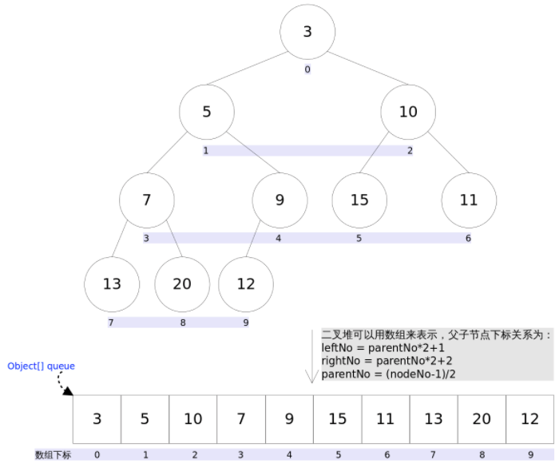
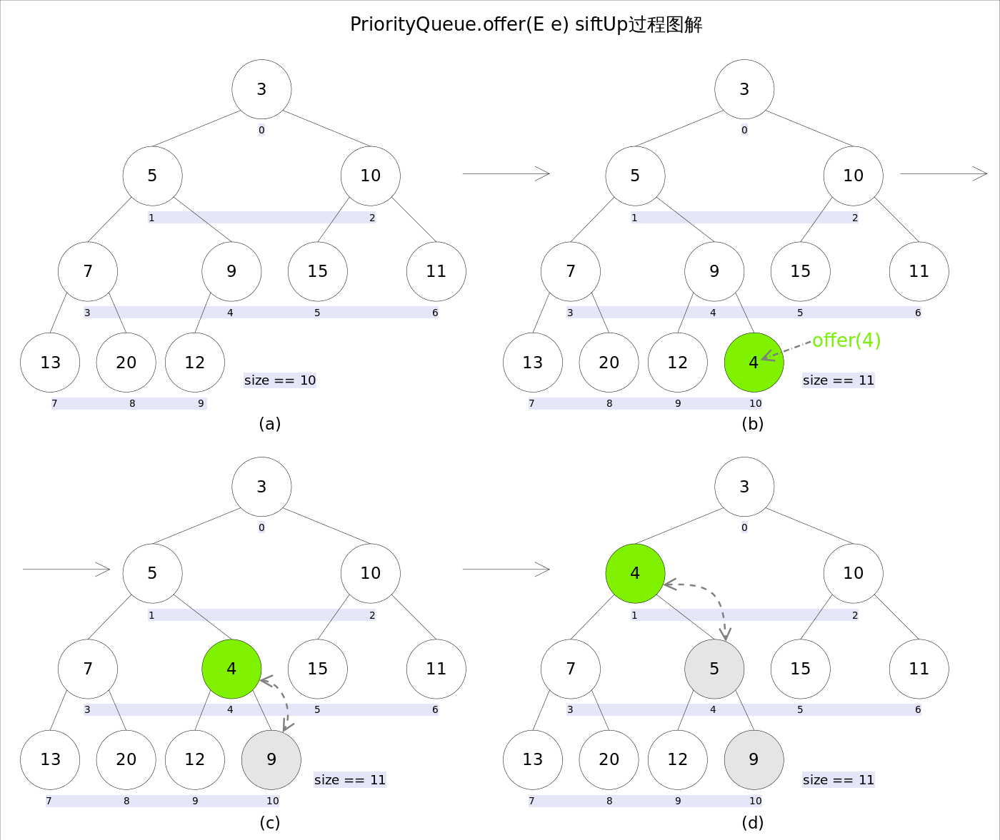
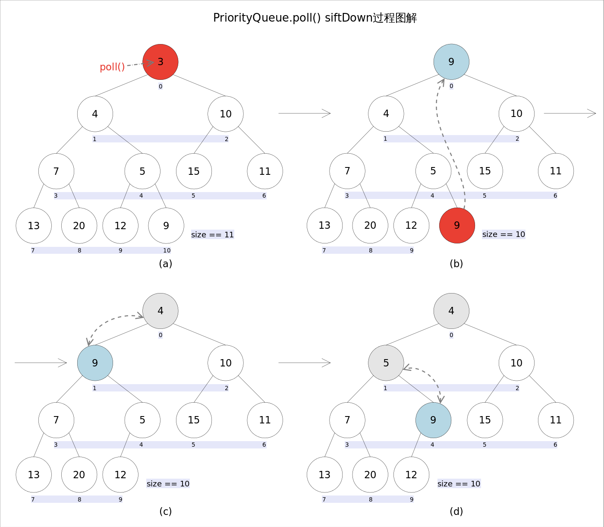
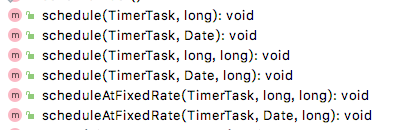
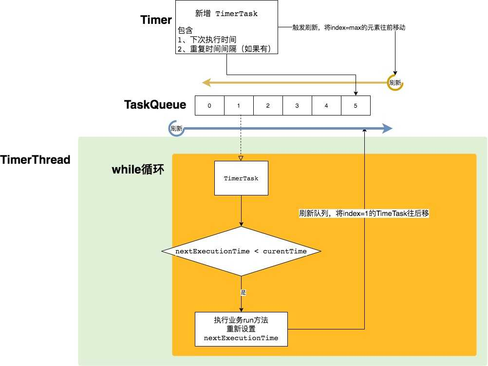
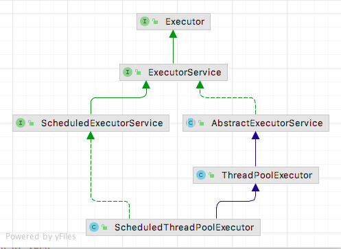
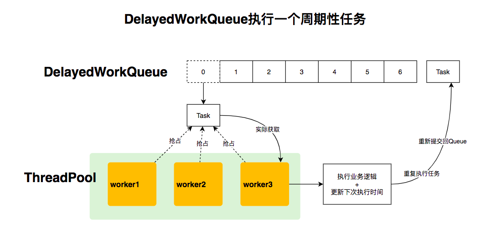
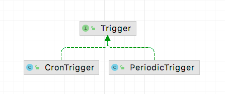

<div style="text-align: center;"><span style="font-size: xxx-large" >JAVA 常用任务调度技术</span></div>

# 前言

在日常开发过程中，我们经常会遇到周期性执行某段代码的场景。比如定期同步订单，定期更新商品信息，定期发送消息等。这些重复执行的代码可以抽象为一个任务(Task)。 一个Task的特点如下：

> 1. 包含需要执行的业务逻辑。
> 2. 能够在指定的时间重复（一次或者多次）执行。

围绕Task的特点，开发者们开发了不同的调度框架或者中间件，满足日常开发中的使用。

以下表格列出了部分实现。


| 技术                     |         来源         | 使用场景                        | 依赖第三方                |
| -------------------------- | :---------------------: | --------------------------------- | --------------------------- |
| Timer                    |        JDK自带        | 目前比较少使用                  |                           |
| ScheduledExecutorService |        JDK自带        | 基于线程池技术，常用于中间件中  |                           |
| Spring Task              |    Spring-context    | Spring 项目，常用于单体应用开发 |                           |
| XXL-JOB                  |    国产开源中间件    | 可用于分布式项目调度            | 依赖mysql                 |
| Quartz                   | OpenSymphony 开源组织 | 一些中间件常常基于Quartz开发    | 分布式需要依赖数据库      |
| Elastic-Job              |      当当⽹开源      | 可用于分布式项目调度            | 需要依赖ZooKeeper + Mesos |
| Apache DolphinScheduler  |       易观开源       | 大数据任务调度                  |                           |

本文对部分技术的实现进行了介绍，从简单到复杂，从具体到抽象，希望可以让大家在面对一个任务调度框架时可以快速抓住要点，不再陌生。

# 1. Timer

java.util.Timer位于JDK的rt.jar包下，始于jdk1.3，是JDK自带的任务调度器，虽然目前基本不再使用Timer来进行任务调度，但是Timer设计简单，理解起来比较容易。而且后续ScheduledExecutorService的基本原理和Timer基本类似，因此需要对Timer进行一个详细的了解。

Timer的核心类比较少，只需要以下4个类即可。


| 类          | 功能                                          | 说明                                             |
| ------------- | ----------------------------------------------- | -------------------------------------------------- |
| Timer       | 入口类，整个调度器的组织者，相当于其他框架的. | 定义了多个提交task的方法                         |
| TimerThread | 任务调度器                                    | 后台线程执行一个轮询方法，核心方法为mainLoop()。 |
| TimerTask   | 抽象类，其实现类包装业务逻辑                  | 核心属性：nextExecutionTime下一个执行时间点。    |
| TaskQueue   | 任务队列                                      | 优先队列，头部节点为最早执行的Task               |

以上类都处于java.util包下。

## 1.1 存储任务的数据结构-平衡二叉堆

一个任务框架，需要可以容纳在不同时间执行的任务，因此必须要有一个容器来缓存或者持久化提交的任务。 那么在多任务的场景下，我们如何挑选出需要执行的任务呢？以下对一些场景进行分析：

> **方案1.** 对所有的任务进行遍历，对于下次执行时间小于当前时间的任务，执行业务逻辑。
>
>> 时间复杂度为O(n)，一些时间没到的任务也被遍历到了。性能不好。
>>
>
> **方案2.** 先对所有的任务，按照下次执行时间的大小进行排序，每次只取头部任务。
>
>> 对2进行分析可以发现，只要保证队列头部为最早执行的元素即可，对于其他任务，因为还不需要执行，是否有序并不重要。
>>
>
> **方案3.** 采用优先队列，头部为权值最小，每次取权值即可。

从以上分析可以看出，一个任务框架，可以采用优先队列来容纳提交的任务。Timer正是如此，它的基本数据结构为平衡二叉堆(balanced binary heap)。想要理解Timer，需要对平衡二叉堆进行了解。
详细可以参考  [【Java基础】JAVA中优先队列详解](https://www.cnblogs.com/satire/p/14919342.html) 。 摘抄如下：

### 1.1.1 基本结构

Java平衡二叉堆的定义为：

> 任意一个非叶子节点的权值，都不大于其左右子节点的权值

可以使用下面的在线数据模拟器进行

> [平衡二叉堆数据结构模拟器](https://iacj.github.io/react-datastructer/#/heap)

结构示例如下：



从图中可以看出，可以通过数组来实现平衡二叉堆。每一个节点的编号，可以使用数组的下标来表示。

> 1. 数组的第一个元素为二叉树的根节点，在所有节点中权值最小。
> 2. 父子节点之间的关系可以用以下算法表示。这个算法很重要。在新增元素或者删除元素的时候，都需要使用到该算法。
>
>> leftNo = parentNo * 2+1
>> rightNo = parentNo * 2+2
>> parentNo = (nodeNo-1)/2
>>

在优先队列中，一般只使用到新增元素和删除根节点元素，因此只对这两个算法进行介绍。

### 1.1.2 新增元素


步骤如下:

> 1.先在队尾新增一个元素。如果数组长度不够就先扩容。
> 2.如果有父节点，则与父节点进行对比。如果权值比父节点小，则与父节点交换位置。
> 3.重复步骤2，直到没有父节点或者比父节点小则完成新增。2~3步一般称作siftUp。

```java
//siftUp()
private void siftUp(int k, E x) {
    while (k > 0) {
        int parent = (k - 1) >>> 1;//parentNo = (nodeNo-1)/2
        Object e = queue[parent];
        if (comparator.compare(x, (E) e) >= 0)//调用比较器的比较方法
            break;
        queue[k] = e;
        k = parent;
    }
    queue[k] = x;
}
```

通过以上步骤。可以保证所有的父节点权值都小于子节点的权值。

### 1.1.3 删除队首元素


步骤如下：

> 1.删除数组的第一个元素。
> 2.将队尾的元素放置到头部位置，记为一个父节点。
> 3.通过比较获取子节点中较小的一个，并与父节点比较，如果父节点大于子节点，则交换位子。
> 4.重复步骤3，直到父节点小于等于子节点或者已经没有子节点，则结束比较。这个过程一般称作siftDown。

```java
//siftDown()
private void siftDown(int k, E x) {
    int half = size >>> 1;
    while (k < half) {
        //首先找到左右孩子中较小的那个，记录到c里，并用child记录其下标
        int child = (k << 1) + 1;//leftNo = parentNo*2+1
        Object c = queue[child];
        int right = child + 1;
        if (right < size &&
            comparator.compare((E) c, (E) queue[right]) > 0)
            c = queue[child = right];
        if (comparator.compare(x, (E) c) <= 0)
            break;
        queue[k] = c;//然后用c取代原来的值
        k = child;
    }
    queue[k] = x;
}
```

## 1.2 Timer 核心执行逻辑

查看Timer类的结构，可以看到提交任务的方法有6个



代表了6种不同的场景

delay： 延迟毫秒数period： 时间间隔

> 1.延迟delay毫秒后，执行任务一次。
> 2.延迟delay毫秒后，周期性执行任务，两次任务之间间隔period毫秒。
> 3.延迟delay毫秒后，以固定频率执行任务，两次任务之间间隔period毫秒。
>
> 4.指定的时间Date开始，执行任务一次。
> 5.指定的时间Date开始，周期性执行任务，两次任务之间间隔period毫秒。
> 6.指定的时间Date开始，以固定频率执行任务，两次任务之间间隔period毫秒。

其中需要特别说明的是2和3，5和6之间的区别，也就是schedule和scheduleAtFixedRate的区别。具体看下表：


| 方法名              | 下一个执行时间nextExecutionTime | 说明                                                                                             |
| --------------------- | --------------------------------- | -------------------------------------------------------------------------------------------------- |
| schedule            | currentTime + delay             | 当前序堵塞时，会影响到后续任务的下次计划时间，<br>下次任务会推迟执行，对于丢失的时间不会补上任务 |
| scheduleAtFixedRate | nextExecutionTime + delay       | 当堵塞时，影响到后续任务的计划时间，<br>任务的次数不会丢失，快速补上调度次数                     |

注： currentTime：当前时间，nextExecutionTime：下次执行时间，delay：时间间隔

### 1.2.1 Timer简单的例子：

Demo先行，先看一个简单的例子，有个初步的印象。

```java
public class Application {
    public static void main(String[] args) {
        //初始化一个timer对象
        Timer timer = new Timer();
        //创建抽象类TimerTask的实例。
        TimerTask myTask = new TimerTask() {
            @Override
            public void run() {
                System.out.println("执行run方法，time="+System.currentTimeMillis()/1000%60+"秒");
            }
        };
        //提交任务，延迟1秒执行，每两秒执行一次
        timer.schedule(myTask, 1000, 1000*2);
    }
}
```

结果：

> 执行run方法，time=25秒
> 执行run方法，time=27秒
> 执行run方法，time=29秒
> 执行run方法，time=31秒
> 执行run方法，time=33秒
> 执行run方法，time=35秒
> 执行run方法，time=37秒

原始代码分析如下，只挑选了核心代码展示。

### 1.2.2 Timer 类源码分析

Timer 是整个任务架构的组织者，也是入口，因此首先看Timer的代码。

```java
public class Timer {
    // TaskQueue 实现了一个优先队列
    private final TaskQueue queue = new TaskQueue();
    // TimerThread继承了Thread。同时组合了TaskQueue。当Timer实例化时。会启动TimerThread实例的的start()方法。启动线程处理定时任务。
    private final TimerThread thread = new TimerThread(queue);

   //构造函数。做了一件事情，及时启动了TimerThread线程，处理队列数据。
   public Timer(String name, boolean isDaemon) {
      thread.setName(name);
      thread.setDaemon(isDaemon);
      thread.start();
   }
  
   //延迟delay毫秒后执行一次任务
   public void schedule(TimerTask task, long delay) {
      sched(task, System.currentTimeMillis()+delay, 0);
   }
   //延迟delay毫秒，以固定频率执行定时任务。下次的执行时间为当前系统时间(System.currentTimeMillis())+|period|
   //当发生阻塞时，有可能丢失调度次数
   public void schedule(TimerTask task, long delay, long period) {
      sched(task, System.currentTimeMillis()+delay, -period);
   }
   //延迟delay毫秒，以固定频率执行定时任务。与schedule不同。下次执行时间为当前本应执行时间(nextExecutionTime)+period
   //当发生阻塞时，不会丢失调度次数。
   public void scheduleAtFixedRate(TimerTask task, long delay, long period) {
      sched(task, System.currentTimeMillis()+delay, period);
   }
   
   
   
    /**
     * 核心新增定时任务的方法。
     * @param task 为实现了业务的任务类。
     * @param time 为下次执行任务的时间。  
     * @param period  为0时表示不会重复执行。当period !=0时表示会周期性执行
     */
    private void sched(TimerTask task, long time, long period) {
        //以下代码省去了部分校验代码
        synchronized(queue) {
            synchronized(task.lock) {
                task.nextExecutionTime = time;
                task.period = period;
                task.state = TimerTask.SCHEDULED;
            }
            queue.add(task);
            if (queue.getMin() == task)
                //说明加入task之前。队列为空，处于wait状态，需要唤醒。或者还有一种情况，就是加入的task处于头部，需要立即处理。有可能此时线程处于等待状态，需要唤醒。
                queue.notify();
        }
    }
  
   //省略。。。

}
```

### 1.2.3  TaskQueue 类源码分析

TaskQueue 本质是一个平衡二叉堆，1.1已经有所介绍。

```java
class TaskQueue {
    /**
     * Priority queue represented as a balanced binary heap: the two children
     * of queue[n] are queue[2*n] and queue[2*n+1].  The priority queue is
     * ordered on the nextExecutionTime field: The TimerTask with the lowest
     * nextExecutionTime is in queue[1] (assuming the queue is nonempty).  For
     * each node n in the heap, and each descendant of n, d,
     * n.nextExecutionTime <= d.nextExecutionTime.
     * 注释已经讲明，就是一个平衡二叉堆。
     */
    private TimerTask[] queue = new TimerTask[128];

  
    void add(TimerTask task) {
        // Grow backing store if necessary
        if (size + 1 == queue.length)
            queue = Arrays.copyOf(queue, 2*queue.length);
        //加到队尾
        queue[++size] = task;
        //向上排序
        fixUp(size);
    }
    //新增元素时向上排序
    private void fixUp(int k) {
        while (k > 1) {
            int j = k >> 1;
            if (queue[j].nextExecutionTime <= queue[k].nextExecutionTime)
                break;
            TimerTask tmp = queue[j];  queue[j] = queue[k]; queue[k] = tmp;
            k = j;
        }
    }
   //刷新
   void rescheduleMin(long newTime) {
      queue[1].nextExecutionTime = newTime;
      fixDown(1);
   }
   
    //删除元素时向下排序
    private void fixDown(int k) {
        int j;
        while ((j = k << 1) <= size && j > 0) {
            if (j < size &&
                queue[j].nextExecutionTime > queue[j+1].nextExecutionTime)
                j++; // j indexes smallest kid
            if (queue[k].nextExecutionTime <= queue[j].nextExecutionTime)
                break;
            TimerTask tmp = queue[j];  queue[j] = queue[k]; queue[k] = tmp;
            k = j;
        }
    }

    //省略其他
}
```

### 1.2.3 TimerThread 类源码分析

从Timer代码可以看到，当实例化Timer时，将会启动一个TimerThread线程，具体作用是不断轮询队列的头部元素，然后执行业务代码。核心代码如下（省略部分代码）：

```java
class TimerThread extends Thread {
    //标识线程已经启用。当为false时，跳出循环。
    boolean newTasksMayBeScheduled = true;
    private TaskQueue queue;

    public void run() {
        try {
            mainLoop();
        } finally {
            //忽略。。。
        }
    }

    //执行轮询
    private void mainLoop() {
        while (true) {
            try {
                TimerTask task;
                boolean taskFired;
                synchronized(queue) {
                    // Wait for queue to become non-empty
                    while (queue.isEmpty() && newTasksMayBeScheduled) {
                       //while循环 让出锁，等待新任务加入
                       queue.wait();
                    }
                    if (queue.isEmpty()){
                       //此时newTasksMayBeScheduled队列已死。退出循环
                       break; 
                    }
                    long currentTime, executionTime;
                    task = queue.getMin();
                    synchronized(task.lock) {
                        //判断状态
                        if (task.state == TimerTask.CANCELLED) {
                            //检查已经取消的任务，移除。
                            queue.removeMin();
                            continue;  
                        }
  
                        currentTime = System.currentTimeMillis();
                        //当前task计划的执行时间。
                        executionTime = task.nextExecutionTime;
                        if (taskFired = (executionTime<=currentTime)) {
                            //当前任务的计划执行时间<=当前时间，则允许执行。
                            if (task.period == 0) { // Non-repeating, remove
                                //只执行一次的任务，移除。
                                queue.removeMin();
                                task.state = TimerTask.EXECUTED;
                            } else { 
                                //修改队列中最小的一个task的时间为下一个执行时间，并且重新排序。
                                queue.rescheduleMin(
                                  task.period<0 ? currentTime   - task.period
                                                : executionTime + task.period);
                            }
                        }
                    }
                    if (!taskFired) // Task hasn't yet fired; wait
                        //最近时间执行的任务还未到时间，需要等待。让出锁。
                        queue.wait(executionTime - currentTime);
                }
                if (taskFired)  
                    //执行业务逻辑。这里可以看到是同步执行的。如果业务逻辑耗时较长，会影响后续任务的执行。
                    task.run();
            } catch(InterruptedException e) {
            }
        }
    }
}
```

TimerThread 中的 mainLoop 方法+TaskQueue队列，看起来非常熟悉，在queue为空的时候，会调用queue.wait()方法。直到Timer在新增元素时，调用了queue.notify()。这些代码和BlockQueue原理非常像。

### 1.2.4 TimerTask 类源码分析

```java
public abstract class TimerTask implements Runnable {
    //执行状态
    int state = VIRGIN;
    //下次执行时间，如果是重复的任务，在任务执行前会被更新成下次的执行时间。
    long nextExecutionTime;
    // 毫秒数，用于重复执行的时间间隔。证书标识以固定频率调度。负数标识以固定的时间延迟调度。0代表不会重复执行。
    long period = 0;
    //抽象犯法，用于实现业务
    public abstract void run();
    //省略部分代码。
}
```

## 1.3 Timer 调度示意图

通过对Timer的四个核心类，我们可以得出以下调度示意图。



## 1.4 Timer 总结

可以看到，Timer 是JDK自带的任务调度器。实现的逻辑如下

> - 实现一个优先队列。队列的头部为最先需要执行的任务。
> - 启动一个后台线程，不断从优先队列中获取待执行的任务。
> - 执行任务。

通过使用Timer，我们可以方便地在一个线程中执行多个计划任务。但是也有一定的局限性，主要是多个任务之间相互影响：

> - 所有的任务都在一个线程中执行，如果前面的任务耗时比较长，则会影响后续任务的执行。
> - 假设前序任务抛出了非InterruptedException的异常，则整个队列将会被清空，任务调度终止。

基于以上局限性，在实际应用中，使用Timer使用得并不多。常用的为 ScheduledExecutorService。ScheduledExecutorService与Timer 的最大区别是将任务提交给线程池处理。

# 2. ScheduledExecutorService

在前一章节可以了解到，在 Timer 类中所有的任务都是同步执行，如果前序任务发生了阻塞或者耗时比较长，那么后续任务就容易被阻塞到。

JDK在1.5之后J引入了 ThreadPoolExecutor 线程池技术。 线程池技术的逻辑机构图如下：


(参考[聊聊Java进阶之并发基础技术—线程池剖析](https://www.jianshu.com/p/41c9db9862be))

从上图可以看到，线程池也是将不同的任务加入到一个队列中（BlockingQueue），等待着多个线程的调用。与Timer的调度很相似，只是最大区别是线程池队列是被多个线程调用的。

因此JDK在1.5引入了ThreadPoolExecutor的同时，也重新编写了一套新任务调度器-ScheduledExecutorService,具体实现类为ScheduledThreadPoolExecutor，用于任务的调度。

其继承关系如下：


从继承关系中可以看出，ScheduledThreadPoolExecutor 继承了 ThreadPoolExecutor，拥有线程池的所有功能。

ScheduledThreadPoolExecutor 在实现上与Timer是相似的，都是通过实现一个优先队列来管理任务，同时这个优先队列又是一个阻塞队列，在获取第一个任务后，只有到了执行时间才会返回任务。一个比较大的改进在于，获取任务后不是直接执行代码，而是交给线程池来调度。

## 2.1核心类和接口

ScheduledExecutorService 的一些核心类如下：


| 类                                              | 功能         | 说明                                                     |
| ------------------------------------------------- | -------------- | ---------------------------------------------------------- |
| ScheduledExecutorService                        | 抽象类       | 定义了规范                                               |
| Executors.DelegatedScheduledExecutorService     | 包装类       | 用于包装 ScheduledThreadPoolExecutor，<br>只暴露关键方法 |
| ScheduledThreadPoolExecutor                     | 核心执行器   | 实现类，真正执行调度逻辑的地方                           |
| ScheduledThreadPoolExecutor.DelayedWorkQueue    | 延迟阻塞队列 | 任务周期执行的核心方法在这个类中实现                     |
| ScheduledThreadPoolExecutor.ScheduledFutureTask | 队列中的对象 | 是ScheduledThreadPoolExecutor的成员内部类                |

以上类处于java.util.concurrent包下

## 2.2 ScheduledExecutorService 的简单用法和介绍

```java
public class Application {
    public static void main(String[] args) {
        ScheduledExecutorService scheduledExecutorService = Executors.newSingleThreadScheduledExecutor();
        Runnable runnable = ()->{System.out.println("执行run方法，time="+System.currentTimeMillis()/1000%60+"秒");};
        scheduledExecutorService.scheduleAtFixedRate(runnable, 1, 2, TimeUnit.SECONDS);
    }
}

```

查看 ScheduledExecutorService 的结构，


提交任务的方法共有4个，与Timer相比做了精简。

```java
public interface ScheduledExecutorService extends ExecutorService {
   //delay时间后，执行一次任务
    public ScheduledFuture<?> schedule(Runnable command, long delay, TimeUnit unit);
    //delay时间后，执行一次任务有返回值的任务
    public <V> ScheduledFuture<V> schedule(Callable<V> callable, long delay, TimeUnit unit);
    //以固定频率执行任务
    public ScheduledFuture<?> scheduleAtFixedRate(Runnable command, long initialDelay, long period, TimeUnit unit);
    //以固定延迟时间执行任务
    public ScheduledFuture<?> scheduleWithFixedDelay(Runnable command, long initialDelay, long delay, TimeUnit unit);
}
```

## 2.3 ScheduledThreadPoolExecutor 类

ScheduledExecutorService只定义了相应的规范，还需要具体类进行实现。

通过查看 Executors.newSingleThreadScheduledExecutor()，具体实现如下

```java
public class Executors {
    public static ScheduledExecutorService newSingleThreadScheduledExecutor() {
        return new DelegatedScheduledExecutorService(new ScheduledThreadPoolExecutor(1);
    }
   public static ScheduledExecutorService newSingleThreadScheduledExecutor(ThreadFactory threadFactory) {
      return new DelegatedScheduledExecutorService
              (new ScheduledThreadPoolExecutor(1, threadFactory));
   }
   
   public static ScheduledExecutorService newScheduledThreadPool(int corePoolSize) {
      return new ScheduledThreadPoolExecutor(corePoolSize);
   }

   
   public static ScheduledExecutorService newScheduledThreadPool(
           int corePoolSize, ThreadFactory threadFactory) {
      return new ScheduledThreadPoolExecutor(corePoolSize, threadFactory);
   }
}
```

DelegatedScheduledExecutorService 只是一个包装类，核心逻辑在 ScheduledThreadPoolExecutor。
其构造函数调用了父类的构造函数的时候，传入了 DelayedWorkQueue 延时阻塞队列。

```java
public class ScheduledThreadPoolExecutor
        extends ThreadPoolExecutor
        implements ScheduledExecutorService {
  
  
    // 构造函数1
   public ScheduledThreadPoolExecutor(int corePoolSize) {
      super(corePoolSize, Integer.MAX_VALUE, 0, NANOSECONDS, new DelayedWorkQueue());
   }
   // 构造函数2
   public ScheduledThreadPoolExecutor(int corePoolSize, ThreadFactory threadFactory) {
      super(corePoolSize, Integer.MAX_VALUE, 0, NANOSECONDS, new DelayedWorkQueue(), threadFactory);
   }
   // 构造函数3
   public ScheduledThreadPoolExecutor(int corePoolSize, RejectedExecutionHandler handler) {
      super(corePoolSize, Integer.MAX_VALUE, 0, NANOSECONDS, new DelayedWorkQueue(), handler);
   }
   // 构造函数4
   public ScheduledThreadPoolExecutor(int corePoolSize, ThreadFactory threadFactory, RejectedExecutionHandler handler) {
      super(corePoolSize, Integer.MAX_VALUE, 0, NANOSECONDS, new DelayedWorkQueue(), threadFactory, handler);
   }
   //ScheduledThreadPoolExecutor 提供了4个构造函数，每个构造函数都调用了父类ThreadPoolExecutor的构造函数，这四个经典参数中，DelayedWorkQueue是不变的，说明它是实现任务队列的关键。
   
   
   
    //向队列提交任务。
    // 查看源码，所有提交任务的方法，经过包装后最终会调用delayedExecute，像队列中新增任务。并调用父类的ensurePrestart()方法确认线程池已经准备就绪。
   private void delayedExecute(RunnableScheduledFuture<?> task) {
      if (isShutdown())
         reject(task);
      else {
         super.getQueue().add(task);
         if (isShutdown() &&
                 !canRunInCurrentRunState(task.isPeriodic()) &&
                 remove(task))
            task.cancel(false);
         else
            ensurePrestart();
      }
   }
}
```

到这时ScheduledExecutorService的秘密浮出水面，核心在于 DelayedWorkQueue。

## 2.4 DelayedWorkQueue 类实现

DelayedWorkQueue 类的定义如下。可以看到，DelayedWorkQueue的实现了BlockingQueue接口，可以传入JDK的线程池进行消费。

```java
static class DelayedWorkQueue extends AbstractQueue<Runnable> implements BlockingQueue<Runnable> {
}
```

但是具体何如实现队列中的任务，在指定的时间被调度呢？

首先来看一下他的队列实现方式。

```java

static class DelayedWorkQueue extends AbstractQueue<Runnable> implements BlockingQueue<Runnable> {
   /*
    * A DelayedWorkQueue is based on a heap-based data structure
    * like those in DelayQueue and PriorityQueue, except that
    * every ScheduledFutureTask also records its index into the
    * heap array. 
    * ...
    * 
    * 从以上注释中可以知道 DelayedWorkQueue 本质上也是一个基于堆的数据结构。
    */
   
   //初始化了一个数组
   private RunnableScheduledFuture<?>[] queue = new RunnableScheduledFuture<?>[INITIAL_CAPACITY];
   //用于新增元素时向上移动元素
   private void siftUp(int k, RunnableScheduledFuture<?> key) {
       //省略代码
   }
   //去除元素时向下移动元素
   private void siftDown(int k, RunnableScheduledFuture<?> key) {
       //省略代码
   }
   //锁
   private final ReentrantLock lock = new ReentrantLock();
   // Condition
   private final Condition available = lock.newCondition();

   /**
    * 当前线程会等待队列头部的任务。 Leader-Follower 模式的这种变体用于最大限度地减少不必要的定时等待。当一个线程成为领导者时，它只等待下一个延迟过去，但其他线程无限期地等待。领导者线程必须在从 take() 或 poll(...) 返回之前向其他线程发出信号，除非其他一些线程在此期间成为领导者。每当队列的头被替换为具有更早到期时间的任务时，leader 字段通过重置为 null 而失效，并且一些等待线程（但不一定是当前的 leader）被发出信号。所以等待线程必须准备好在等待时获取和失去领导权。
    */
   private Thread leader = null;

   public void put(Runnable e) {
      offer(e);
   }

   public boolean add(Runnable e) {
      return offer(e);
   }

   public boolean offer(Runnable e, long timeout, TimeUnit unit) {
      return offer(e);
   }
   //以上几个方法都是指向了offer
   public boolean offer(Runnable x) {
      if (x == null)
         throw new NullPointerException();
      RunnableScheduledFuture<?> e = (RunnableScheduledFuture<?>)x;
      final ReentrantLock lock = this.lock;
      lock.lock();
      try {
         int i = size;
         if (i >= queue.length)
             //扩容
            grow();
         size = i + 1;
         if (i == 0) {
             //第一个元素，不需要排序
            queue[0] = e;
            setIndex(e, 0);
         } else {
             //队列中还有其他元素，需要排序
            siftUp(i, e);
         }
         if (queue[0] == e) {
             //加入元素。如果排序后，新增的元素属于队首。则触发一次通知，唤起一个线程（有可能是队首正在倒计时的任务，也有可能是非队首线程）。
            leader = null;
            //唤起一个线程。
            available.signal();
         }
      } finally {
         lock.unlock();
      }
      return true;
   }
   
   
   //查看阻塞队列的take方法
   public RunnableScheduledFuture<?> take() throws InterruptedException {
      final ReentrantLock lock = this.lock;
      lock.lockInterruptibly();
      try {
         for (;;) {
             //1、从队首获取待执行的任务。此任务在队列中最早执行。
            RunnableScheduledFuture<?> first = queue[0];
            if (first == null)
                // 2 如果队列为空，所有的线程都在这里等待，此时锁已经被释放，等待offer方法被调用，此时加入的任务在队首，会调用available.signal()唤起一个线程。
               available.await();
            else {
                //3 delay=下次执行时间-当前时间。当<=0说明需要被执行。
               long delay = first.getDelay(NANOSECONDS);
               if (delay <= 0) {
                  // 4 删除队列的第一个个元素并重新向下排序。返回任务
                  return finishPoll(first);
               }
   
               first = null; // don't retain ref while waiting  等待时去除引用
               if (leader != null)
                   // 6 注意这里我编码为了6，因为第一个线程进来，是不会执行到这里。
                   // 在等待的过程过，如果leader已经有值，说明他是后来者。会进入这里等待，直到leader线程执行完。或者新加了一个元素到队列的头部，才会重新获取锁。
                   // 这种场景下，会有一个leader线程正在available.awaitNanos(delay)，其他线程是available.await(); 大家一起在等。
                  available.await();
               else {
                  Thread thisThread = Thread.currentThread();
                  leader = thisThread;
                  try {
                      //5 当前线程，是第一个线程进到这个代码，因此被标记为leader。在此过程中，如果有其他线程进来，只能进到第6步等待，
                     available.awaitNanos(delay);
                  } finally {
                     if (leader == thisThread)
                        leader = null;
                  }
               }
            }
         }
      } finally {
         if (leader == null && queue[0] != null)
            available.signal();
         lock.unlock();
      }
   }

   /**
    * 查看finishPoll方法。
    * 
    * 使用最后一个元素替换掉当前元素，并且重新向下排序。
    * 注意，这时第一个元素已经从队列中去除，这一点与Timer的实现方式不同。
    * Timer是不需要将元素取出，而是直接修改时间了之后，从上往下重新排序。只需要排序一次。
    * 
    * ScheduledExecutorService执行一个周期性任务，需要进行两次排序。第一次是获取了task，排序，第二次是真正执行task的时候。再放回队列，需要排序
    * 
    * @param f
    * @return
    */
   private RunnableScheduledFuture<?> finishPoll(RunnableScheduledFuture<?> f) {
      int s = --size;
      RunnableScheduledFuture<?> x = queue[s];
      queue[s] = null;
      if (s != 0)
          //把队列头部换成x，向下排序
         siftDown(0, x);
      setIndex(f, -1);
      return f;
   }
}
```

具体流程如下：


## 2.5 ScheduledFutureTask 类

从上一节DelayedWorkQueue类中的take方法和finishPoll方法可知，在线程池获取task后，已经从队列中移走，那么对于重复执行的队列怎么办呢？那就是在线程池执行run方法前，重新将task加到队列中。

```java
// 注意 ScheduledFutureTask 属于  ScheduledThreadPoolExecutor 的成员内部类，因此可以使用ScheduledThreadPoolExecutor方法和成员变量。
public class ScheduledThreadPoolExecutor
        extends ThreadPoolExecutor
        implements ScheduledExecutorService {
  
   private class ScheduledFutureTask<V> extends FutureTask<V> implements RunnableScheduledFuture<V> {

      /** 下次执行时间 */
      private long time;
      /** 周期性执行任务的时间间隔 分为0、正、负值。*/
      private final long period;

      ScheduledFutureTask(Runnable r, V result, long ns, long period) {
         super(r, result);
         this.time = ns;
         this.period = period;
         this.sequenceNumber = sequencer.getAndIncrement();
      }

      /**Overrides FutureTask version so as to reset/requeue if periodic. 
       * 重写了 FutureTask 的run方法，主要是增加了重置下个调度时间以及重新排序*/
      public void run() {
         boolean periodic = isPeriodic();
         if (!canRunInCurrentRunState(periodic))
             //判断当前状态能不能运行
            cancel(false);
         else if (!periodic)
             //非周期性的任务，只执行一次
            ScheduledFutureTask.super.run();
         else if (ScheduledFutureTask.super.runAndReset()) {
             //设置下次执行时间
            setNextRunTime();
            //直接调用外部类的方法。重新将任务加入到队列中。
            reExecutePeriodic(outerTask);
         }
      }
   }
   //重新将任务加入到队列中
   void reExecutePeriodic(RunnableScheduledFuture<?> task) {
      if (canRunInCurrentRunState(true)) {
          //往队列加任务
         super.getQueue().add(task);
         if (!canRunInCurrentRunState(true) && remove(task))
            task.cancel(false);
         else
            ensurePrestart();
      }
   }
}

```

## 2.6  总结

通过分析源码可以看出，ScheduledExecutorService  是通过实现一个优先队列来存储和调度任务的。从原理上来说是和Timer是类似的。可以认为是Timer 的升级版，新增了线程池执行任务的功能。



ScheduledExecutorService 和 Timer 比较


|           框架           | 相同                 | 不同                                                                                                                              |
| :------------------------: | ---------------------- | ----------------------------------------------------------------------------------------------------------------------------------- |
|          Timer          | 都使用堆作为数据结构 | 1、同步执行任务<br> <br>2、从队列头部获取任务之后，直接修改下次执行时间，直接排序                                                |
| ScheduledExecutorService |                      | 1、线程池异步执行任务<br>      2、从头部获取任务后，移除当前任务 ，排序一次。在执行任务前修改时间后，再提交到队列。相当于排序两次 |

但是ScheduledExecutorService也有一定的局限性，那就是任务只能执行一次或者以固定的时间差周期性执行。不够灵活。

# 3 Spring Task

Spring Task处于spring-context项目的org.springframework.scheduling包下，因此只要是Spring项目，都可以通过注解的方式，将Spring bean中的某个方法变成一个task进行调度，非常方便。而且引入了cron表达式，使用更加灵活。

## 3.1 Spring Task 简单用法

新建一个maven项目，引入spring-context包

```xml
<dependency>
   <groupId>org.springframework</groupId>
   <artifactId>spring-context</artifactId>
   <version>5.3.15</version>
</dependency>
```

新建一个启动类

```java
@Configuration
//启用任务调度配置
@EnableScheduling
public class Application {

    public static void main(String[] args) {
        AnnotationConfigApplicationContext annotationConfigApplicationContext = new AnnotationConfigApplicationContext(Application.class);
    }
    //配置注解，将一个方法配置成为任务
    @Scheduled(fixedRate = 1*1000)
    public void schedled(){
        System.out.println("执行定时任务，time="+System.currentTimeMillis()/1000%60+"秒");
    }
}
```

启动main方法后，执行结果如下：

> 执行定时任务，time=18秒
> 执行定时任务，time=19秒
> 执行定时任务，time=20秒
> 执行定时任务，time=21秒

从以上demo中可以看出，在spring中，只需要两个注解@EnableScheduling和@Scheduled，就可以启动一个定时任务了，非常方便。

## 3.2 Spring Task核心类


| 类                                   | 功能                 | 说明                                                         |
| -------------------------------------- | ---------------------- | -------------------------------------------------------------- |
| Trigger                              | 触发器接口           | 提供了nextExecutionTime方法，由具体实现类去实现              |
| Task                                 | Task的公共父类       | 只封装了Runnable一个属性，有一系列的子类拓展成为不同的功能   |
| TaskScheduler                        | 基础接口             | 定义了Spring Task提交任务的基本规范                          |
| ConcurrentTaskScheduler              | 调度器-适配器        | 将 ScheduledExecutorService 适配成  TaskScheduler            |
| Scheduled                            | 注解类               | 将一个方法标记为定时执行的task，提供了多种配置触发时间的方式 |
| ScheduledAnnotationBeanPostProcessor | 后置处理器           | 解析所有被Scheduled标识的方法处理成的task，并做相关配置      |
| ScheduledTaskRegistrar               | 任务注册中心         | 缓存了task和任务处理器                                       |
| ReschedulingRunnable                 | cron表达式Task适配器 | 对于使用了Trigger的Task，将使用ReschedulingRunnable重新封装  |

初始化基本流程


需要注意的是，Spring Task本质上只定义了提交task的抽象类，并没有提供具体的调度的实现。

为了实现开箱可用，Spring task将ScheduledExecutorService适配成了默认的实现，但是可以根据具体的需要，替换成其他实现。

## 3.3 Trigger接口及实现类

Trigger排在最前面介绍，是因为Timer和ScheduledExcecutorService是没有Trigger的概念的，都是再在各自的Task类中拥有一个下次执行时间的属性。Timer的TimerTask是private long nextExecutionTime。ScheduledFutureTask的是private long time。为了让任务的触发时间更加灵活，引入了Trigger的概念。

Trigger的本意为触发器，枪的扳机。因此相对的，当一个任务被触发时，常常用fire这个词。

Trigger的本质是封装了获取下一次执行时间的逻辑。

```java
public interface Trigger {
    // 获取下一次执行时间
	@Nullable
	Date nextExecutionTime(TriggerContext triggerContext);
}

//上下文，用于存储一些时间变量
public interface TriggerContext {
   
   default Clock getClock() {
      return Clock.systemDefaultZone();
   }

   //上一次计划执行时间
   @Nullable
   Date lastScheduledExecutionTime();
   // 上一次具体执行时间
   @Nullable
   Date lastActualExecutionTime();
   //完成时间
   @Nullable
   Date lastCompletionTime();

}
//TriggerContext实现类很简单
public class SimpleTriggerContext implements TriggerContext {
    private final Clock clock;
    @Nullable
    private volatile Date lastScheduledExecutionTime;

    @Nullable
    private volatile Date lastActualExecutionTime;

    @Nullable
    private volatile Date lastCompletionTime;
}
```

spring task中提供了两个Trigger实现



周期性触发器-目前没有看到使用的地方

```java
public class PeriodicTrigger implements Trigger {

    private final long period;

    private final TimeUnit timeUnit;

    private volatile long initialDelay;

    private volatile boolean fixedRate;

    @Override
    public Date nextExecutionTime(TriggerContext triggerContext) {
        Date lastExecution = triggerContext.lastScheduledExecutionTime();
        Date lastCompletion = triggerContext.lastCompletionTime();
        if (lastExecution == null || lastCompletion == null) {
            return new Date(triggerContext.getClock().millis() + this.initialDelay);
        }
        if (this.fixedRate) {
            return new Date(lastExecution.getTime() + this.period);
        }
        return new Date(lastCompletion.getTime() + this.period);
    }

}
```

CronTrigger-支持cron表达式

```java

public class CronTrigger implements Trigger {

	private final CronExpression expression;

	private final ZoneId zoneId;

    //提供了多个构造函数 完成 expression 和 zoneId的复制
	public CronTrigger(String expression) {
		this(expression, ZoneId.systemDefault());
	}

	public CronTrigger(String expression, TimeZone timeZone) {
		this(expression, timeZone.toZoneId());
	}

	public CronTrigger(String expression, ZoneId zoneId) {
		Assert.hasLength(expression, "Expression must not be empty");
		Assert.notNull(zoneId, "ZoneId must not be null");

		this.expression = CronExpression.parse(expression);
		this.zoneId = zoneId;
	}

	@Override
	public Date nextExecutionTime(TriggerContext triggerContext) {
		Date date = triggerContext.lastCompletionTime();
		if (date != null) {
			Date scheduled = triggerContext.lastScheduledExecutionTime();
			if (scheduled != null && date.before(scheduled)) {
				// Previous task apparently executed too early...
				// Let's simply use the last calculated execution time then,
				// in order to prevent accidental re-fires in the same second.
				date = scheduled;
			}
		}
		else {
			date = new Date(triggerContext.getClock().millis());
		}
		ZonedDateTime dateTime = ZonedDateTime.ofInstant(date.toInstant(), this.zoneId);
		ZonedDateTime next = this.expression.next(dateTime);
		return (next != null ? Date.from(next.toInstant()) : null);
	}
}

```

目前，在Spring task中，只有cron类型的任务才用到Trigger，其他的固定固定周期执行和固定频率执行，还是用传统的模式。

## 3.4 Task父类以及子类

Task是所有Spring task的所有父类，比较简单，就是定义了runnable变量，用来存储业务逻辑，而其他周期性执行，延迟执行等参数留给子类实现

```java
public class Task {
	private final Runnable runnable;
}
```

其子类如下：


从图上可知，Task的子类分为两种：

1. Trigger触发的Task。代表为CronTask
2. 固定间歇执行的Task。代表为FixedDelayTask和FixedRateTask。其中FixedDelayTask和FixedRateTask本身没有任何实现，只是为了区分不同的调度方式（还记得Timer中的正负period吗），具体功能都是由父类IntervalTask承担。

```java
public class IntervalTask extends Task {
    private final long interval;
    private final long initialDelay;
    public IntervalTask(Runnable runnable, long interval, long initialDelay) {
        super(runnable);
        this.interval = interval;
        this.initialDelay = initialDelay;
    }
}
public class FixedRateTask extends IntervalTask {
    public FixedRateTask(Runnable runnable, long interval, long initialDelay) {
        super(runnable, interval, initialDelay);
    }
}
public class FixedDelayTask extends IntervalTask {
    public FixedDelayTask(Runnable runnable, long interval, long initialDelay) {
        super(runnable, interval, initialDelay);
    }
}
```

```java
public class TriggerTask extends Task {
	private final Trigger trigger;
    public TriggerTask(Runnable runnable, Trigger trigger) {
        super(runnable);
        this.trigger = trigger;
    }
}

public class CronTask extends TriggerTask {
    private final String expression;
    public CronTask(Runnable runnable, String expression) {
        this(runnable, new CronTrigger(expression));
    }
}
```

## 3.3 TaskScheduler接口逻辑

TaskScheduler 是Spring task中的任务调度接口，定义了一系列提交任务的方法，与 ScheduledExecutorService 角色相当。
方法概览如下：

```java
public interface TaskScheduler {

    default Clock getClock() {
        return Clock.systemDefaultZone();
    }
   
    @Nullable
    ScheduledFuture<?> schedule(Runnable task, Trigger trigger);
   
    ScheduledFuture<?> schedule(Runnable task, Date startTime);
   
    ScheduledFuture<?> scheduleAtFixedRate(Runnable task, Date startTime, long period);
   
    ScheduledFuture<?> scheduleAtFixedRate(Runnable task, long period);
   
    ScheduledFuture<?> scheduleWithFixedDelay(Runnable task, long delay);
   
    ScheduledFuture<?> scheduleWithFixedDelay(Runnable task, Date startTime, long delay);
   
    //另外提供了一些default方法
    default ScheduledFuture<?> schedule(Runnable task, Instant startTime) {
        return schedule(task, Date.from(startTime));
    }
   
    default ScheduledFuture<?> scheduleAtFixedRate(Runnable task, Instant startTime, Duration period) {
        return scheduleAtFixedRate(task, Date.from(startTime), period.toMillis());
    }
   
    default ScheduledFuture<?> scheduleAtFixedRate(Runnable task, Duration period) {
        return scheduleAtFixedRate(task, period.toMillis());
    }
   
    default ScheduledFuture<?> scheduleWithFixedDelay(Runnable task, Instant startTime, Duration delay) {
        return scheduleWithFixedDelay(task, Date.from(startTime), delay.toMillis());
    }
   
   
    default ScheduledFuture<?> scheduleWithFixedDelay(Runnable task, Duration delay) {
        return scheduleWithFixedDelay(task, delay.toMillis());
    }


}
```

与ScheduledExecutorService的接口很类似

```java
public interface ScheduledExecutorService extends ExecutorService {
   //delay时间后，执行一次任务
    public ScheduledFuture<?> schedule(Runnable command, long delay, TimeUnit unit);
    //delay时间后，执行一次任务有返回值的任务
    public <V> ScheduledFuture<V> schedule(Callable<V> callable, long delay, TimeUnit unit);
    //以固定频率执行任务
    public ScheduledFuture<?> scheduleAtFixedRate(Runnable command, long initialDelay, long period, TimeUnit unit);
    //以固定延迟时间执行任务
    public ScheduledFuture<?> scheduleWithFixedDelay(Runnable command, long initialDelay, long delay, TimeUnit unit);
}
```

但需要注意的是新增了一个方法。

```
ScheduledFuture<?> schedule(Runnable task, Trigger trigger);
```

这个方法比较特殊，也是实现cron表达式的关键，依靠 Trigger。Trigger在上一节已经有介绍。

看下TaskScheduler，spring提供了三个实现类。


实现类 ConcurrentTaskScheduler 注解上讲的很明白，就是一个将java.util.concurrent.ScheduledExecutorService 适配成 TaskScheduler 的适配器。
其构造器如下


ThreadPoolTaskScheduler 则是封装了ScheduledThreadPoolExecutor。


因此很明显，默认情况下，Spring-task的底层就是由ScheduledExecutorService来提供实际调度的。当然也可以自己实现一个TaskScheduler的实现类，但目前看来并没有理由再造一个这样的轮子。置于为什么没有直接使用ScheduledExecutorService，一是提供了一个新的方法提交Trigger。二是方便拓展，可以自己实现一个任务调度器。

```java
public class ConcurrentTaskScheduler extends ConcurrentTaskExecutor implements TaskScheduler {

	@Nullable
	private static Class<?> managedScheduledExecutorServiceClass;

	static {
		try {
               // 需要单独引入 javax.enterprise.concurrent-api 包。默认是没有的。ManagedScheduledExecutorService
			managedScheduledExecutorServiceClass = ClassUtils.forName(
					"javax.enterprise.concurrent.ManagedScheduledExecutorService",
					ConcurrentTaskScheduler.class.getClassLoader());
		}
		catch (ClassNotFoundException ex) {
			// JSR-236 API not available...
			managedScheduledExecutorServiceClass = null;
		}
	}


	private ScheduledExecutorService scheduledExecutor;

	private boolean enterpriseConcurrentScheduler = false;

	@Nullable
	private ErrorHandler errorHandler;

	private Clock clock = Clock.systemDefaultZone();


	public ConcurrentTaskScheduler() {
		super();
		this.scheduledExecutor = initScheduledExecutor(null);
	}

	public ConcurrentTaskScheduler(ScheduledExecutorService scheduledExecutor) {
		super(scheduledExecutor);
		this.scheduledExecutor = initScheduledExecutor(scheduledExecutor);
	}

	public ConcurrentTaskScheduler(Executor concurrentExecutor, ScheduledExecutorService scheduledExecutor) {
		super(concurrentExecutor);
		this.scheduledExecutor = initScheduledExecutor(scheduledExecutor);
	}


	private ScheduledExecutorService initScheduledExecutor(@Nullable ScheduledExecutorService scheduledExecutor) {
		if (scheduledExecutor != null) {
			this.scheduledExecutor = scheduledExecutor;
            // 当前实现类为 ManagedScheduledExecutorService的子类
			this.enterpriseConcurrentScheduler = (managedScheduledExecutorServiceClass != null &&
					managedScheduledExecutorServiceClass.isInstance(scheduledExecutor));
		} else {
			this.scheduledExecutor = Executors.newSingleThreadScheduledExecutor();
			this.enterpriseConcurrentScheduler = false;
		}
		return this.scheduledExecutor;
	}


	@Override
	@Nullable
	public ScheduledFuture<?> schedule(Runnable task, Trigger trigger) {
		try {
			if (this.enterpriseConcurrentScheduler) {
				return new EnterpriseConcurrentTriggerScheduler().schedule(decorateTask(task, true), trigger);
			} else {
                //默认为走到这里
				ErrorHandler errorHandler = (this.errorHandler != null ? this.errorHandler : TaskUtils.getDefaultErrorHandler(true));
				return new ReschedulingRunnable(task, trigger, this.clock, this.scheduledExecutor, errorHandler).schedule();
			}
		} catch (RejectedExecutionException ex) {
			throw new TaskRejectedException("Executor [" + this.scheduledExecutor + "] did not accept task: " + task, ex);
		}
	}

	@Override
	public ScheduledFuture<?> schedule(Runnable task, Date startTime) {
		long initialDelay = startTime.getTime() - this.clock.millis();
		try {
			return this.scheduledExecutor.schedule(decorateTask(task, false), initialDelay, TimeUnit.MILLISECONDS);
		}
		catch (RejectedExecutionException ex) {
			throw new TaskRejectedException("Executor [" + this.scheduledExecutor + "] did not accept task: " + task, ex);
		}
	}

	@Override
	public ScheduledFuture<?> scheduleAtFixedRate(Runnable task, Date startTime, long period) {
		long initialDelay = startTime.getTime() - this.clock.millis();
		try {
			return this.scheduledExecutor.scheduleAtFixedRate(decorateTask(task, true), initialDelay, period, TimeUnit.MILLISECONDS);
		}
		catch (RejectedExecutionException ex) {
			throw new TaskRejectedException("Executor [" + this.scheduledExecutor + "] did not accept task: " + task, ex);
		}
	}

	@Override
	public ScheduledFuture<?> scheduleAtFixedRate(Runnable task, long period) {
		try {
			return this.scheduledExecutor.scheduleAtFixedRate(decorateTask(task, true), 0, period, TimeUnit.MILLISECONDS);
		}
		catch (RejectedExecutionException ex) {
			throw new TaskRejectedException("Executor [" + this.scheduledExecutor + "] did not accept task: " + task, ex);
		}
	}

	@Override
	public ScheduledFuture<?> scheduleWithFixedDelay(Runnable task, Date startTime, long delay) {
		long initialDelay = startTime.getTime() - this.clock.millis();
		try {
			return this.scheduledExecutor.scheduleWithFixedDelay(decorateTask(task, true), initialDelay, delay, TimeUnit.MILLISECONDS);
		}
		catch (RejectedExecutionException ex) {
			throw new TaskRejectedException("Executor [" + this.scheduledExecutor + "] did not accept task: " + task, ex);
		}
	}

	@Override
	public ScheduledFuture<?> scheduleWithFixedDelay(Runnable task, long delay) {
		try {
			return this.scheduledExecutor.scheduleWithFixedDelay(decorateTask(task, true), 0, delay, TimeUnit.MILLISECONDS);
		}
		catch (RejectedExecutionException ex) {
			throw new TaskRejectedException("Executor [" + this.scheduledExecutor + "] did not accept task: " + task, ex);
		}
	}

	private Runnable decorateTask(Runnable task, boolean isRepeatingTask) {
		Runnable result = TaskUtils.decorateTaskWithErrorHandler(task, this.errorHandler, isRepeatingTask);
		if (this.enterpriseConcurrentScheduler) {
			result = ManagedTaskBuilder.buildManagedTask(result, task.toString());
		}
		return result;
	}


	/**
	 * Delegate that adapts a Spring Trigger to a JSR-236 Trigger.
	 * Separated into an inner class in order to avoid a hard dependency on the JSR-236 API.
	 */
	private class EnterpriseConcurrentTriggerScheduler {

		public ScheduledFuture<?> schedule(Runnable task, final Trigger trigger) {
			ManagedScheduledExecutorService executor = (ManagedScheduledExecutorService) scheduledExecutor;
			return executor.schedule(task, new javax.enterprise.concurrent.Trigger() {
				@Override
				@Nullable
				public Date getNextRunTime(@Nullable LastExecution le, Date taskScheduledTime) {
					return (trigger.nextExecutionTime(le != null ?
							new SimpleTriggerContext(le.getScheduledStart(), le.getRunStart(), le.getRunEnd()) :
							new SimpleTriggerContext()));
				}
				@Override
				public boolean skipRun(LastExecution lastExecution, Date scheduledRunTime) {
					return false;
				}
			});
		}
	}

}
```

## 3.4 Scheduled 注解

首先看一下Scheduled的代码，看提供了哪些功能呢。

```java
public @interface Scheduled {
    //核心参数如下
   //1、cron表达式
	String cron() default "";
    //2、固定延迟
	long fixedDelay() default -1;
    //3、固定频率
	long fixedRate() default -1;
    //4、固定的延迟
	long initialDelay() default -1;
    //时间单位，默认是毫秒
    TimeUnit timeUnit() default TimeUnit.MILLISECONDS;
    //一下是String类型的配，方便接收配置化的数据，如${fixedDelay:10}
    String fixedDelayString() default "";
    String fixedRateString() default "";
    String initialDelayString() default "";

}
```

Scheduled 中包含了任务调度的相关配置参数。 相比较ScheduledExecutorService，多了cron表达式。在任务的控制上更加灵活，不再局限于固定重复周期。

## 3.5 ScheduledAnnotationBeanPostProcessor 类

spring-task需要@EnableScheduling开启注解，查看其定义：

```java
@Target(ElementType.TYPE)
@Retention(RetentionPolicy.RUNTIME)
@Import(SchedulingConfiguration.class)
@Documented
public @interface EnableScheduling {
}
```

最重要的是@Import(SchedulingConfiguration.class)，将SchedulingConfiguration注入到spring容器中

```java
@Configuration(proxyBeanMethods = false)
@Role(BeanDefinition.ROLE_INFRASTRUCTURE)
public class SchedulingConfiguration {

	@Bean(name = TaskManagementConfigUtils.SCHEDULED_ANNOTATION_PROCESSOR_BEAN_NAME)
	@Role(BeanDefinition.ROLE_INFRASTRUCTURE)
	public ScheduledAnnotationBeanPostProcessor scheduledAnnotationProcessor() {
		return new ScheduledAnnotationBeanPostProcessor();
	}

}
```

SchedulingConfiguration只做了一件事情，那就是配置了ScheduledAnnotationBeanPostProcessor。

ScheduledAnnotationBeanPostProcessor实现了Spring的后置处理器，因此在Spring启动后，可以根据相应的配置或者注解，可以筛选出对应的方法，封装成为ScheduledTask，等待被调用。在Spring初始化完成后将会触发任务的调度。

首先来看下 ScheduledMethodRunnable。ScheduledAnnotationBeanPostProcessor一个重要的目标就是将注解的方法封装成为ScheduledMethodRunnable。

```java
public class ScheduledMethodRunnable implements Runnable {
	private final Object target;
	private final Method method;

	public ScheduledMethodRunnable(Object target, Method method) {
		this.target = target;
		this.method = method;
	}

    @Override
    public void run() {
        try {
            ReflectionUtils.makeAccessible(this.method);
            this.method.invoke(this.target);
        } catch (InvocationTargetException ex) {
        }
    }
}
```

```java

//只保留核心代码
public class ScheduledAnnotationBeanPostProcessor
        implements ScheduledTaskHolder, MergedBeanDefinitionPostProcessor, DestructionAwareBeanPostProcessor,
        Ordered, EmbeddedValueResolverAware, BeanNameAware, BeanFactoryAware, ApplicationContextAware,
        SmartInitializingSingleton, ApplicationListener<ContextRefreshedEvent>, DisposableBean {
  
    //用来缓存task和TaskScheduler调度器
   private final ScheduledTaskRegistrar registrar;

    public ScheduledAnnotationBeanPostProcessor() {
        this.registrar = new ScheduledTaskRegistrar();
    }

   @Override
   public Object postProcessAfterInitialization(Object bean, String beanName) {
       // 忽略...
      // 查找Scheduled注解的Method
      Map<Method, Set<Scheduled>> annotatedMethods = MethodIntrospector.selectMethods(targetClass,
              (MethodIntrospector.MetadataLookup<Set<Scheduled>>) method -> {
                 Set<Scheduled> scheduledAnnotations = AnnotatedElementUtils.getMergedRepeatableAnnotations(
                         method, Scheduled.class, Schedules.class);
                 return (!scheduledAnnotations.isEmpty() ? scheduledAnnotations : null);
              });
  
      annotatedMethods.forEach((method, scheduledAnnotations) ->
              scheduledAnnotations.forEach(scheduled -> processScheduled(scheduled, method, bean)));
       //忽略。。
   }
  
    //处理Spring bean
   protected void processScheduled(Scheduled scheduled, Method method, Object bean) {
      try {
          //将Spring bean 封装成为一个Runnable 。在执行Runnable方法时，使用反射技术 method.invoke(this.target)，执行原本逻辑即可。
         Runnable runnable = createRunnable(bean, method);
   
         // 处理延迟时间
         long initialDelay = convertToMillis(scheduled.initialDelay(), scheduled.timeUnit());
         String initialDelayString = scheduled.initialDelayString();
         if (StringUtils.hasText(initialDelayString)) {
            Assert.isTrue(initialDelay < 0, "Specify 'initialDelay' or 'initialDelayString', not both");
            if (this.embeddedValueResolver != null) {
               initialDelayString = this.embeddedValueResolver.resolveStringValue(initialDelayString);
            }
            if (StringUtils.hasLength(initialDelayString)) {
               try {
                  initialDelay = convertToMillis(initialDelayString, scheduled.timeUnit());
               }
               catch (RuntimeException ex) {
                  throw new IllegalArgumentException(
                          "Invalid initialDelayString value \"" + initialDelayString + "\" - cannot parse into long");
               }
            }
         }
   
         // 1、处理cron表达式
         String cron = scheduled.cron();
         if (StringUtils.hasText(cron)) {
             //处理一下时区的问题
            String zone = scheduled.zone();
            if (this.embeddedValueResolver != null) {
               cron = this.embeddedValueResolver.resolveStringValue(cron);
               zone = this.embeddedValueResolver.resolveStringValue(zone);
            }
            if (StringUtils.hasLength(cron)) {
               Assert.isTrue(initialDelay == -1, "'initialDelay' not supported for cron triggers");
               processedSchedule = true;
               if (!Scheduled.CRON_DISABLED.equals(cron)) {
                  TimeZone timeZone;
                  if (StringUtils.hasText(zone)) {
                     timeZone = StringUtils.parseTimeZoneString(zone);
                  }
                  else {
                     timeZone = TimeZone.getDefault();
                  }
                  tasks.add(this.registrar.scheduleCronTask(new CronTask(runnable, new CronTrigger(cron, timeZone))));
               }
            }
         }
   
         // At this point we don't need to differentiate between initial delay set or not anymore
         if (initialDelay < 0) {
            initialDelay = 0;
         }
         // 2、处理
         // Check fixed delay
         long fixedDelay = convertToMillis(scheduled.fixedDelay(), scheduled.timeUnit());
         if (fixedDelay >= 0) {
            processedSchedule = true;
            tasks.add(this.registrar.scheduleFixedDelayTask(new FixedDelayTask(runnable, fixedDelay, initialDelay)));
         }
         // 3、处理字符串形式的Scheduled ,比如配置化${time:1000}
         String fixedDelayString = scheduled.fixedDelayString();
         //延迟
         if (StringUtils.hasText(fixedDelayString)) {
            if (this.embeddedValueResolver != null) {
               fixedDelayString = this.embeddedValueResolver.resolveStringValue(fixedDelayString);
            }
            if (StringUtils.hasLength(fixedDelayString)) {
               processedSchedule = true;
               try {
                  fixedDelay = convertToMillis(fixedDelayString, scheduled.timeUnit());
               }
               catch (RuntimeException ex) {
                  throw new IllegalArgumentException(
                          "Invalid fixedDelayString value \"" + fixedDelayString + "\" - cannot parse into long");
               }
               tasks.add(this.registrar.scheduleFixedDelayTask(new FixedDelayTask(runnable, fixedDelay, initialDelay)));
            }
         }

         // 3 固定频率的任务
         long fixedRate = convertToMillis(scheduled.fixedRate(), scheduled.timeUnit());
         if (fixedRate >= 0) {
            processedSchedule = true;
            tasks.add(this.registrar.scheduleFixedRateTask(new FixedRateTask(runnable, fixedRate, initialDelay)));
         }
         String fixedRateString = scheduled.fixedRateString();
         if (StringUtils.hasText(fixedRateString)) {
            if (this.embeddedValueResolver != null) {
               fixedRateString = this.embeddedValueResolver.resolveStringValue(fixedRateString);
            }
            if (StringUtils.hasLength(fixedRateString)) {
               Assert.isTrue(!processedSchedule, errorMessage);
               processedSchedule = true;
               try {
                  fixedRate = convertToMillis(fixedRateString, scheduled.timeUnit());
               }
               catch (RuntimeException ex) {
                  throw new IllegalArgumentException(
                          "Invalid fixedRateString value \"" + fixedRateString + "\" - cannot parse into long");
               }
               tasks.add(this.registrar.scheduleFixedRateTask(new FixedRateTask(runnable, fixedRate, initialDelay)));
            }
         }
         //忽略其他情况
   
      }catch (Exception e){}
  
   }

   protected Runnable createRunnable(Object target, Method method) {
      Method invocableMethod = AopUtils.selectInvocableMethod(method, target.getClass());
      return new ScheduledMethodRunnable(target, invocableMethod);
   }

   //监听容器刷新事件
   public void onApplicationEvent(ContextRefreshedEvent event) {
      if (event.getApplicationContext() == this.applicationContext) {
         finishRegistration();
      }
   }
   
   //这部分主要是从Spring中获取配置的 scheduler 只保留核心代码
   private void finishRegistration() {
   
      if (this.scheduler != null) {
         this.registrar.setScheduler(this.scheduler);
      }
       //检查是否做了配置SchedulingConfigurer
       if (this.beanFactory instanceof ListableBeanFactory) {
         Map<String, SchedulingConfigurer> beans =
                 ((ListableBeanFactory) this.beanFactory).getBeansOfType(SchedulingConfigurer.class);
         List<SchedulingConfigurer> configurers = new ArrayList<>(beans.values());
         AnnotationAwareOrderComparator.sort(configurers);
         for (SchedulingConfigurer configurer : configurers) {
            configurer.configureTasks(this.registrar);
         }
      }

      /**
       * 获取调度器的核心代码
       */

      if (this.registrar.hasTasks() && this.registrar.getScheduler() == null) {
         try {
             //1、根据类型获取TaskScheduler实现类
            this.registrar.setTaskScheduler(resolveSchedulerBean(this.beanFactory, TaskScheduler.class, false));
         }
         catch (NoUniqueBeanDefinitionException ex) {
            try {
                //2、实现类不唯一，尝试使用默认名称taskScheduler查找
               this.registrar.setTaskScheduler(resolveSchedulerBean(this.beanFactory, TaskScheduler.class, true));
            }
            catch (NoSuchBeanDefinitionException ex2) {
            }
         }
         catch (NoSuchBeanDefinitionException ex) {
            try {
               //3、根据类型获取 ScheduledExecutorService 实现类
               this.registrar.setScheduler(resolveSchedulerBean(this.beanFactory, ScheduledExecutorService.class, false));
            }
            catch (NoUniqueBeanDefinitionException ex2) {
               try {
                  //4、实现类不唯一，尝试使用默认名称taskScheduler查找
                  this.registrar.setScheduler(resolveSchedulerBean(this.beanFactory, ScheduledExecutorService.class, true));
               }
               catch (NoSuchBeanDefinitionException ex3) {
               }
            }
            catch (NoSuchBeanDefinitionException ex2) {
               // Giving up -> falling back to default scheduler within the registrar...
            }
         }
      }

      this.registrar.afterPropertiesSet();
   }
}
```

从 ScheduledAnnotationBeanPostProcessor 源码可以看出，经过处理后，所有的任务和执行器都存放于ScheduledTaskRegistrar中。通过调用afterPropertiesSet()来启动任务。总结来说，做了以下3件事情

> 1、将被注解的方法封装成为 Task。
> 2、从容器中查找合适的 TaskScheduler。
> 3、将1和2都存到ScheduledTaskRegistrar。

其中查找 TaskScheduler 的来源分为4个。

> 1、调用ScheduledAnnotationBeanPostProcessor实例的set方法。
> 2、配置SchedulingConfigurer实现类到spring容器中。
> 3、配置 TaskScheduler 实现类 到spring容器中。
> 4、配置ScheduledExecutorService实现类到Spring 容器中。
> 5、在1-4都没有做的情况下ScheduledTaskRegistrar会直接调用 Executors.newSingleThreadScheduledExecutor()获取一个ScheduledExecutorService。

其中1-4在 ScheduledAnnotationBeanPostProcessor 中实现， 5在ScheduledTaskRegistrar中实现。

## 3.6 ScheduledTaskRegistrar 类

ScheduledTaskRegistrar是一个核心类，也是一个容器类，保存了所有的task的定义(这地方和xxl-job的类似)。同时也是真正将Task提交给调度器的地方。具体看以下代码。

```java
public class ScheduledTaskRegistrar implements ScheduledTaskHolder, InitializingBean, DisposableBean {

    //处理器，是Spring的类
	private TaskScheduler taskScheduler;
  
	//默认处理器 JDK
	private ScheduledExecutorService localExecutor;

    //根据不同的配置，缓存了不同的类型的task。名字与Scheduled中配置基本一样。
	@Nullable
	private List<TriggerTask> triggerTasks;

	@Nullable
	private List<CronTask> cronTasks;

	@Nullable
	private List<IntervalTask> fixedRateTasks;

	@Nullable
	private List<IntervalTask> fixedDelayTasks;

	private final Map<Task, ScheduledTask> unresolvedTasks = new HashMap<>(16);
    //已经加入执行器中的任务
	private final Set<ScheduledTask> scheduledTasks = new LinkedHashSet<>(16);

   @Override
   public void afterPropertiesSet() {
      scheduleTasks();
   }
    //具体将任务提交到执行器中的方法
   protected void scheduleTasks() {
      if (this.taskScheduler == null) {
          //当容器中没有找到执行器的时候，将会使用 ScheduledExecutorService。此时只有一个线程处理。
         this.localExecutor = Executors.newSingleThreadScheduledExecutor();
         //需要将ScheduledExecutorService 封装成为 TaskScheduler 才能够使用
         this.taskScheduler = new ConcurrentTaskScheduler(this.localExecutor);
      }

      if (this.triggerTasks != null) {
         for (TriggerTask task : this.triggerTasks) {
            addScheduledTask(scheduleTriggerTask(task));
         }
      }
      if (this.cronTasks != null) {
         for (CronTask task : this.cronTasks) {
            addScheduledTask(scheduleCronTask(task));
         }
      }
      if (this.fixedRateTasks != null) {
         for (IntervalTask task : this.fixedRateTasks) {
            addScheduledTask(scheduleFixedRateTask(task));
         }
      }
      if (this.fixedDelayTasks != null) {
         for (IntervalTask task : this.fixedDelayTasks) {
            addScheduledTask(scheduleFixedDelayTask(task));
         }
      }
   }
   public ScheduledTask scheduleTriggerTask(TriggerTask task) {
      ScheduledTask scheduledTask = this.unresolvedTasks.remove(task);
      boolean newTask = false;
      if (scheduledTask == null) {
         scheduledTask = new ScheduledTask(task);
         newTask = true;
      }
      if (this.taskScheduler != null) {
         scheduledTask.future = this.taskScheduler.schedule(task.getRunnable(), task.getTrigger());
      }
      else {
         addTriggerTask(task);
         this.unresolvedTasks.put(task, scheduledTask);
      }
      return (newTask ? scheduledTask : null);
   }

  
   @Nullable
   public ScheduledTask scheduleCronTask(CronTask task) {
      ScheduledTask scheduledTask = this.unresolvedTasks.remove(task);
      boolean newTask = false;
      if (scheduledTask == null) {
         scheduledTask = new ScheduledTask(task);
         newTask = true;
      }
      if (this.taskScheduler != null) {
         scheduledTask.future = this.taskScheduler.schedule(task.getRunnable(), task.getTrigger());
      }
      else {
         addCronTask(task);
         this.unresolvedTasks.put(task, scheduledTask);
      }
      return (newTask ? scheduledTask : null);
   }

  
   @Deprecated
   @Nullable
   public ScheduledTask scheduleFixedRateTask(IntervalTask task) {
      FixedRateTask taskToUse = (task instanceof FixedRateTask ? (FixedRateTask) task :
              new FixedRateTask(task.getRunnable(), task.getInterval(), task.getInitialDelay()));
      return scheduleFixedRateTask(taskToUse);
   }

   
   @Nullable
   public ScheduledTask scheduleFixedRateTask(FixedRateTask task) {
      ScheduledTask scheduledTask = this.unresolvedTasks.remove(task);
      boolean newTask = false;
      if (scheduledTask == null) {
         scheduledTask = new ScheduledTask(task);
         newTask = true;
      }
      if (this.taskScheduler != null) {
         if (task.getInitialDelay() > 0) {
            Date startTime = new Date(this.taskScheduler.getClock().millis() + task.getInitialDelay());
            scheduledTask.future =
                    this.taskScheduler.scheduleAtFixedRate(task.getRunnable(), startTime, task.getInterval());
         }
         else {
            scheduledTask.future =
                    this.taskScheduler.scheduleAtFixedRate(task.getRunnable(), task.getInterval());
         }
      }
      else {
         addFixedRateTask(task);
         this.unresolvedTasks.put(task, scheduledTask);
      }
      return (newTask ? scheduledTask : null);
   }

   
   @Deprecated
   @Nullable
   public ScheduledTask scheduleFixedDelayTask(IntervalTask task) {
      FixedDelayTask taskToUse = (task instanceof FixedDelayTask ? (FixedDelayTask) task :
              new FixedDelayTask(task.getRunnable(), task.getInterval(), task.getInitialDelay()));
      return scheduleFixedDelayTask(taskToUse);
   }

   
   @Nullable
   public ScheduledTask scheduleFixedDelayTask(FixedDelayTask task) {
      ScheduledTask scheduledTask = this.unresolvedTasks.remove(task);
      boolean newTask = false;
      if (scheduledTask == null) {
         scheduledTask = new ScheduledTask(task);
         newTask = true;
      }
      if (this.taskScheduler != null) {
         if (task.getInitialDelay() > 0) {
            Date startTime = new Date(this.taskScheduler.getClock().millis() + task.getInitialDelay());
            scheduledTask.future = this.taskScheduler.scheduleWithFixedDelay(task.getRunnable(), startTime, task.getInterval());
         }
         else {
            scheduledTask.future = this.taskScheduler.scheduleWithFixedDelay(task.getRunnable(), task.getInterval());
         }
      }
      else {
         addFixedDelayTask(task);
         this.unresolvedTasks.put(task, scheduledTask);
      }
      return (newTask ? scheduledTask : null);
   }

}
```

## 3.7 如何执行cron表达式的任务

从前面的代码中我们知道， Spring-task默认使用  ScheduledExecutorService 作为底层逻辑，但是ScheduledExecutorService并不支持cron表达式。不过可以通过将cron表达式的任务封装成ScheduledExecutorService支持的参数即可。基本思想是将任务当成一次延时任务即可，等执行完上一次任务之后，如果还有下次，则重新提交到调度器。也就是：

> 1、将task在封装一层成为 ReschedulingRunnable，
> 2、计算cron的下次执行时间与当前的时间差delay。
> 3、调用提交任务。让任务延迟delay执行一次，注意只执行一次。
> 4、执行业务 run 方法。
> 5、重复执行2-4即可。

这个思路与ScheduledExecutorService获取task后再提交到队列中的思路是一样的。具体代码参考 ReschedulingRunnable 类和 CronTask 类。


```java
class ReschedulingRunnable extends DelegatingErrorHandlingRunnable implements ScheduledFuture<Object> {
   // trigger 封装了cron和获取下次触发时间的类
   private final Trigger trigger;
    // 上下文
	private final SimpleTriggerContext triggerContext;
    // 执行器
	private final ScheduledExecutorService executor;

	@Nullable
	private ScheduledFuture<?> currentFuture;

	@Nullable
	private Date scheduledExecutionTime;

	private final Object triggerContextMonitor = new Object();

    //重新将task封装成为 ReschedulingRunnable 
	public ReschedulingRunnable(Runnable delegate, Trigger trigger, Clock clock,
			ScheduledExecutorService executor, ErrorHandler errorHandler) {
		super(delegate, errorHandler);
		this.trigger = trigger;
		this.triggerContext = new SimpleTriggerContext(clock);
		this.executor = executor;
	}

    @Override
    public void run() {
        //实际执行时间
        Date actualExecutionTime = new Date(this.triggerContext.getClock().millis());
        //执行业务方法
        super.run();
        //完成时间
        Date completionTime = new Date(this.triggerContext.getClock().millis());
        synchronized (this.triggerContextMonitor) {
            //更新相关参数
            this.triggerContext.update(this.scheduledExecutionTime, actualExecutionTime, completionTime);
            //判断是否可以继续执行
            if (!obtainCurrentFuture().isCancelled()) {
                //继续提交任务
                schedule();
            }
        }
    }
  
	@Nullable
	public ScheduledFuture<?> schedule() {
		synchronized (this.triggerContextMonitor) {
            //获取下次执行时间
			this.scheduledExecutionTime = this.trigger.nextExecutionTime(this.triggerContext);
			if (this.scheduledExecutionTime == null) {
                //没有下次时间，终止执行
				return null;
			}
			long initialDelay = this.scheduledExecutionTime.getTime() - this.triggerContext.getClock().millis();
            //提交到线程池 ScheduledExecutorService。只执行一次。
			this.currentFuture = this.executor.schedule(this, initialDelay, TimeUnit.MILLISECONDS);
			return this;
		}
	}


    //省略其他代码。。。
}
```

## 3.8 Spring task使用注意事项

通过ScheduledAnnotationBeanPostProcessor查找TaskScheduler的过程，以及ScheduledTaskRegistrar调度过程，我们知道，如果我们没有配置TaskScheduler实例，默认情况下使用 Executors.newSingleThreadScheduledExecutor()新建了一个实例，这个实例只有一个线程处理任务，在任务耗时比较高的情况下会有可能发生阻塞。最好是配置一个ScheduledExecutorService实例交给Spring管理

如：

```java
@Configuration
@EnableScheduling
public class Application2 {

    public static void main(String[] args) {
        AnnotationConfigApplicationContext annotationConfigApplicationContext = new AnnotationConfigApplicationContext(Application2.class);
    }
  
    @Scheduled(fixedRate = 100)
    public void schedled(){
        System.out.println("执行定时任务，time="+System.currentTimeMillis()/1000%60+"秒。threadName="+Thread.currentThread().getName());
    }

    @Bean
    public ScheduledExecutorService executorService(){
        ThreadFactory factory = new ThreadFactory() {
            private  int seq = 0;
            @Override
            public Thread newThread(Runnable r) {
                return new Thread(r,"定时任务线程池 seq="+seq++);
            }
        };
        ScheduledExecutorService scheduledExecutorService = Executors.newScheduledThreadPool(3, factory);
        return scheduledExecutorService;
    }
}

```

## 3.9 总结

spring task中任务处理器为TaskScheduler实现类，任务为Task的子类。

基本的思想还是与 ScheduledExecutorService 想类似的。在默认情况下也是使用ScheduledExecutorService作为任务的处理器。
