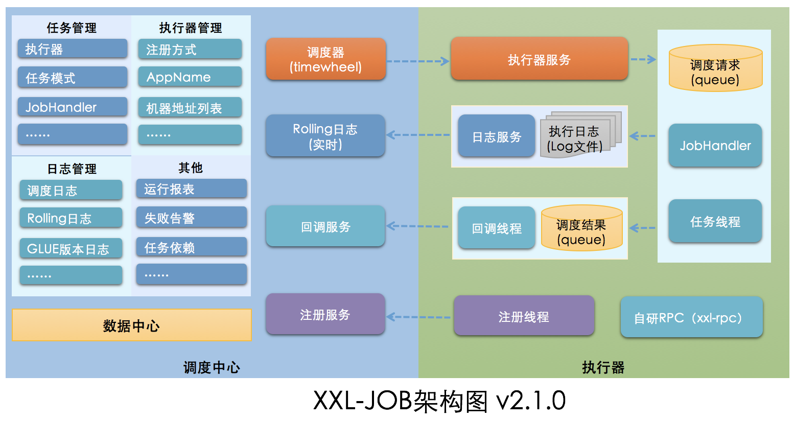
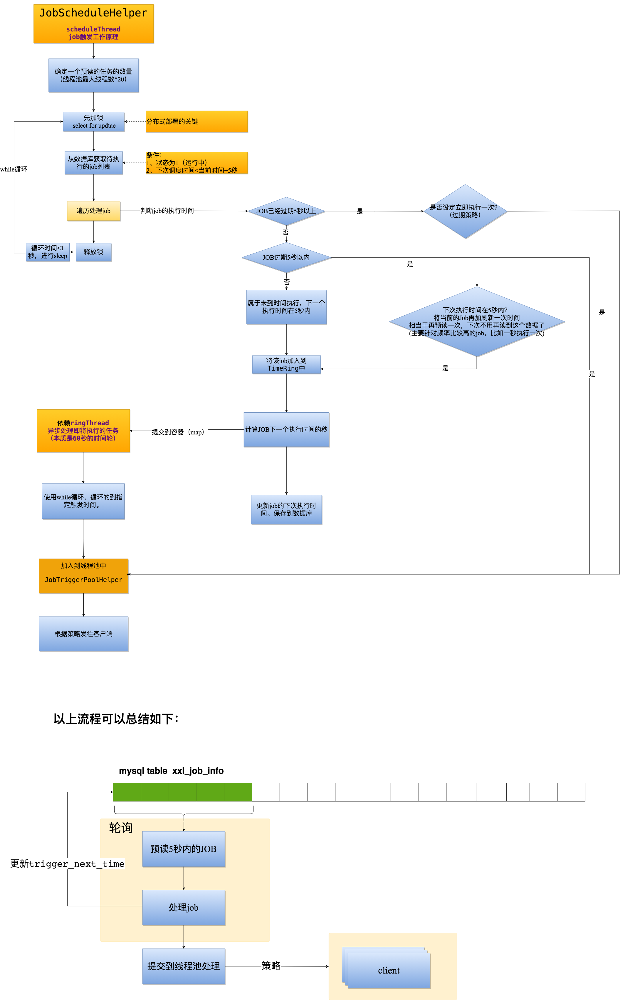
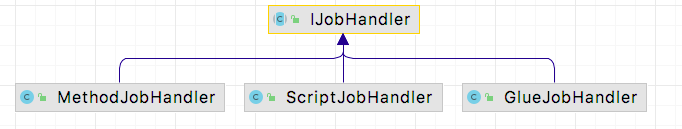
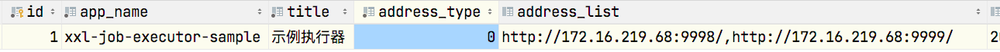
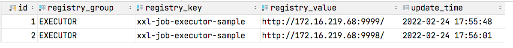

# 4 XXL-JOB

XXL-JOB是一个分布式任务调度平台，其核心设计目标是开发迅速、学习简单、轻量级、易扩展。现已开放源代码并接入多家公司线上产品线，开箱即用。由于是国产开发的，中文文档，而且很全面，具体使用方法可以直接看官方文档 [《分布式任务调度平台XXL-JOB》-官方文档](https://www.xuxueli.com/xxl-job/) 。

fe最初XXL-JOB的底层是Quartz，后来发现Quartz比较复杂，不利于扩展和维护，因此自研了一个调度器，简单但是很实用，很值得学习。

## 4.1 为什么我们需要一个分布式的调度平台

前面介绍的Timer, ScheduledExcutorService 和 Spring Task，都是针对单个实例内的任务调度，在分布式部署的时候，可能会有一定的问题。比如假设有一个任务A，是给用户发送消息的，设置每一秒执行一次，如果部署了3个实例，那么就会变成每秒执行3次，调度频率随着实例的增多而增多，如果没有加全局锁，会出现重复发送的问题。此外在实际的业务中，我们还有可能需要随时JOB的调度周期，随时停止和启动一个任务等，这些操作都需要发版才能实现。因此在分布式系统中，有一个分布式调度器尤为重要。

### 4.1.1 分布式调度平台的设计思路

通过前面的几个任务调度工具的介绍，我们可以总结出来，一个任务调度系统，包含以下几个元素：


其中，Runnable(业务逻辑)可以是任意的可执行的业务逻辑，包括一个HTTP请求。如果是通过HTTP请求调度其他服务的任务，那么就实现了一个最基本的任务调度服务。


但是，如果我们还希望任务的调度更加灵活，比如可以随时修改调度的频率，随时停止和启动，那么就必须将触发器持久化，比如存储到Mysql等。


除此以外，我们还希望这个调度服务是高可用的，因此多实例部署，加一个锁就可以了


## 4.2 XXL-JOB 的模块

从[github](https://github.com/xuxueli/xxl-job/) 上下载源码，可以看到XXL-JOB的核心模块分为2个，xxl-job-admin 和 xxl-job-core。另外的xxl-job-executor-samples是一个例子模块


核心模块的作用如下：


| 模块          | 说明               | 功能                       |
| --------------- | -------------------- | ---------------------------- |
| xxl-job-admin | 服务端（调度中心） | 管理界面+任务调度          |
| xxl-job-core  | 客户端（执行器）   | 在项目中引用，执行业务逻辑 |

从模块划分可以看出，xxl-job的任务调度和任务的执行是分开的，客户端只管执行任务，不用管任务单的调度。任务调度是由服务端执行，这样各司其职，进行了解耦，提高系统整体稳定性和扩展性

官方架构图


如果大家心中没有任务调度的概念，直接看官方架构图是有些吃力的，因此我做了简化，保留了核心部分，如下图：


从上图可以看出，XXL-JOB框架分为三个结构。

> 1、Mysql：存储相关信息
> 2、客户端：将自己注册到服务端，等待任务下发。
> 3、服务端：维护JOB的信息，将需要执行的JOB，通过一定的策略，找到对应的客户端地址，发送HTTP请求，客户端执行即可。

## 4.3 xxl-job-admin 解析

**服务端**核心类如下：


| 类                   | 功能                                             |
| ---------------------- | -------------------------------------------------- |
| JobScheduleHelper    | 调度器，将需要执行的JOB提交到线程池              |
| XxlJobInfo           | 实体类，记录了一个任务的配置，持久化到mysql中    |
| JobTriggerPoolHelper | 线程池，多个线程发送job到客户端                  |
| XxlJobTrigger        | 触发器， 真正处理 XxlJobInfo并发送到制定的客户端 |
| JobRegistryHelper    | 注册中心 ，接收客户端的注册和心跳                |

以上类处于com.xxl.job.admin.core包

### 4.3.1 服务端初始化入口

admin的初始化入口在XxlJobAdminConfig，是InitializingBean的实现类，因此在spring配置文件初始化完成后就触发了XXL-JOB的初始化

```java
@Component
public class XxlJobAdminConfig implements InitializingBean, DisposableBean {

    private XxlJobScheduler xxlJobScheduler;

    @Override
    public void afterPropertiesSet() throws Exception {
        adminConfig = this;

        xxlJobScheduler = new XxlJobScheduler();
        xxlJobScheduler.init();
    }
    //省略
}
```

从上边可以看到，真正执行初始化的类是XxlJobScheduler，初始化逻辑在init()方法中。

```java
public class XxlJobScheduler  {

   //启动了一些列的线程或者线程池来来处理相关逻辑
    public void init() throws Exception {
        // init i18n
        initI18n();
        // admin trigger pool start  触发器，触发http请求。接收JobScheduleHelper发送过来的trigger
        JobTriggerPoolHelper.toStart();
        // admin registry monitor run  处理注册上来的服务IP地址，并监控心跳等信息
        JobRegistryHelper.getInstance().start();
        // admin fail-monitor run  生成一些任务失败的告警等
        JobFailMonitorHelper.getInstance().start();
        // admin lose-monitor run ( depend on JobTriggerPoolHelper )  
        // 处理执行完成的任务，并监控丢失执行器的任务记录为失败。
        JobCompleteHelper.getInstance().start();
        // admin log report start  调度统计
        JobLogReportHelper.getInstance().start();
        // start-schedule  ( depend on JobTriggerPoolHelper )
        // 调度器
        JobScheduleHelper.getInstance().start();
    }
    //省略。。。
}
```

服务端初始化流程图如下：


XXL-JOB服务端在初始化过程中启动了多个后台线程或者线程池，用于异步处理多项任务。

### 4.3.2 JobScheduleHelper 类

从前面对任务调度的介绍可以看出，一个任务调度器，离不开

> 1.带有执行时间的任务列表
> 2.轮询执行任务的调度器

XXL-JOB 也不例外。其中JobScheduleHelper类就属于轮询执行任务的调度器，包含了任务调用的基本逻辑，属于必看的类

具体代码如下

```java

public class JobScheduleHelper {
    //预读5秒
    public static final long PRE_READ_MS = 5000;    // pre read
    //时间轮刻度-任务ID映射表
    private volatile static Map<Integer, List<Integer>> ringData = new ConcurrentHashMap<>();

    public void start(){
        scheduleThread = new Thread(new Runnable() {
            @Override
            public void run() {
                // 按照默认配置 （快200+慢100）* 20 = 6000
                int preReadCount = (XxlJobAdminConfig.getAdminConfig().getTriggerPoolFastMax() + XxlJobAdminConfig.getAdminConfig().getTriggerPoolSlowMax()) * 20;

                while (!scheduleThreadToStop) {
                    // Scan Job
                    long start = System.currentTimeMillis();
                    //数据库连接
                    Connection conn = null;
                    PreparedStatement preparedStatement = null;

                    boolean preReadSuc = true;
                    try {

                        conn = XxlJobAdminConfig.getAdminConfig().getDataSource().getConnection();
                        conn.setAutoCommit(false);
                        //加锁
                        preparedStatement = conn.prepareStatement(  "select * from xxl_job_lock where lock_name = 'schedule_lock' for update" );
                        preparedStatement.execute();

                        // 1、预读 查询数据库，获取下次执行时间 <= 当前时间+5秒 的所有JOB
                        long nowTime = System.currentTimeMillis();
  
                        //SELECT * FROM xxl_job_info AS t WHERE t.trigger_status = 1 and t.trigger_next_time <= #{maxNextTime} ORDER BY id ASC LIMIT #{pagesize}
                        List<XxlJobInfo> scheduleList = XxlJobAdminConfig.getAdminConfig().getXxlJobInfoDao().scheduleJobQuery(nowTime + PRE_READ_MS, preReadCount);
  
                        if (scheduleList!=null && scheduleList.size()>0) {
                            // 2、遍历处理JOB，看是直接提交给线程池还是先提交到 time-ring后再提交给线程池。
                            for (XxlJobInfo jobInfo: scheduleList) {
                                // time-ring jump
                                if (nowTime > jobInfo.getTriggerNextTime() + PRE_READ_MS) {
                                    // 2.1、超时>5秒以上，当做错失触发时机

                                    // 1、超时触发策略
                                    MisfireStrategyEnum misfireStrategyEnum = MisfireStrategyEnum.match(jobInfo.getMisfireStrategy(), MisfireStrategyEnum.DO_NOTHING);
  
                                    if (MisfireStrategyEnum.FIRE_ONCE_NOW == misfireStrategyEnum) {
                                        // FIRE_ONCE_NOW 》 trigger
                                        JobTriggerPoolHelper.trigger(jobInfo.getId(), TriggerTypeEnum.MISFIRE, -1, null, null, null);
                                    }
                                    // 2、更新时间
                                    refreshNextValidTime(jobInfo, new Date());

                                } else if (nowTime > jobInfo.getTriggerNextTime()) {
                                    // 2.2、超时时间在5秒以内
                                    // 1、提交到线程池
                                    JobTriggerPoolHelper.trigger(jobInfo.getId(), TriggerTypeEnum.CRON, -1, null, null, null);
                                    // 2、刷新一次时间
                                    refreshNextValidTime(jobInfo, new Date());
                                    if (jobInfo.getTriggerStatus()==1 && nowTime + PRE_READ_MS > jobInfo.getTriggerNextTime()) {
                                       //下次执行在5秒内，说明下次循环还有它，可以再预读一次，直接提交到时间轮，提高想能
                                        // 1、计算时间轮刻度
                                        int ringSecond = (int)((jobInfo.getTriggerNextTime()/1000)%60);
                                        // 2、提交到时间轮
                                        pushTimeRing(ringSecond, jobInfo.getId());
                                        // 3、再更新一次时间
                                        refreshNextValidTime(jobInfo, new Date(jobInfo.getTriggerNextTime()));

                                    }

                                } else {
                                    // 2.3、未到执行时间
                                    // 1、计算时间轮刻度(60秒时间轮)
                                    int ringSecond = (int)((jobInfo.getTriggerNextTime()/1000)%60);
                                    // 2、提交到时间轮线程
                                    pushTimeRing(ringSecond, jobInfo.getId());
                                    // 3、刷新
                                    refreshNextValidTime(jobInfo, new Date(jobInfo.getTriggerNextTime()));
                                }
                            }
                            // 3、将修改了下次执行时间的任务存到数据库中
                            for (XxlJobInfo jobInfo: scheduleList) {
                                XxlJobAdminConfig.getAdminConfig().getXxlJobInfoDao().scheduleUpdate(jobInfo);
                            }
                        } else {
                            preReadSuc = false;
                        }
                    } finally {
                        //省略处理数据库连接
                    }
                    long cost = System.currentTimeMillis()-start;
                    //省略。。。
                }
            }
        });
        scheduleThread.setDaemon(true);
        scheduleThread.setName("xxl-job, admin JobScheduleHelper#scheduleThread");
        scheduleThread.start();
  
        // ring thread
        ringThread = new Thread(new Runnable() {
            @Override
            public void run() {

                while (!ringThreadToStop) {

                    //时间轮代码，忽略
                }
                logger.info(">>>>>>>>>>> xxl-job, JobScheduleHelper#ringThread stop");
            }
        });
        ringThread.setDaemon(true);
        ringThread.setName("xxl-job, admin JobScheduleHelper#ringThread");
        ringThread.start();
    }
    //忽略其他代码
}

```

源码逻辑解析


从以上逻辑看，XXL-JOB的核心逻辑与JDK的 ScheduledExecutorService 是基本类似的。都是先从一个队列（xxl-job是使用mysql排序）中取出JOB，然后提交给线程池处理。

但有一点区别：XXL-JOB是从数据库读取数据，因此为了提高性能，做了一个预读5秒的变化。未到时间执行的job提交给时间轮，再由时间轮提交给线程池处理。

### 4.3.3  XxlJobTrigger 类

经过JobScheduleHelper调度，job的参数会被提交的线程池，线程池由JobTriggerPoolHelper实现，比较简单，不再描述，然后最终会使用 XxlJobTrigger 是触发执行job的地方。

```java
public class XxlJobTrigger {
   
    public static void trigger(int jobId,
                               TriggerTypeEnum triggerType,
                               int failRetryCount,
                               String executorShardingParam,
                               String executorParam,
                               String addressList) {

        //1、 从数据库获取job配置
        XxlJobInfo jobInfo = XxlJobAdminConfig.getAdminConfig().getXxlJobInfoDao().loadById(jobId);
        if (jobInfo == null) {
            return;
        }
        if (executorParam != null) {
            //如果传参就覆盖
            jobInfo.setExecutorParam(executorParam);
        }
        int finalFailRetryCount = failRetryCount>=0?failRetryCount:jobInfo.getExecutorFailRetryCount();
  
        // 2 从数据库获取分组信息（本质就是获取接收job的地址）
        XxlJobGroup group = XxlJobAdminConfig.getAdminConfig().getXxlJobGroupDao().load(jobInfo.getJobGroup());

        // cover addressList
        if (addressList!=null && addressList.trim().length()>0) {
            group.setAddressType(1);
            //传参的话就覆盖
            group.setAddressList(addressList.trim());
        }

        // sharding param
        int[] shardingParam = null;
        if (executorShardingParam!=null){
            String[] shardingArr = executorShardingParam.split("/");
            if (shardingArr.length==2 && isNumeric(shardingArr[0]) && isNumeric(shardingArr[1])) {
                shardingParam = new int[2];
                shardingParam[0] = Integer.valueOf(shardingArr[0]);
                shardingParam[1] = Integer.valueOf(shardingArr[1]);
            }
        }
        if (ExecutorRouteStrategyEnum.SHARDING_BROADCAST==ExecutorRouteStrategyEnum.match(jobInfo.getExecutorRouteStrategy(), null)
                && group.getRegistryList()!=null && !group.getRegistryList().isEmpty()
                && shardingParam==null) {
            //分片
            for (int i = 0; i < group.getRegistryList().size(); i++) {
                processTrigger(group, jobInfo, finalFailRetryCount, triggerType, i, group.getRegistryList().size());
            }
        } else {
            if (shardingParam == null) {
                //分片参数，这里意思是只发给一个地址。
                shardingParam = new int[]{0, 1};
            }
            processTrigger(group, jobInfo, finalFailRetryCount, triggerType, shardingParam[0], shardingParam[1]);
        }

    }

    /**
     * @param group                     job group, registry list may be empty
     * @param jobInfo
     * @param finalFailRetryCount  纯粹是为了打日志
     * @param triggerType          为了打日志
     * @param index                     sharding index
     * @param total                     sharding index
     */
    private static void processTrigger(XxlJobGroup group, XxlJobInfo jobInfo, int finalFailRetryCount, TriggerTypeEnum triggerType, int index, int total){

        //阻塞策略
        ExecutorBlockStrategyEnum blockStrategy = ExecutorBlockStrategyEnum.match(jobInfo.getExecutorBlockStrategy(), ExecutorBlockStrategyEnum.SERIAL_EXECUTION);  // block strategy
       //路由策略 就是如何发给客户端，如第一个，最后一个，一致性哈希
        ExecutorRouteStrategyEnum executorRouteStrategyEnum = ExecutorRouteStrategyEnum.match(jobInfo.getExecutorRouteStrategy(), null);    // route strategy
       //分片参数 日志记录用
        String shardingParam = (ExecutorRouteStrategyEnum.SHARDING_BROADCAST==executorRouteStrategyEnum)?String.valueOf(index).concat("/").concat(String.valueOf(total)):null;

        // 1、save log-id
        XxlJobLog jobLog = new XxlJobLog();
        jobLog.setJobGroup(jobInfo.getJobGroup());
        jobLog.setJobId(jobInfo.getId());
        jobLog.setTriggerTime(new Date());
  
        //记录日志
        XxlJobAdminConfig.getAdminConfig().getXxlJobLogDao().save(jobLog);

        // 2、组装参数
        TriggerParam triggerParam = new TriggerParam();
        triggerParam.setJobId(jobInfo.getId());
        triggerParam.setExecutorHandler(jobInfo.getExecutorHandler());
        triggerParam.setExecutorParams(jobInfo.getExecutorParam());
        triggerParam.setExecutorBlockStrategy(jobInfo.getExecutorBlockStrategy());
        triggerParam.setExecutorTimeout(jobInfo.getExecutorTimeout());
        triggerParam.setLogId(jobLog.getId());
        triggerParam.setLogDateTime(jobLog.getTriggerTime().getTime());
        triggerParam.setGlueType(jobInfo.getGlueType());
        triggerParam.setGlueSource(jobInfo.getGlueSource());
        triggerParam.setGlueUpdatetime(jobInfo.getGlueUpdatetime().getTime());
        triggerParam.setBroadcastIndex(index);
        triggerParam.setBroadcastTotal(total);

        // 3、init address
        String address = null;
        ReturnT<String> routeAddressResult = null;
        if (group.getRegistryList()!=null && !group.getRegistryList().isEmpty()) {
            if (ExecutorRouteStrategyEnum.SHARDING_BROADCAST == executorRouteStrategyEnum) {
                //广播模式，获取指定下标的 url 。
                if (index < group.getRegistryList().size()) {
                    address = group.getRegistryList().get(index);
                } else {
                    address = group.getRegistryList().get(0);
                }
            } else {
                //根据路由策略获取 url.
                routeAddressResult = executorRouteStrategyEnum.getRouter().route(triggerParam, group.getRegistryList());
                if (routeAddressResult.getCode() == ReturnT.SUCCESS_CODE) {
                    address = routeAddressResult.getContent();
                }
            }
        } else {
            routeAddressResult = new ReturnT<String>(ReturnT.FAIL_CODE, I18nUtil.getString("jobconf_trigger_address_empty"));
        }

        // 4、trigger remote executor
        ReturnT<String> triggerResult = null;
        if (address != null) {
            triggerResult = runExecutor(triggerParam, address);
        } else {
            triggerResult = new ReturnT<String>(ReturnT.FAIL_CODE, null);
        }
  
        // 5、collection trigger info
        //忽略一长串组装日志代码
   
        //保存日志
        XxlJobAdminConfig.getAdminConfig().getXxlJobLogDao().updateTriggerInfo(jobLog);
    }

  
    //根据地址url，将参数发送到指定的客户端。
    public static ReturnT<String> runExecutor(TriggerParam triggerParam, String address){
        ReturnT<String> runResult = null;
        try {
            ExecutorBiz executorBiz = XxlJobScheduler.getExecutorBiz(address);
            runResult = executorBiz.run(triggerParam);
        } catch (Exception e) {
            logger.error(">>>>>>>>>>> xxl-job trigger error, please check if the executor[{}] is running.", address, e);
            runResult = new ReturnT<String>(ReturnT.FAIL_CODE, ThrowableUtil.toString(e));
        }

        StringBuffer runResultSB = new StringBuffer(I18nUtil.getString("jobconf_trigger_run") + "：");
        runResultSB.append("<br>address：").append(address);
        runResultSB.append("<br>code：").append(runResult.getCode());
        runResultSB.append("<br>msg：").append(runResult.getMsg());

        runResult.setMsg(runResultSB.toString());
        return runResult;
    }

}

```

总结以上XxlJobTrigger类的代码，做了几件事

> 1、根据jobId从数据库获取job参数
> 2、根据job参数获取groupId后，再获取分组信息，里面包含了分组中的客户端 ip:port地址。
> 3、根据路由策略，获取指定的address，将job参数通过http发送往客户端。
> 4、记录日志。

### 4.3.4 JobRegistryHelper 类

客户端会定时上报自身的ip+port，JobRegistryHelper就是专门处理这些信息的。
实现类比较简单，就补贴源码了，只讲一下逻辑。
1、定义了一个线程池，专门保存或者修改用来处理客户端上报的address。
2、定义了一个后台线程，周期性（30s）处理以下逻辑：清除过期的客户端注册信息（30*3s不上报），将最新的address更新到各自的任务组中。

### 4.3.4 路由策略

路由策略抽象类为 ExecutorRouter，在配置job的时候指定的路由策略，就有对应的ExecutorRouter子类去实现。

```java
public abstract class ExecutorRouter {

    /**
     * route address
     * @param addressList
     * @return  ReturnT.content=address
     */
    public abstract ReturnT<String> route(TriggerParam triggerParam, List<String> addressList);

}
```

> 1、第一个：直接取addressList第一个地址
> 2、最后一个：直接取 addressList最后地址
> 3、轮询: 对调度次数进行计数n，n%addressList.size获取地址下标。
> 4、随机: 随机取一个。
> 5、一致性hash: 使用java.util.TreeMap.tailMap()方法来实现。[负载均衡之一致性哈希环算法](http://betheme.net/news/txtlist_i105436v.html)
> 6、最不经常使用：LFU(Least Frequently Used)：最不经常使用，频率/次数
> 7、最近最久未使用：LRU(Least Recently Used)：最近最久未使用，时间
> 8、故障转移：对addressList进行循环http请求，第一个正常返回的地址作为调度地州。
> 9、忙碌转移：通过http请求客户端检查JobThread，第一个空闲的客户端作为调度客户端。
> 10、分片广播：发送给所有的客户端。

## 4.4 客户端逻辑

**客户端**核心类如下：


| 类              | 功能             | 说明                                                                                                          |
| ----------------- | ------------------ | --------------------------------------------------------------------------------------------------------------- |
| XxlJob          | Task注解         | 被标注的方法将会被处理成为 IJobHandler, 与@Scheduled注解功能相似 （19年底新增注解）。 每个IJobHandler有唯标识 |
| EmbedServer     | 客户端server     | 启动一个netty,用于接收服务端的调度                                                                            |
| ExecutorBizImpl | 处理服务端的请求 | EmbedServer接收请求后，实际交给ExecutorBizImpl进行处理，里面有处理阻塞策略                                    |
| TriggerParam    | 触发参数         | 记录服务端发送过来的任务                                                                                      |
| JobThread       | Job线程          | 用 LinkedBlockingQueue 缓存服务端传递过来的 TriggerParam。轮询 LinkedBlockingQueue，顺序处理同一个job的任务   |
| IJobHandler     | Task抽象类       | 被@XxlJob的注释的方法，或者通过服务端传递过来的代码，将会封装成为一个  IJobHandler    实现类                  |
| XxlJobContext   | 上下文           | 内置InheritableThreadLocal，在线程中存储变量，供给IJobHandler                                                 |

从以上表格基本可以看出客户端的执行逻辑，其中比较重要的是 ExecutorBizImpl 和 JobThread，以及XxlJob注解的原理。 将会对这三个类进行介绍。

### 4.4.1 @XxlJob 注解原理

在客户端引入XXL-JOB的时候，一般需要进行如下配置

```java
    @Bean
    public XxlJobSpringExecutor xxlJobExecutor() {
        logger.info(">>>>>>>>>>> xxl-job config init.");
        XxlJobSpringExecutor xxlJobSpringExecutor = new XxlJobSpringExecutor();
        xxlJobSpringExecutor.setAdminAddresses(adminAddresses);
        xxlJobSpringExecutor.setAppname(appname);
        xxlJobSpringExecutor.setAddress(address);
        xxlJobSpringExecutor.setIp(ip);
        xxlJobSpringExecutor.setPort(port);
        xxlJobSpringExecutor.setAccessToken(accessToken);
        xxlJobSpringExecutor.setLogPath(logPath);
        xxlJobSpringExecutor.setLogRetentionDays(logRetentionDays);
        return xxlJobSpringExecutor;
    }
```

查看XxlJobSpringExecutor 具体代码如下

```java
public class XxlJobSpringExecutor extends XxlJobExecutor implements ApplicationContextAware, SmartInitializingSingleton, DisposableBean {
    // start
    @Override
    public void afterSingletonsInstantiated() {
        // init JobHandler Repository (for method)
        initJobHandlerMethodRepository(applicationContext);
        // refresh GlueFactory
        GlueFactory.refreshInstance(1);

        // super start
        try {
            super.start();
        } catch (Exception e) {
            throw new RuntimeException(e);
        }
    }

  
    //通过Spring的ApplicationContext，获取到使用了@XxlJob注解的类，缓存起来。
    private void initJobHandlerMethodRepository(ApplicationContext applicationContext) {
        if (applicationContext == null) {
            return;
        }
        // init job handler from method
        String[] beanDefinitionNames = applicationContext.getBeanNamesForType(Object.class, false, true);
        for (String beanDefinitionName : beanDefinitionNames) {
            Object bean = applicationContext.getBean(beanDefinitionName);

            Map<Method, XxlJob> annotatedMethods = null;   // referred to ：org.springframework.context.event.EventListenerMethodProcessor.processBean
            try {
                annotatedMethods = MethodIntrospector.selectMethods(bean.getClass(),
                        new MethodIntrospector.MetadataLookup<XxlJob>() {
                            @Override
                            public XxlJob inspect(Method method) {
                                return AnnotatedElementUtils.findMergedAnnotation(method, XxlJob.class);
                            }
                        });
            } catch (Throwable ex) {
                logger.error("xxl-job method-jobhandler resolve error for bean[" + beanDefinitionName + "].", ex);
            }
            if (annotatedMethods==null || annotatedMethods.isEmpty()) {
                continue;
            }

            for (Map.Entry<Method, XxlJob> methodXxlJobEntry : annotatedMethods.entrySet()) {
                Method executeMethod = methodXxlJobEntry.getKey();
                XxlJob xxlJob = methodXxlJobEntry.getValue();
                // 父类核心方法
                registJobHandler(xxlJob, bean, executeMethod);
            }
        }
    }

  

}
```

继续看父类XxlJobExecutor，可以看到使用一个ConcurrentMap缓存了包装过的业务方法。其中key为每个job的唯一标识，与服务端的key一一对应。

```java
public class XxlJobExecutor {
    //使用一个ConcurrentMap缓存了包装过的业务方法。其中key为每个job的唯一标识，与服务端的key一一对应。
    private static ConcurrentMap<String, IJobHandler> jobHandlerRepository = new ConcurrentHashMap<String, IJobHandler>();

    protected void registJobHandler(XxlJob xxlJob, Object bean, Method executeMethod){
        if (xxlJob == null) {
            return;
        }

        String name = xxlJob.value();
        //make and simplify the variables since they'll be called several times later
        Class<?> clazz = bean.getClass();
        String methodName = executeMethod.getName();
        if (name.trim().length() == 0) {
            throw new RuntimeException("xxl-job method-jobhandler name invalid, for[" + clazz + "#" + methodName + "] .");
        }
        if (loadJobHandler(name) != null) {
            throw new RuntimeException("xxl-job jobhandler[" + name + "] naming conflicts.");
        }

   

        executeMethod.setAccessible(true);

        // init and destroy
        Method initMethod = null;
        Method destroyMethod = null;
        //初始化代码
        if (xxlJob.init().trim().length() > 0) {
            try {
                initMethod = clazz.getDeclaredMethod(xxlJob.init());
                initMethod.setAccessible(true);
            } catch (NoSuchMethodException e) {
                throw new RuntimeException("xxl-job method-jobhandler initMethod invalid, for[" + clazz + "#" + methodName + "] .");
            }
        }
        //销毁代码
        if (xxlJob.destroy().trim().length() > 0) {
            try {
                destroyMethod = clazz.getDeclaredMethod(xxlJob.destroy());
                destroyMethod.setAccessible(true);
            } catch (NoSuchMethodException e) {
                throw new RuntimeException("xxl-job method-jobhandler destroyMethod invalid, for[" + clazz + "#" + methodName + "] .");
            }
        }

        // registry jobhandler
        registJobHandler(name, new MethodJobHandler(bean, executeMethod, initMethod, destroyMethod));

    }
    public static IJobHandler registJobHandler(String name, IJobHandler jobHandler){
        logger.info(">>>>>>>>>>> xxl-job register jobhandler success, name:{}, jobHandler:{}", name, jobHandler);
        return jobHandlerRepository.put(name, jobHandler);
    }
}
```

最终包装成为了MethodJobHandler

```java
public class MethodJobHandler extends IJobHandler {

    private final Object target;
    private final Method method;
    private Method initMethod;
    private Method destroyMethod;
}
```

以上流程总结如下

> 在spring启动，所有单例类都创建完成后，触发从ApplicationContext获取所有标注了 @XxlJob的bean和对应方法。最终封装成为MethodJobHandler，存储到了了一个ConcurrentMap中。key为JOB的唯一标识，与服务端一对一对应。等待服务端的调用。

### 4.4.2 JobThread

从@XxlJob的原理，可以看到，一个job最终会被封装成为MethodJobHandler，那么客户端如何处理服务端下发的调度任务呢。
J
obThread是真正客户端真正执行任务的地方。每一个JAVA类型的JOB都会对应一个JobThread。

```java
public class JobThread extends Thread{
	private static Logger logger = LoggerFactory.getLogger(JobThread.class);

	private int jobId;
    //标注了@XxlJob的方法或者从前端传过来的代码脚本。
	private IJobHandler handler;
    // 存储服务端穿过来的请求，如果前一个任务没有执行文，后续的会继续存在这里。
	private LinkedBlockingQueue<TriggerParam> triggerQueue;
    // 服务端每发送一次到客户端，会生成一个唯一的JOBid，可以用来做幂等，防止HTTP请求重试等造成重复调用。
	private Set<Long> triggerLogIdSet;

	private volatile boolean toStop = false;
	private String stopReason;

    private boolean running = false;    // if running job
	private int idleTimes = 0;			// idel times


	public JobThread(int jobId, IJobHandler handler) {
		this.jobId = jobId;
		this.handler = handler;
		this.triggerQueue = new LinkedBlockingQueue<TriggerParam>();
		this.triggerLogIdSet = Collections.synchronizedSet(new HashSet<Long>());

		// assign job thread name
		this.setName("xxl-job, JobThread-"+jobId+"-"+System.currentTimeMillis());
	}
	public IJobHandler getHandler() {
		return handler;
	}

    //存储服务端调度请求
	public ReturnT<String> pushTriggerQueue(TriggerParam triggerParam) {
		// avoid repeat
		if (triggerLogIdSet.contains(triggerParam.getLogId())) {
			logger.info(">>>>>>>>>>> repeate trigger job, logId:{}", triggerParam.getLogId());
			return new ReturnT<String>(ReturnT.FAIL_CODE, "repeate trigger job, logId:" + triggerParam.getLogId());
		}

		triggerLogIdSet.add(triggerParam.getLogId());
		triggerQueue.add(triggerParam);
        return ReturnT.SUCCESS;
	}

   //杀死调度任务
	public void toStop(String stopReason) {
		/**
		 * Thread.interrupt只支持终止线程的阻塞状态(wait、join、sleep)，
		 * 在阻塞出抛出InterruptedException异常,但是并不会终止运行的线程本身；
		 * 所以需要注意，此处彻底销毁本线程，需要通过共享变量方式；
		 */
		this.toStop = true;
		this.stopReason = stopReason;
	}

    //启动线程
    @Override
	public void run() {

    	// init
    	try {
			handler.init();
		} catch (Throwable e) {
    		logger.error(e.getMessage(), e);
		}

		// 死循环知道停止
		while(!toStop){
			running = false;
            //统计空闲次数 超过30次就终止线程
			idleTimes++;

            TriggerParam triggerParam = null;
            try {
				// to check toStop signal, we need cycle, so wo cannot use queue.take(), instand of poll(timeout)
				triggerParam = triggerQueue.poll(3L, TimeUnit.SECONDS);
				if (triggerParam!=null) {
					running = true;
					idleTimes = 0;
					triggerLogIdSet.remove(triggerParam.getLogId());

					// 创建日志文件，用于存储日志，日志异步上报。
					String logFileName = XxlJobFileAppender.makeLogFileName(new Date(triggerParam.getLogDateTime()), triggerParam.getLogId());
					XxlJobContext xxlJobContext = new XxlJobContext(
							triggerParam.getJobId(),
							triggerParam.getExecutorParams(),
							logFileName,
							triggerParam.getBroadcastIndex(),
							triggerParam.getBroadcastTotal());

					// 初始化上下文，使用InheritableThreadLocal保存
					XxlJobContext.setXxlJobContext(xxlJobContext);

					// execute
					XxlJobHelper.log("<br>----------- xxl-job job execute start -----------<br>----------- Param:" + xxlJobContext.getJobParam());

					if (triggerParam.getExecutorTimeout() > 0) {
						// 设定调度过期时间
						Thread futureThread = null;
						try {
							FutureTask<Boolean> futureTask = new FutureTask<Boolean>(new Callable<Boolean>() {
								@Override
								public Boolean call() throws Exception {

									// init job context
									XxlJobContext.setXxlJobContext(xxlJobContext);

									handler.execute();
									return true;
								}
							});
							futureThread = new Thread(futureTask);
							futureThread.start();

							Boolean tempResult = futureTask.get(triggerParam.getExecutorTimeout(), TimeUnit.SECONDS);
						} catch (TimeoutException e) {

							XxlJobHelper.log("<br>----------- xxl-job job execute timeout");
							XxlJobHelper.log(e);

							// handle result
							XxlJobHelper.handleTimeout("job execute timeout ");
						} finally {
							futureThread.interrupt();
						}
					} else {
						//没有过期时间，直接执行
						handler.execute();
					}

					// 处理执行结果
					if (XxlJobContext.getXxlJobContext().getHandleCode() <= 0) {
						XxlJobHelper.handleFail("job handle result lost.");
					} else {
						String tempHandleMsg = XxlJobContext.getXxlJobContext().getHandleMsg();
						tempHandleMsg = (tempHandleMsg!=null&&tempHandleMsg.length()>50000)
								?tempHandleMsg.substring(0, 50000).concat("...")
								:tempHandleMsg;
						XxlJobContext.getXxlJobContext().setHandleMsg(tempHandleMsg);
					}
					XxlJobHelper.log("<br>----------- xxl-job job execute end(finish) -----------<br>----------- Result: handleCode="
							+ XxlJobContext.getXxlJobContext().getHandleCode()
							+ ", handleMsg = "
							+ XxlJobContext.getXxlJobContext().getHandleMsg()
					);

				} else {
					if (idleTimes > 30) {
						if(triggerQueue.size() == 0) {	// avoid concurrent trigger causes jobId-lost
							XxlJobExecutor.removeJobThread(jobId, "excutor idel times over limit.");
						}
					}
				}
			} catch (Throwable e) {
				if (toStop) {
					XxlJobHelper.log("<br>----------- JobThread toStop, stopReason:" + stopReason);
				}

				// handle result
				StringWriter stringWriter = new StringWriter();
				e.printStackTrace(new PrintWriter(stringWriter));
				String errorMsg = stringWriter.toString();

				XxlJobHelper.handleFail(errorMsg);

				XxlJobHelper.log("<br>----------- JobThread Exception:" + errorMsg + "<br>----------- xxl-job job execute end(error) -----------");
			} finally {
                if(triggerParam != null) {
                    // callback handler info
                    if (!toStop) {
                        // 提交处理结果到队列中，等待上报
                        TriggerCallbackThread.pushCallBack(new HandleCallbackParam(
                        		triggerParam.getLogId(),
								triggerParam.getLogDateTime(),
								XxlJobContext.getXxlJobContext().getHandleCode(),
								XxlJobContext.getXxlJobContext().getHandleMsg() )
						);
                    } else {
                        // 提交处理结果到队列中，等待上报
                        TriggerCallbackThread.pushCallBack(new HandleCallbackParam(
                        		triggerParam.getLogId(),
								triggerParam.getLogDateTime(),
								XxlJobContext.HANDLE_CODE_FAIL,
								stopReason + " [job running, killed]" )
						);
                    }
                }
            }
        }

		// callback trigger request in queue
		while(triggerQueue !=null && triggerQueue.size()>0){
			TriggerParam triggerParam = triggerQueue.poll();
			if (triggerParam!=null) {
				// is killed
				TriggerCallbackThread.pushCallBack(new HandleCallbackParam(
						triggerParam.getLogId(),
						triggerParam.getLogDateTime(),
						XxlJobContext.HANDLE_CODE_FAIL,
						stopReason + " [job not executed, in the job queue, killed.]")
				);
			}
		}

		// destroy
		try {
			handler.destroy();
		} catch (Throwable e) {
			logger.error(e.getMessage(), e);
		}

		logger.info(">>>>>>>>>>> xxl-job JobThread stoped, hashCode:{}", Thread.currentThread());
	}
}
```



### 4.4.3 ExecutorBizImpl

客户端在启动后，会在EmbedServer实例中启动一个netty专门接收从服务端发送来的请求。其中包括检查服务端心跳，job线程心跳，终止调度，读取日志以及JOB调度等，都是交给ExecutorBizImpl进行处理。这里主要介绍下任务调度的过程：

```java
public class ExecutorBizImpl implements ExecutorBiz {

    @Override
    public ReturnT<String> run(TriggerParam triggerParam) {
        // 根据id获取 JOB的执行线程JobThread
        JobThread jobThread = XxlJobExecutor.loadJobThread(triggerParam.getJobId());
        // 获取jobThread内部的 jobHandler
        IJobHandler jobHandler = jobThread!=null?jobThread.getHandler():null;
        String removeOldReason = null;

        // valid：jobHandler + jobThread
        GlueTypeEnum glueTypeEnum = GlueTypeEnum.match(triggerParam.getGlueType());
        if (GlueTypeEnum.BEAN == glueTypeEnum) {

            // new jobhandler
            IJobHandler newJobHandler = XxlJobExecutor.loadJobHandler(triggerParam.getExecutorHandler());

            // valid old jobThread
            if (jobThread!=null && jobHandler != newJobHandler) {
                // change handler, need kill old thread
                removeOldReason = "change jobhandler or glue type, and terminate the old job thread.";

                jobThread = null;
                jobHandler = null;
            }

            // valid handler
            if (jobHandler == null) {
                jobHandler = newJobHandler;
                if (jobHandler == null) {
                    return new ReturnT<String>(ReturnT.FAIL_CODE, "job handler [" + triggerParam.getExecutorHandler() + "] not found.");
                }
            }

        } else if (GlueTypeEnum.GLUE_GROOVY == glueTypeEnum) {

            // valid old jobThread
            if (jobThread != null &&
                    !(jobThread.getHandler() instanceof GlueJobHandler
                        && ((GlueJobHandler) jobThread.getHandler()).getGlueUpdatetime()==triggerParam.getGlueUpdatetime() )) {
                // change handler or gluesource updated, need kill old thread
                removeOldReason = "change job source or glue type, and terminate the old job thread.";

                jobThread = null;
                jobHandler = null;
            }

            // valid handler
            if (jobHandler == null) {
                try {
                    IJobHandler originJobHandler = GlueFactory.getInstance().loadNewInstance(triggerParam.getGlueSource());
                    jobHandler = new GlueJobHandler(originJobHandler, triggerParam.getGlueUpdatetime());
                } catch (Exception e) {
                    logger.error(e.getMessage(), e);
                    return new ReturnT<String>(ReturnT.FAIL_CODE, e.getMessage());
                }
            }
        } else if (glueTypeEnum!=null && glueTypeEnum.isScript()) {

            // valid old jobThread
            if (jobThread != null &&
                    !(jobThread.getHandler() instanceof ScriptJobHandler
                            && ((ScriptJobHandler) jobThread.getHandler()).getGlueUpdatetime()==triggerParam.getGlueUpdatetime() )) {
                // change script or gluesource updated, need kill old thread
                removeOldReason = "change job source or glue type, and terminate the old job thread.";

                jobThread = null;
                jobHandler = null;
            }

            // valid handler
            if (jobHandler == null) {
                jobHandler = new ScriptJobHandler(triggerParam.getJobId(), triggerParam.getGlueUpdatetime(), triggerParam.getGlueSource(), GlueTypeEnum.match(triggerParam.getGlueType()));
            }
        } else {
            return new ReturnT<String>(ReturnT.FAIL_CODE, "glueType[" + triggerParam.getGlueType() + "] is not valid.");
        }

        // executor block strategy
        if (jobThread != null) {
            ExecutorBlockStrategyEnum blockStrategy = ExecutorBlockStrategyEnum.match(triggerParam.getExecutorBlockStrategy(), null);
            if (ExecutorBlockStrategyEnum.DISCARD_LATER == blockStrategy) {
                // discard when running
                if (jobThread.isRunningOrHasQueue()) {
                    return new ReturnT<String>(ReturnT.FAIL_CODE, "block strategy effect："+ExecutorBlockStrategyEnum.DISCARD_LATER.getTitle());
                }
            } else if (ExecutorBlockStrategyEnum.COVER_EARLY == blockStrategy) {
                // kill running jobThread
                if (jobThread.isRunningOrHasQueue()) {
                    removeOldReason = "block strategy effect：" + ExecutorBlockStrategyEnum.COVER_EARLY.getTitle();

                    jobThread = null;
                }
            } else {
                // just queue trigger
            }
        }

        // replace thread (new or exists invalid)
        if (jobThread == null) {
            jobThread = XxlJobExecutor.registJobThread(triggerParam.getJobId(), jobHandler, removeOldReason);
        }

        // push data to queue
        ReturnT<String> pushResult = jobThread.pushTriggerQueue(triggerParam);
        return pushResult;
    }
}
```

## 4.5 几个表格作用

xxl_job_group：任务分组。一个执行器算作一个组。每组下面会记录对应的实例地址。

xxl_job_info：具体的任务信息。
xxl_job_lock：分布式锁
xxl_job_log：日志
xxl_job_log_report：调度统计
xxl_job_logglue： 可以记录GLUE模式代码历史版本
xxl_job_registry：注册信息表，每一台机器注册上来，都会记录一条记录。

xxl_job_user：用户表

其中xxl_job_group，xxl_job_info，xxl_job_lock是调度器的关键，其他的是起到支撑辅助作用。
