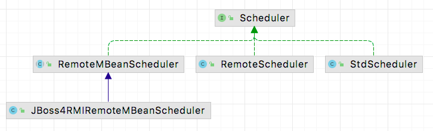
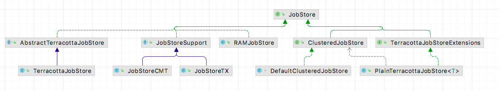

# 5 Quartz

## 5.1 什么是 Quartz

从 [Quartz官网](http://www.quartz-scheduler.org/) 简介可以知道，
Quartz 是一个开源的任务调度框架，可以用于单体应用，也可以用于大型的电子商务平台，支持成千上万的任务。

## 5.1 Quartz 简单demo

新建一个maven项目，引入依赖

```xml
<dependency>
   <groupId>org.quartz-scheduler</groupId>
   <artifactId>quartz</artifactId>
   <version>2.3.1</version>
</dependency>
```

````java
public class Application {
    public static void main(String[] args) {
        try {
            Scheduler scheduler = StdSchedulerFactory.getDefaultScheduler();
            scheduler.start();
            //定义一个工作对象 设置工作名称与组名
            JobDetail job = JobBuilder.newJob(HelloJob.class).withIdentity("job41","group1").build();
            //定义一个触发器 简单Trigger 设置工作名称与组名 5秒触发一次
            Trigger trigger = TriggerBuilder.newTrigger().withIdentity("trigger1","group1").startNow().withSchedule(SimpleScheduleBuilder.repeatSecondlyForever(5)).build();
            //设置工作 与触发器
            scheduler.scheduleJob(job, trigger);
//            scheduler.shutdown();
        } catch (SchedulerException se) {
            se.printStackTrace();
        }
    }
}

````

Scheduler 是一个接口定义了一系列提交job的方法。
其实现类如下:


查看 StdScheduler 本质上是一个代理类，代理了 QuartzScheduler 类的所有方法。

挑选一个方法来看：

```java
public class QuartzScheduler implements RemotableQuartzScheduler {
    //存储job
   private QuartzSchedulerResources resources;

   public Date scheduleJob(JobDetail jobDetail,
                           Trigger trigger) throws SchedulerException {
       //省略校验
      OperableTrigger trig = (OperableTrigger) trigger;

      if (trigger.getJobKey() == null) {
         trig.setJobKey(jobDetail.getKey());
      } else if (!trigger.getJobKey().equals(jobDetail.getKey())) {
         throw new SchedulerException(
                 "Trigger does not reference given job!");
      }

      trig.validate();

      Calendar cal = null;
      if (trigger.getCalendarName() != null) {
         cal = resources.getJobStore().retrieveCalendar(trigger.getCalendarName());
      }
      Date ft = trig.computeFirstFireTime(cal);

      if (ft == null) {
         throw new SchedulerException(
                 "Based on configured schedule, the given trigger '" + trigger.getKey() + "' will never fire.");
      }

      resources.getJobStore().storeJobAndTrigger(jobDetail, trig);
      notifySchedulerListenersJobAdded(jobDetail);
      notifySchedulerThread(trigger.getNextFireTime().getTime());
      notifySchedulerListenersSchduled(trigger);

      return ft;
   }

   //start方法
   public void start() throws SchedulerException {

      if (shuttingDown|| closed) {
         throw new SchedulerException(
                 "The Scheduler cannot be restarted after shutdown() has been called.");
      }

      // QTZ-212 : calling new schedulerStarting() method on the listeners
      // right after entering start()
      notifySchedulerListenersStarting();

      if (initialStart == null) {
         initialStart = new Date();
         //启动了线程
         this.resources.getJobStore().schedulerStarted();
         startPlugins();
      } else {
         resources.getJobStore().schedulerResumed();
      }

      schedThread.togglePause(false);

      getLog().info(
              "Scheduler " + resources.getUniqueIdentifier() + " started.");

      notifySchedulerListenersStarted();
   }
}
```

可以看到存储和触发的代码

> resources.getJobStore().storeJobAndTrigger(jobDetail, trig);

其中resources.getJobStore() 为 JobStore 实例。用于存储job和triger提供给 QuartzScheduler 使用。

## JOB Store



RAMJobStore 内存行存储，单机情况下默认。
JDBC JobStore 数据库。
查看 RAMJobStore 。

```java
public class RAMJobStore implements JobStore {

    /*
     * ~~~~~~~~~~~~~~~~~~~~~~~~~~~~~~~~~~~~~~~~~~~~~~~~~~~~~~~~~~~~~~~~~~~~~~~~~
     * 
     * Data members.
     * 
     * ~~~~~~~~~~~~~~~~~~~~~~~~~~~~~~~~~~~~~~~~~~~~~~~~~~~~~~~~~~~~~~~~~~~~~~~~~
     */

    protected HashMap<JobKey, JobWrapper> jobsByKey = new HashMap<JobKey, JobWrapper>(1000);

    protected HashMap<TriggerKey, TriggerWrapper> triggersByKey = new HashMap<TriggerKey, TriggerWrapper>(1000);

    protected HashMap<String, HashMap<JobKey, JobWrapper>> jobsByGroup = new HashMap<String, HashMap<JobKey, JobWrapper>>(25);

    protected HashMap<String, HashMap<TriggerKey, TriggerWrapper>> triggersByGroup = new HashMap<String, HashMap<TriggerKey, TriggerWrapper>>(25);

    protected TreeSet<TriggerWrapper> timeTriggers = new TreeSet<TriggerWrapper>(new TriggerWrapperComparator());

    protected HashMap<String, Calendar> calendarsByName = new HashMap<String, Calendar>(25);

    protected Map<JobKey, List<TriggerWrapper>> triggersByJob = new HashMap<JobKey, List<TriggerWrapper>>(1000);

    protected final Object lock = new Object();

    protected HashSet<String> pausedTriggerGroups = new HashSet<String>();

    protected HashSet<String> pausedJobGroups = new HashSet<String>();

    protected HashSet<JobKey> blockedJobs = new HashSet<JobKey>();
  
    protected long misfireThreshold = 5000l;

    protected SchedulerSignaler signaler;

    //获取下一个任务
   public List<OperableTrigger> acquireNextTriggers(long noLaterThan, int maxCount, long timeWindow) {
      synchronized (lock) {
         List<OperableTrigger> result = new ArrayList<OperableTrigger>();
         Set<JobKey> acquiredJobKeysForNoConcurrentExec = new HashSet<JobKey>();
         Set<TriggerWrapper> excludedTriggers = new HashSet<TriggerWrapper>();
         long batchEnd = noLaterThan;

         // return empty list if store has no triggers.
         if (timeTriggers.size() == 0)
            return result;

         while (true) {
            TriggerWrapper tw;

            try {
               tw = timeTriggers.first();
               if (tw == null)
                  break;
               timeTriggers.remove(tw);
            } catch (java.util.NoSuchElementException nsee) {
               break;
            }

            if (tw.trigger.getNextFireTime() == null) {
               continue;
            }

            if (applyMisfire(tw)) {
               if (tw.trigger.getNextFireTime() != null) {
                  timeTriggers.add(tw);
               }
               continue;
            }

            if (tw.getTrigger().getNextFireTime().getTime() > batchEnd) {
               timeTriggers.add(tw);
               break;
            }

            // If trigger's job is set as @DisallowConcurrentExecution, and it has already been added to result, then
            // put it back into the timeTriggers set and continue to search for next trigger.
            JobKey jobKey = tw.trigger.getJobKey();
            JobDetail job = jobsByKey.get(tw.trigger.getJobKey()).jobDetail;
            if (job.isConcurrentExectionDisallowed()) {
               if (acquiredJobKeysForNoConcurrentExec.contains(jobKey)) {
                  excludedTriggers.add(tw);
                  continue; // go to next trigger in store.
               } else {
                  acquiredJobKeysForNoConcurrentExec.add(jobKey);
               }
            }

            tw.state = TriggerWrapper.STATE_ACQUIRED;
            tw.trigger.setFireInstanceId(getFiredTriggerRecordId());
            OperableTrigger trig = (OperableTrigger) tw.trigger.clone();
            if (result.isEmpty()) {
               batchEnd = Math.max(tw.trigger.getNextFireTime().getTime(), System.currentTimeMillis()) + timeWindow;
            }
            result.add(trig);
            if (result.size() == maxCount)
               break;
         }

         // If we did excluded triggers to prevent ACQUIRE state due to DisallowConcurrentExecution, we need to add them back to store.
         if (excludedTriggers.size() > 0)
            timeTriggers.addAll(excludedTriggers);
         return result;
      }
   }
}
```

从以上源码可知 RAMJobStore 是存储job以及相关参数的地方。
其中特别注意的是timeTriggers属性，其使用TreeSet来保存，这个是实现类似Timer优先队列的作用。

QuartzSchedulerThread 的run方法，就是去获取任务的地方。

```java
public class QuartzSchedulerThread extends Thread {

    /**
     * <p>
     * The main processing loop of the <code>QuartzSchedulerThread</code>.
     * </p>
     */
    @Override
    public void run() {
        int acquiresFailed = 0;

        while (!halted.get()) {
            try {
                // check if we're supposed to pause...
                synchronized (sigLock) {
                    while (paused && !halted.get()) {
                        try {
                            // wait until togglePause(false) is called...
                            sigLock.wait(1000L);
                        } catch (InterruptedException ignore) {
                        }

                        // reset failure counter when paused, so that we don't
                        // wait again after unpausing
                        acquiresFailed = 0;
                    }

                    if (halted.get()) {
                        break;
                    }
                }

                // wait a bit, if reading from job store is consistently
                // failing (e.g. DB is down or restarting)..
                if (acquiresFailed > 1) {
                    try {
                        long delay = computeDelayForRepeatedErrors(qsRsrcs.getJobStore(), acquiresFailed);
                        Thread.sleep(delay);
                    } catch (Exception ignore) {
                    }
                }

                int availThreadCount = qsRsrcs.getThreadPool().blockForAvailableThreads();
                if(availThreadCount > 0) { // will always be true, due to semantics of blockForAvailableThreads...

                    List<OperableTrigger> triggers;

                    long now = System.currentTimeMillis();

                    clearSignaledSchedulingChange();
                    try {
                        triggers = qsRsrcs.getJobStore().acquireNextTriggers(
                                now + idleWaitTime, Math.min(availThreadCount, qsRsrcs.getMaxBatchSize()), qsRsrcs.getBatchTimeWindow());
                        acquiresFailed = 0;
                        if (log.isDebugEnabled())
                            log.debug("batch acquisition of " + (triggers == null ? 0 : triggers.size()) + " triggers");
                    } catch (JobPersistenceException jpe) {
                        if (acquiresFailed == 0) {
                            qs.notifySchedulerListenersError(
                                "An error occurred while scanning for the next triggers to fire.",
                                jpe);
                        }
                        if (acquiresFailed < Integer.MAX_VALUE)
                            acquiresFailed++;
                        continue;
                    } catch (RuntimeException e) {
                        if (acquiresFailed == 0) {
                            getLog().error("quartzSchedulerThreadLoop: RuntimeException "
                                    +e.getMessage(), e);
                        }
                        if (acquiresFailed < Integer.MAX_VALUE)
                            acquiresFailed++;
                        continue;
                    }

                    if (triggers != null && !triggers.isEmpty()) {

                        now = System.currentTimeMillis();
                        long triggerTime = triggers.get(0).getNextFireTime().getTime();
                        long timeUntilTrigger = triggerTime - now;
                        while(timeUntilTrigger > 2) {
                            synchronized (sigLock) {
                                if (halted.get()) {
                                    break;
                                }
                                if (!isCandidateNewTimeEarlierWithinReason(triggerTime, false)) {
                                    try {
                                        // we could have blocked a long while
                                        // on 'synchronize', so we must recompute
                                        now = System.currentTimeMillis();
                                        timeUntilTrigger = triggerTime - now;
                                        if(timeUntilTrigger >= 1)
                                            sigLock.wait(timeUntilTrigger);
                                    } catch (InterruptedException ignore) {
                                    }
                                }
                            }
                            if(releaseIfScheduleChangedSignificantly(triggers, triggerTime)) {
                                break;
                            }
                            now = System.currentTimeMillis();
                            timeUntilTrigger = triggerTime - now;
                        }

                        // this happens if releaseIfScheduleChangedSignificantly decided to release triggers
                        if(triggers.isEmpty())
                            continue;

                        // set triggers to 'executing'
                        List<TriggerFiredResult> bndles = new ArrayList<TriggerFiredResult>();

                        boolean goAhead = true;
                        synchronized(sigLock) {
                            goAhead = !halted.get();
                        }
                        if(goAhead) {
                            try {
                                List<TriggerFiredResult> res = qsRsrcs.getJobStore().triggersFired(triggers);
                                if(res != null)
                                    bndles = res;
                            } catch (SchedulerException se) {
                                qs.notifySchedulerListenersError(
                                        "An error occurred while firing triggers '"
                                                + triggers + "'", se);
                                //QTZ-179 : a problem occurred interacting with the triggers from the db
                                //we release them and loop again
                                for (int i = 0; i < triggers.size(); i++) {
                                    qsRsrcs.getJobStore().releaseAcquiredTrigger(triggers.get(i));
                                }
                                continue;
                            }

                        }

                        for (int i = 0; i < bndles.size(); i++) {
                            TriggerFiredResult result =  bndles.get(i);
                            TriggerFiredBundle bndle =  result.getTriggerFiredBundle();
                            Exception exception = result.getException();

                            if (exception instanceof RuntimeException) {
                                getLog().error("RuntimeException while firing trigger " + triggers.get(i), exception);
                                qsRsrcs.getJobStore().releaseAcquiredTrigger(triggers.get(i));
                                continue;
                            }

                            // it's possible to get 'null' if the triggers was paused,
                            // blocked, or other similar occurrences that prevent it being
                            // fired at this time...  or if the scheduler was shutdown (halted)
                            if (bndle == null) {
                                qsRsrcs.getJobStore().releaseAcquiredTrigger(triggers.get(i));
                                continue;
                            }

                            JobRunShell shell = null;
                            try {
                                shell = qsRsrcs.getJobRunShellFactory().createJobRunShell(bndle);
                                shell.initialize(qs);
                            } catch (SchedulerException se) {
                                qsRsrcs.getJobStore().triggeredJobComplete(triggers.get(i), bndle.getJobDetail(), CompletedExecutionInstruction.SET_ALL_JOB_TRIGGERS_ERROR);
                                continue;
                            }

                            if (qsRsrcs.getThreadPool().runInThread(shell) == false) {
                                // this case should never happen, as it is indicative of the
                                // scheduler being shutdown or a bug in the thread pool or
                                // a thread pool being used concurrently - which the docs
                                // say not to do...
                                getLog().error("ThreadPool.runInThread() return false!");
                                qsRsrcs.getJobStore().triggeredJobComplete(triggers.get(i), bndle.getJobDetail(), CompletedExecutionInstruction.SET_ALL_JOB_TRIGGERS_ERROR);
                            }

                        }

                        continue; // while (!halted)
                    }
                } else { // if(availThreadCount > 0)
                    // should never happen, if threadPool.blockForAvailableThreads() follows contract
                    continue; // while (!halted)
                }

                long now = System.currentTimeMillis();
                long waitTime = now + getRandomizedIdleWaitTime();
                long timeUntilContinue = waitTime - now;
                synchronized(sigLock) {
                    try {
                      if(!halted.get()) {
                        // QTZ-336 A job might have been completed in the mean time and we might have
                        // missed the scheduled changed signal by not waiting for the notify() yet
                        // Check that before waiting for too long in case this very job needs to be
                        // scheduled very soon
                        if (!isScheduleChanged()) {
                          sigLock.wait(timeUntilContinue);
                        }
                      }
                    } catch (InterruptedException ignore) {
                    }
                }

            } catch(RuntimeException re) {
                getLog().error("Runtime error occurred in main trigger firing loop.", re);
            }
        } // while (!halted)

        // drop references to scheduler stuff to aid garbage collection...
        qs = null;
        qsRsrcs = null;
    }

  

  

} 
```

5.2 几个概念

Trigger


# 6 Elastic-Job

待续

# 7 Apache DolphinScheduler

待续

# 总结


[Java中常见的几种任务调度框架对比](https://blog.csdn.net/miaomiao19971215/article/details/105634418?spm=1001.2101.3001.6650.2&utm_medium=distribute.pc_relevant.none-task-blog-2%7Edefault%7EBlogCommendFromBaidu%7ERate-2.pc_relevant_default&depth_1-utm_source=distribute.pc_relevant.none-task-blog-2%7Edefault%7EBlogCommendFromBaidu%7ERate-2.pc_relevant_default&utm_relevant_index=5)

# 引用

1. [Spring Job？Quartz？XXL-Job？年轻人才做选择，艿艿全莽~
   ](https://mp.weixin.qq.com/s?__biz=MzUzMTA2NTU2Ng==&mid=2247490679&idx=1&sn=25374dbdcca95311d41be5d7b7db454d&chksm=fa4963c6cd3eead055bb9cd10cca13224bb35d0f7373a27aa22a55495f71e24b8273a7603314&scene=27#wechat_redirect)
2. [Timer与TimerTask的真正原理&amp;使用介绍](https://blog.csdn.net/xieyuooo/article/details/8607220)
3. [深入 DelayQueue 内部实现](https://www.zybuluo.com/mikumikulch/note/712598)
4. [PriorityQueue详解](https://www.jianshu.com/p/f1fd9b82cb72)
5. [Java优先级队列DelayedWorkQueue原理分析](https://www.jianshu.com/p/587901245c95)
6. [【Java基础】JAVA中优先队列详解](https://www.cnblogs.com/satire/p/14919342.html)
7. [quartz （从原理到应用）详解篇](https://blog.csdn.net/lkl_csdn/article/details/73613033)
8. [《分布式任务调度平台XXL-JOB》-官方文档](https://www.xuxueli.com/xxl-job/)
9. [平衡二叉堆](https://blog.csdn.net/weixin_33704234/article/details/91899391)
10. [聊聊Java进阶之并发基础技术—线程池剖析](https://www.jianshu.com/p/41c9db9862be)
11. [Java中常见的几种任务调度框架对比](https://blog.csdn.net/miaomiao19971215/article/details/105634418?spm=1001.2101.3001.6650.2&utm_medium=distribute.pc_relevant.none-task-blog-2%7Edefault%7EBlogCommendFromBaidu%7ERate-2.pc_relevant_default&depth_1-utm_source=distribute.pc_relevant.none-task-blog-2%7Edefault%7EBlogCommendFromBaidu%7ERate-2.pc_relevant_default&utm_relevant_index=5)
12. [Quartz 源码解析(一) —— 基本介绍](https://www.jianshu.com/p/3f77224ad9d4)
